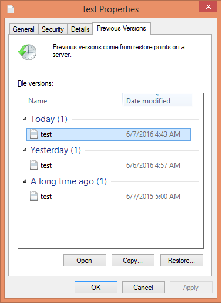

[[chap-Accessing_Data_-_Setting_Up_Clients]]
= Accessing Data - Setting Up Clients

{{ book.productTitle }} volumes can be accessed using a number of
technologies:

* Native Client (see <<sect-Native_Client>>)
* Network File System (NFS) v3 (see <<sect-NFS>>)
* Server Message Block (SMB) (see <<sect-SMB>>)

*Cross Protocol Data Access.*

Although a {{ book.productTitle }} trusted pool can be configured to
support multiple protocols simultaneously, a single volume cannot be
freely accessed by different protocols due to differences in locking
semantics. The table below defines which protocols can safely access the
same volume concurrently.

.Cross Protocol Data Access Matrix
[cols=",,,,",options="header",]
|==================================
| |SMB |NFS |Native Client |Object
|`SMB` |Yes |No |No |No
|`NFS` |No |Yes |Yes |Yes
|`Native Client` |No |Yes |Yes |Yes
|`Object` |No |Yes |Yes |Yes
|==================================

*Access Protocols Supportability.*

The following table provides the support matrix for the supported access
protocols with TCP/RDMA.

.Access Protocol Supportability Matrix
[cols=",,",options="header",]
|===========================
|Access Protocols |TCP |RDMA
|FUSE |Yes |Yes
|SMB |Yes |No
|NFS |Yes |Yes
|===========================

____________________________________________________________________________________________________________________________________________
*Important*

{{ book.productTitle }} requires certain ports to be open. You must
ensure that the firewall settings allow access to the ports listed at
<<../getting-started/chap-Getting_Started_with_RHGS.adoc#chap-Getting_Started-Port_Information,
Port Information>>.
____________________________________________________________________________________________________________________________________________

[[sect-Native_Client]]
= Native Client

Native Client is a FUSE-based client running in user space. Native
Client is the recommended method for accessing {{ book.productTitle }}
volumes when high concurrency and high write performance is required.

This section introduces Native Client and explains how to install the
software on client machines. This section also describes how to mount
{{ book.productTitle }} volumes on clients (both manually and
automatically) and how to verify that the {{ book.productTitle }} volume
has mounted successfully.

.{{ book.productTitle }} Support Matrix
[cols=",,",options="header",]
|=======================================================================
|Red Hat Enterprise Linux version |{{ book.productTitle }} version
|Native client version
|6.5 |3.0 |3.0, 2.1*

|6.6 |3.0.2, 3.0.3, 3.0.4 |3.0, 2.1*

|6.7 |3.1, 3.1.1, 3.1.2 |3.1, 3.0, 2.1*

|6.8 |3.1.3 |3.1.3

|7.1 |3.1, 3.1.1 |3.1, 3.0, 2.1*

|7.2 |3.1.2 |3.1, 3.0, 2.1*

|7.2 |3.1.3 |3.1.3
|=======================================================================



___________________________________________________________________________________________________________________________________________________________________________________________________________________________________________________________________________________________________________________________________________________________________________________________________________________________________________________________________________________________________________________________________________________________________________________________________________________________________________________________________________
*Warning*

If you want to access a volume being provided by a {{ book.productTitle }}
{{ book.productVersion }} server, your client must also be using {{ book.productTitle }}
{{ book.productVersion }}. Accessing {{ book.productTitle }} {{ book.productTitle }}
volumes from other client versions can result in data becoming unavailable and
problems with directory operations. This requirement exists because
{{ book.productTitle }} {{ book.productTitle }} contains a number of changes that affect how
the Distributed Hash Table works in order to improve directory
consistency and remove the effects seen in
https://bugzilla.redhat.com/show_bug.cgi?id=1115367[BZ#1115367] and
https://bugzilla.redhat.com/show_bug.cgi?id=1118762[BZ#1118762].
___________________________________________________________________________________________________________________________________________________________________________________________________________________________________________________________________________________________________________________________________________________________________________________________________________________________________________________________________________________________________________________________________________________________________________________________________________________________________________________________________________

______________________________________________________________________________________________________________________________________________________________________________________________________________________________________________________________________________
*Note*

If an existing {{ book.productTitle }} 2.1 cluster is upgraded to
{{ book.productTitle }} 3.x, older 2.1 based clients can mount the new 3.x
volumes, however, clients must be upgraded to {{ book.productTitle }}
3.x to run rebalance operation. For more information, see
<<sect-Mounting_Gluster_Volumes>>
______________________________________________________________________________________________________________________________________________________________________________________________________________________________________________________________________________



[[Installing_Native_Client]]
== Installing Native Client



After installing the client operating system, register the target system
to Red Hat Network and subscribe to the Red Hat Enterprise Linux Server
channel.

________________________________________________________________________________________________________________________
*Important*

All clients must be of the same version. Red Hat strongly recommends
upgrading the servers before upgrading the clients.
________________________________________________________________________________________________________________________

[[task-Command_Line_Register_Subscribe_System-RHN]]
Register the system using the command line, and subscribe to the correct
channels.

* Know the user name and password of the Red Hat Network (RHN) account
with {{ book.productTitle }} entitlements.

Run the `rhn_register` command to register the system.

--------------
# rhn_register
--------------

In the Operating System Release Version screen, select All available
updates and follow the prompts to register the system to the standard
base channel of the respective Red Hat Enterprise Linux Server version.

Run the `rhn-channel --add --channel` command to subscribe the system to
the correct {{ book.productTitle }} Native Client channel:

* For Red Hat Enterprise Linux 7.x clients using Red Hat Satellite
Server:
+
----------------------------------------------------------------------
# rhn-channel --add --channel=rhel-x86_64-server-7-rh-gluster-3-client
----------------------------------------------------------------------
+
______________________________________________________________________________________________________________________________
*Note*

The following command can also be used, but {{ book.productTitle }} may
deprecate support for this channel in future releases.

------------------------------------------------------------
# rhn-channel --add --channel=rhel-x86_64-server-rh-common-7
------------------------------------------------------------
______________________________________________________________________________________________________________________________
* For Red Hat Enterprise Linux 6.x clients:
+
------------------------------------------------------------
# rhn-channel --add --channel=rhel-x86_64-server-rhsclient-6
------------------------------------------------------------
* For Red Hat Enterprise Linux 5.x clients:
+
------------------------------------------------------------
# rhn-channel --add --channel=rhel-x86_64-server-rhsclient-5
------------------------------------------------------------

Verify that the system is subscribed to the required channels.

--------------
# yum repolist
--------------

[[task-Command_Line_Register_Subscribe_System-RHSM]]
Register the system using the command line, and subscribe to the correct
repositories.

* Know the user name and password of the Red Hat Subscription Manager
account with {{ book.productTitle }} entitlements.

Run the `subscription-manager register` command and enter your Red Hat
Subscription Manager user name and password to register the system with
Red Hat Subscription Manager.

---------------------------------------------
# subscription-manager register --auto-attach
---------------------------------------------

Depending on your client, run one of the following commands to subscribe
to the correct repositories.

* For Red Hat Enterprise Linux 7.x clients:
+
------------------------------------------------------------------------------------------------------------
# subscription-manager repos --enable=rhel-7-server-rpms --enable=rh-gluster-3-client-for-rhel-7-server-rpms
------------------------------------------------------------------------------------------------------------
+
_________________________________________________________________________________________________________________________________
*Note*

The following command can also be used, but {{ book.productTitle }} may
deprecate support for this repository in future releases.

------------------------------------------------------------------
# subscription-manager repos --enable=rhel-7-server-rh-common-rpms
------------------------------------------------------------------
_________________________________________________________________________________________________________________________________
* For Red Hat Enterprise Linux 6.1 and later clients:
+
-------------------------------------------------------------------------------------------------
# subscription-manager repos --enable=rhel-6-server-rpms --enable=rhel-6-server-rhs-client-1-rpms
-------------------------------------------------------------------------------------------------
* For Red Hat Enterprise Linux 5.7 and later clients:
+
-------------------------------------------------------------------------------------------------
# subscription-manager repos --enable=rhel-5-server-rpms --enable=rhel-5-server-rhs-client-1-rpms
-------------------------------------------------------------------------------------------------

For more information, see
https://access.redhat.com/documentation/en-US/Red_Hat_Subscription_Management/1/html/RHSM/registering-cmd.html[Section
3.2 Registering from the Command Line] in Using and Configuring Red Hat
Subscription Management.

Verify that the system is subscribed to the required repositories.

--------------
# yum repolist
--------------
[[task-Web_Interface_Register_Subscribe_System]]
Register the system using the web interface, and subscribe to the
correct channels.

* Know the user name and password of the Red Hat Network (RHN) account
with {{ book.productTitle }} entitlements.

Log on to Red Hat Network (http://rhn.redhat.com[]).

Move the mouse cursor over the `Subscriptions` link at the top of the
screen, and then click the `Registered Systems` link.

Click the name of the system to which the {{ book.productTitle }} Native
Client channel must be appended.

Click Alter Channel Subscriptions in the Subscribed Channels section of
the screen.

Expand the node for Additional Services Channels for
`Red Hat Enterprise Linux 7 for x86_64` or
`Red Hat Enterprise Linux 6 for x86_64` or for
`Red Hat Enterprise Linux 5 for x86_64` depending on the client
platform.

Click the Change Subscriptions button to finalize the changes.

When the page refreshes, select the Details tab to verify the system is
subscribed to the appropriate channels.

Install Native Client packages from Red Hat Network

* <<task-Command_Line_Register_Subscribe_System-RHN, Using command-line subscribe to RHN>> or
* <<task-Command_Line_Register_Subscribe_System-RHSM, Using command-line subscribe to RHSM>> or
* <<task-Web_Interface_Register_Subscribe_Systemi, Using web interface subscribe>>



Run the `yum install` command to install the native client RPM packages.

--------------------------------------
# yum install glusterfs glusterfs-fuse
--------------------------------------



For Red Hat Enterprise 5.x client systems, run the `modprobe` command to
load FUSE modules before mounting {{ book.productTitle }} volumes.

---------------
# modprobe fuse
---------------

For more information on loading modules at boot time, see
https://access.redhat.com/knowledge/solutions/47028[] .



[[Upgrading_Native_Client]]
== Upgrading Native Client



Before updating the Native Client, subscribe the clients to the channels
mentioned in <<Installing_Native_Client>>

___________________________________________________________________________________________________________________________________________________________________________________________________________________________________________________________________________________________________________________________________________________________________________________________________________________________________________________________________________________________________________________________________________________________________________________________________________________________________________________________________________
*Warning*

If you want to access a volume being provided by a {{ book.productTitle }}
3.1.3 server, your client must also be using {{ book.productTitle }}
3.1.3. Accessing {{ book.productTitle }} 3.1.3 volumes from
other client versions can result in data becoming unavailable and
problems with directory operations. This requirement exists because
{{ book.productTitle }} 3.1.3 contains a number of changes that affect how
the Distributed Hash Table works in order to improve directory
consistency and remove the effects seen in
https://bugzilla.redhat.com/show_bug.cgi?id=1115367[BZ#1115367] and
https://bugzilla.redhat.com/show_bug.cgi?id=1118762[BZ#1118762].
___________________________________________________________________________________________________________________________________________________________________________________________________________________________________________________________________________________________________________________________________________________________________________________________________________________________________________________________________________________________________________________________________________________________________________________________________________________________________________________________________________



Unmount any gluster volumes prior to upgrading the native client.

-----------------------
# umount /mnt/glusterfs
-----------------------

Run the `yum update` command to upgrade the native client:

-------------------------------------
# yum update glusterfs glusterfs-fuse
-------------------------------------

Remount volumes as discussed in <<sect-Mounting_Gluster_Volumes>>.

[[sect-Mounting_Gluster_Volumes]]
== Mounting {{ book.productTitle }} Volumes

After installing Native Client, the {{ book.productTitle }} volumes must
be mounted to access data. Two methods are available:

* <<Mounting_Volumes_Automatically>>
* <<Mounting_Volumes_Manually>>

After mounting a volume, test the mounted volume using the procedure
described in <<Testing_Mounted_Volumes>>.



_________________________________________________________________________________________________________________________________________________________________________________________
*Note*

* For {{ book.productTitle }} 3.1 and {{ book.productTitle }} 3.1.z, the
recommended native client version should either be 3.1.z, or 3.0.z.
* Server names selected during volume creation should be resolvable in
the client machine. Use appropriate `/etc/hosts` entries, or a DNS
server to resolve server names to IP addresses.
_________________________________________________________________________________________________________________________________________________________________________________________



[[Mount_Commands_and_Options]]
=== Mount Commands and Options

The following options are available when using the `mount -t glusterfs`
command. All options must be separated with commas.

-------------------------------------------------------------------------------------------------------------------------------------------------------------------------------------------------------------
# mount -t glusterfs -o backup-volfile-servers=volfile_server2:volfile_server3:.... ..:volfile_serverN,transport-type tcp,log-level=WARNING,log-file=/var/log/gluster.log server1:/test-volume /mnt/glusterfs
-------------------------------------------------------------------------------------------------------------------------------------------------------------------------------------------------------------

backup-volfile-servers=<volfile_server2>:<volfile_server3>:...:<volfile_serverN>::
  List of the backup volfile servers to mount the client. If this option
  is specified while mounting the fuse client, when the first volfile
  server fails, the servers specified in `backup-volfile-servers` option
  are used as volfile servers to mount the client until the mount is
  successful.
  +
  _____________________________________________________________________________________
  *Note*

  This option was earlier specified as `backupvolfile-server` which is
  no longer valid.
  _____________________________________________________________________________________
log-level::
  Logs only specified level or higher severity messages in the log-file.
log-file::
  Logs the messages in the specified file.
transport-type::
  Specifies the transport type that FUSE client must use to communicate
  with bricks. If the volume was created with only one transport type,
  then that becomes the default when no value is specified. In case of
  `tcp,rdma` volume, tcp is the default.
ro::
  Mounts the file system as read only.
acl::
  Enables POSIX Access Control List on mount.
background-qlen=n::
  Enables FUSE to handle n number of requests to be queued before
  subsequent requests are denied. Default value of n is 64.
enable-ino32::
  this option enables file system to present 32-bit inodes instead of
  64- bit inodes.

[[Mounting_Volumes_Manually]]
=== Mounting Volumes Manually

Create a mount point and run the
`mount -t glusterfs HOSTNAME|IPADDRESS:/VOLNAME /MOUNTDIR` command to
manually mount a {{ book.productTitle }} volume.

____________________________________________________________________________________________________________________________________________________________________________________________________________________________________________________________________________
*Note*

The server specified in the mount command is used to fetch the glusterFS
configuration volfile, which describes the volume name. The client then
communicates directly with the servers mentioned in the volfile (which
may not actually include the server used for mount).
____________________________________________________________________________________________________________________________________________________________________________________________________________________________________________________________________________

If a mount point has not yet been created for the volume, run the
`mkdir` command to create a mount point.

----------------------
# mkdir /mnt/glusterfs
----------------------

Run the `mount -t glusterfs` command, using the key in the task summary
as a guide.

--------------------------------------------------------
# mount -t glusterfs server1:/test-volume /mnt/glusterfs
--------------------------------------------------------

[[Mounting_Volumes_Automatically]]
=== Mounting Volumes Automatically

Volumes can be mounted automatically each time the systems starts.

The server specified in the mount command is used to fetch the glusterFS
configuration volfile, which describes the volume name. The client then
communicates directly with the servers mentioned in the volfile (which
may not actually include the server used for mount).

*Mounting a Volume Automatically*

Mount a {{ book.productTitle }} Volume automatically at server start.

1.  Open the `/etc/fstab` file in a text editor.
2.  Append the following configuration to the `fstab` file.
+
--------------------------------------------------------------------
HOSTNAME|IPADDRESS:/VOLNAME /MOUNTDIR glusterfs defaults,_netdev 0 0
--------------------------------------------------------------------
+
Using the example server names, the entry contains the following
replaced values.
+
------------------------------------------------------------------
server1:/test-volume /mnt/glusterfs glusterfs defaults,_netdev 0 0
------------------------------------------------------------------
+
If you want to specify the transport type then check the following
example:
+
--------------------------------------------------------------------------------
server1:/test-volume /mnt/glusterfs glusterfs defaults,_netdev,transport=tcp 0 0
--------------------------------------------------------------------------------

[[Testing_Mounted_Volumes]]
=== Testing Mounted Volumes

Using the command-line, verify the {{ book.productTitle }} volumes have
been successfully mounted. All three commands can be run in the order
listed, or used independently to verify a volume has been successfully
mounted.

* <<Mounting_Volumes_Automatically>>, or
* <<Mounting_Volumes_Manually>>

Run the `mount` command to check whether the volume was successfully
mounted.

-------------------------------------------------------------------------------------------------------------
# mount
server1:/test-volume on /mnt/glusterfs type fuse.glusterfs(rw,allow_other,default_permissions,max_read=131072
-------------------------------------------------------------------------------------------------------------

If transport option is used while mounting a volume, mount status will
have the transport type appended to the volume name. For example, for
transport=tcp:

-----------------------------------------------------------------------------------------------------------------
# mount
server1:/test-volume.tcp on /mnt/glusterfs type fuse.glusterfs(rw,allow_other,default_permissions,max_read=131072
-----------------------------------------------------------------------------------------------------------------

Run the `df` command to display the aggregated storage space from all
the bricks in a volume.

------------------------------------------------------------
# df -h /mnt/glusterfs
Filesystem           Size  Used  Avail  Use%  Mounted on
server1:/test-volume  28T  22T   5.4T   82%   /mnt/glusterfs
------------------------------------------------------------

Move to the mount directory using the `cd` command, and list the
contents.

-------------------
# cd /mnt/glusterfs
# ls
-------------------

[[sect-NFS]]
= NFS

Linux, and other operating systems that support the NFSv3 standard can
use NFS to access the {{ book.productTitle }} volumes.



Differences in implementation of the NFSv3 standard in operating systems
may result in some operational issues. If issues are encountered when
using NFSv3, contact Red Hat support to receive more information on Red
{{ book.productTitle }} client operating system compatibility, and
information about known issues affecting NFSv3.



NFS ACL v3 is supported, which allows `getfacl` and `setfacl `operations
on NFS clients. The following options are provided to configure the
Access Control Lists (ACL) in the glusterFS NFS server with the
`nfs.acl` option. For example:

* To set nfs.acl `ON`, run the following command:
+
`# gluster volume set VOLNAME nfs.acl on`
* To set nfs.acl `OFF`, run the following command:
+
`# gluster volume set VOLNAME nfs.acl off`

_______________________
*Note*

ACL is `ON` by default.
_______________________

{{ book.productTitle }} includes Network Lock Manager (NLM) v4. NLM
protocol allows NFSv3 clients to lock files across the network. NLM is
required to make applications running on top of NFSv3 mount points to
use the standard fcntl() (POSIX) and flock() (BSD) lock system calls to
synchronize access across clients.

This section describes how to use NFS to mount {{ book.productTitle }}
volumes (both manually and automatically) and how to verify that the
volume has been mounted successfully.

___________________________________________________________________________________________________________________________________________
*Important*

On Red Hat Enterprise Linux 7, enable the firewall service in the active
zones for runtime and permanent mode using the following commands:

To get a list of active zones, run the following command:

---------------------------------
# firewall-cmd --get-active-zones
---------------------------------

To allow the firewall service in the active zones, run the following
commands:

------------------------------------------------------------------------------------
# firewall-cmd --zone=zone_name --add-service=nfs --add-service=rpc-bind
# firewall-cmd --zone=zone_name --add-service=nfs --add-service=rpc-bind --permanent
------------------------------------------------------------------------------------
___________________________________________________________________________________________________________________________________________

== Setting up CTDB for NFS

In a replicated volume environment, the CTDB software (Cluster Trivial
Database) has to be configured to provide high availability and lock
synchronization for Samba shares. CTDB provides high availability by
adding virtual IP addresses (VIPs) and a heartbeat service.

When a node in the trusted storage pool fails, CTDB enables a different
node to take over the virtual IP addresses that the failed node was
hosting. This ensures the IP addresses for the services provided are
always available.

____________________________________________________________________________________________________________________________________________
*Important*

On Red Hat Enterprise Linux 7, enable the CTDB firewall service in the
active zones for runtime and permanent mode using the below commands:

To get a list of active zones, run the following command:

---------------------------------
# firewall-cmd --get-active-zones
---------------------------------

To add ports to the active zones, run the following commands:

----------------------------------------------------------------
# firewall-cmd --zone=zone_name --add-port=4379/tcp
# firewall-cmd --zone=zone_name --add-port=4379/tcp  --permanent
----------------------------------------------------------------
____________________________________________________________________________________________________________________________________________

________________________________________________________________________________________________________
*Note*

Amazon Elastic Compute Cloud (EC2) does not support VIPs and is hence
not compatible with this solution.
________________________________________________________________________________________________________

=== Prerequisites

Follow these steps before configuring CTDB on a {{ book.productTitle }}
Server:

* If you already have an older version of CTDB (version <= ctdb1.x),
then remove CTDB by executing the following command:
+
-----------------
# yum remove ctdb
-----------------
+
After removing the older version, proceed with installing the latest
CTDB.
+
__________________________________________________________________________________________
*Note*

Ensure that the system is subscribed to the samba channel to get the
latest CTDB packages.
__________________________________________________________________________________________
* Install CTDB on all the nodes that are used as NFS servers to the
latest version using the following command:
+
------------------
# yum install ctdb
------------------
* In a CTDB based high availability environment of Samba/NFS , the locks
will not be migrated on failover.
* You must ensure to open TCP port 4379 between the {{ book.productTitle }}
servers: This is the internode communication port of CTDB.

=== Configuring CTDB on {{ book.productTitle }} Server

To configure CTDB on {{ book.productTitle }} server, execute the
following steps:

1.  Create a replicate volume. This volume will host only a zero byte
lock file, hence choose minimal sized bricks. To create a replicate
volume run the following command:
+
-----------------------------------------------------------------------------
# gluster volume create volname replica n ipaddress:/brick path.......N times
-----------------------------------------------------------------------------
+
where,
+
N: The number of nodes that are used as NFS servers. Each node must host
one brick.
+
For example:
+
------------------------------------------------------------------------------------------------------------------------------------------------------------------------------
# gluster volume create ctdb replica 4 10.16.157.75:/rhgs/brick1/ctdb/b1 10.16.157.78:/rhgs/brick1/ctdb/b2 10.16.157.81:/rhgs/brick1/ctdb/b3 10.16.157.84:/rhgs/brick1/ctdb/b4
------------------------------------------------------------------------------------------------------------------------------------------------------------------------------
2.  In the following files, replace "all" in the statement META="all" to
the newly created volume name
+
------------------------------------------------------
/var/lib/glusterd/hooks/1/start/post/S29CTDBsetup.sh
/var/lib/glusterd/hooks/1/stop/pre/S29CTDB-teardown.sh
------------------------------------------------------
+
For example:
+
-----------
META="all"
  to
META="ctdb"
-----------
3.  Start the volume.
+
The S29CTDBsetup.sh script runs on all {{ book.productTitle }} servers,
adds an entry in /etc/fstab/ for the mount, and mounts the volume at
/gluster/lock on all the nodes with NFS server. It also enables
automatic start of CTDB service on reboot.
+
_____________________________________________________________________________________________________________________________________________________________________________________________________________
*Note*

When you stop the special CTDB volume, the S29CTDB-teardown.sh script
runs on all {{ book.productTitle }} servers and removes an entry in
/etc/fstab/ for the mount and unmounts the volume at /gluster/lock.
_____________________________________________________________________________________________________________________________________________________________________________________________________________
4.  Verify if the file /etc/sysconfig/ctdb exists on all the nodes that
is used as NFS server. This file contains {{ book.productTitle }}
recommended CTDB configurations.
5.  Create /etc/ctdb/nodes file on all the nodes that is used as NFS
servers and add the IPs of these nodes to the file.
+
-----------
10.16.157.0
10.16.157.3
10.16.157.6
10.16.157.9
-----------
+
The IPs listed here are the private IPs of NFS servers.
6.  On all the nodes that are used as NFS server which require IP
failover, create /etc/ctdb/public_addresses file and add the virtual IPs
that CTDB should create to this file. Add these IP address in the
following format:
+
---------------------------------------------
<Virtual IP>/<routing prefix><node interface>
---------------------------------------------
+
For example:
+
--------------------
192.168.1.20/24 eth0
192.168.1.21/24 eth0
--------------------
7.  Start the CTDB service on all the nodes by executing the following
command:
+
--------------------
# service ctdb start
--------------------

[[sect-Using_NFS_to_Mount_Gluster_Volumes]]
== Using NFS to Mount {{ book.productTitle }} Volumes

You can use either of the following methods to mount
{{ book.productTitle }} volumes:

______________________________________________________________________________________________________________________________________________________________________________________________________________________________________________
*Note*

Currently GlusterFS NFS server only supports version 3 of NFS protocol.
As a preferred option, always configure version 3 as the default version
in the `nfsmount.conf` file at `/etc/nfsmount.conf` by adding the
following text in the file:

`Defaultvers=3`

In case the file is not modified, then ensure to add `vers=3` manually
in all the mount commands.

`# mount nfsserver:export -o vers=3 /MOUNTPOINT`
______________________________________________________________________________________________________________________________________________________________________________________________________________________________________________

RDMA support in GlusterFS that is mentioned in the previous sections is
with respect to communication between bricks and Fuse mount/GFAPI/NFS
server. NFS kernel client will still communicate with GlusterFS NFS
server over tcp.

In case of volumes which were created with only one type of transport,
communication between GlusterFS NFS server and bricks will be over that
transport type. In case of `tcp,rdma` volume it could be changed using
the volume set option `nfs.transport-type`.

* <<Manually_Mounting_Volumes_Using_NFS>>
* <<Automatically_Mounting_Volumes_Using_NFS>>

After mounting a volume, you can test the mounted volume using the
procedure described in <<Testing_Volumes_Mounted_Using_NFS>>.

[[Manually_Mounting_Volumes_Using_NFS]]
=== Manually Mounting Volumes Using NFS

Create a mount point and run the `mount` command to manually mount a
{{ book.productTitle }} volume using NFS.

1.  If a mount point has not yet been created for the volume, run the
`mkdir` command to create a mount point.
+
----------------------
# mkdir /mnt/glusterfs
----------------------
2.  Run the correct `mount` command for the system.
+
For Linux::
------------------------------------------------------------
# mount -t nfs -o vers=3 server1:/test-volume /mnt/glusterfs
------------------------------------------------------------
For Solaris::
----------------------------------------------------------------
# mount -o vers=3 nfs://server1:38467/test-volume /mnt/glusterfs
----------------------------------------------------------------

*Manually Mount a {{ book.productTitle }} Volume using NFS over TCP*

Create a mount point and run the `mount` command to manually mount a
{{ book.productTitle }} volume using NFS over TCP.

___________________________________________________________________________________________________________________________________________________________________________________________________________________________________________________________________________________________________________
*Note*

glusterFS NFS server does not support UDP. If a NFS client such as
Solaris client, connects by default using UDP, the following message
appears:

`requested NFS version or transport protocol is not supported`

The option `nfs.mount-udp` is supported for mounting a volume, by
default it is disabled. The following are the limitations:

* If `nfs.mount-udp` is enabled, the MOUNT protocol needed for NFSv3 can
handle requests from NFS-clients that require MOUNT over UDP. This is
useful for at least some versions of Solaris, IBM AIX and HP-UX.
* Currently, MOUNT over UDP does not have support for mounting
subdirectories on a volume. Mounting `server:/volume/subdir` exports is
only functional when MOUNT over TCP is used.
* MOUNT over UDP does not currently have support for different
authentication options that MOUNT over TCP honors. Enabling
`nfs.mount-udp` may give more permissions to NFS clients than intended
via various authentication options like `nfs.rpc-auth-allow`,
`nfs.rpc-auth-reject` and `nfs.export-dir`.
___________________________________________________________________________________________________________________________________________________________________________________________________________________________________________________________________________________________________________

1.  If a mount point has not yet been created for the volume, run the
`mkdir` command to create a mount point.
+
----------------------
# mkdir /mnt/glusterfs
----------------------
2.  Run the correct `mount` command for the system, specifying the TCP
protocol option for the system.
+
For Linux::
---------------------------------------------------------------------------
# mount -t nfs -o vers=3,mountproto=tcp server1:/test-volume /mnt/glusterfs
---------------------------------------------------------------------------
For Solaris::
--------------------------------------------------------------------
# mount -o proto=tcp, nfs://server1:38467/test-volume /mnt/glusterfs
--------------------------------------------------------------------

[[Automatically_Mounting_Volumes_Using_NFS]]
=== Automatically Mounting Volumes Using NFS

{{ book.productTitle }} volumes can be mounted automatically using NFS,
each time the system starts.

_______________________________________________________________________________________________________________________________________________________________________________________________________
*Note*

In addition to the tasks described below, {{ book.productTitle }}
supports Linux, UNIX, and similar operating system's standard method of
auto-mounting NFS mounts.

Update the `/etc/auto.master` and` /etc/auto.misc` files, and restart
the `autofs` service. Whenever a user or process attempts to access the
directory it will be mounted in the background on-demand.
_______________________________________________________________________________________________________________________________________________________________________________________________________

*Mounting a Volume Automatically using NFS*

Mount a {{ book.productTitle }} Volume automatically using NFS at server
start.

1.  Open the `/etc/fstab` file in a text editor.
2.  Append the following configuration to the `fstab` file.
+
----------------------------------------------------------------------------------
HOSTNAME|IPADDRESS:/VOLNAME /MOUNTDIR glusterfs mountdir nfs defaults,_netdev, 0 0
----------------------------------------------------------------------------------
+
Using the example server names, the entry contains the following
replaced values.
+
-------------------------------------------------------------
server1:/test-volume /mnt/glusterfs nfs defaults,_netdev, 0 0
-------------------------------------------------------------

*Mounting a Volume Automatically using NFS over TCP*

Mount a {{ book.productTitle }} Volume automatically using NFS over TCP
at server start.

1.  Open the `/etc/fstab` file in a text editor.
2.  Append the following configuration to the `fstab` file.
+
---------------------------------------------------------------------------------------
HOSTNAME|IPADDRESS:/VOLNAME /MOUNTDIR glusterfs nfs defaults,_netdev,mountproto=tcp 0 0
---------------------------------------------------------------------------------------
+
Using the example server names, the entry contains the following
replaced values.
+
---------------------------------------------------------------------------
server1:/test-volume /mnt/glusterfs nfs defaults,_netdev,mountproto=tcp 0 0
---------------------------------------------------------------------------

[[Authentication_Support_for_Subdirectory_Mount]]
=== Authentication Support for Subdirectory Mount

This update extends `nfs.export-dir` option to provide client
authentication during sub-directory mount. The `nfs.export-dir` and
`nfs.export-dirs` options provide granular control to restrict or allow
specific clients to mount a sub-directory. These clients can be
authenticated with either an IP, host name or a Classless Inter-Domain
Routing (CIDR) range.

* __nfs.export-dirs__: By default, all NFS sub-volumes are exported as
individual exports. This option allows you to manage this behavior. When
this option is turned off, none of the sub-volumes are exported and
hence the sub-directories cannot be mounted. This option is on by
default.
+
To set this option to off, run the following command:
+
`# gluster volume set VOLNAME nfs.export-dirs off`
+
To set this option to on, run the following command:
+
`# gluster volume set VOLNAME nfs.export-dirs on`
* __nfs.export-dir__: This option allows you to export specified
subdirectories on the volume. You can export a particular subdirectory,
for example:
+
`# gluster volume set VOLNAME nfs.export-dir /d1,/d2/d3/d4,/d6`
+
where d1, d2, d3, d4, d6 are the sub-directories.
+
You can also control the access to mount these subdirectories based on
the IP address, host name or a CIDR. For example:
+
`# gluster volume set VOLNAME nfs.export-dir "/d1(<ip address>),/d2/d3/d4(<host name>|<ip address>),/d6(<CIDR>)"`
+
The directory /d1, /d2 and /d6 are directories inside the volume. Volume
name must not be added to the path. For example if the volume vol1 has
directories d1 and d2, then to export these directories use the
following command:
`gluster volume set vol1 nfs.export-dir "/d1(192.0.2.2),d2(192.0.2.34)"`

[[Testing_Volumes_Mounted_Using_NFS]]
=== Testing Volumes Mounted Using NFS

You can confirm that {{ book.productTitle }} directories are mounting
successfully.

*To test mounted volumes*

Using the command-line, verify the {{ book.productTitle }} volumes have
been successfully mounted. All three commands can be run in the order
listed, or used independently to verify a volume has been successfully
mounted.

* <<Automatically_Mounting_Volumes_Using_NFS>>, or
* <<Manually_Mounting_Volumes_Using_NFS>>

Run the `mount` command to check whether the volume was successfully
mounted.

-----------------------------------------------------------------
# mount
server1:/test-volume on /mnt/glusterfs type nfs (rw,addr=server1)
-----------------------------------------------------------------

Run the `df` command to display the aggregated storage space from all
the bricks in a volume.

-----------------------------------------------------------
# df -h /mnt/glusterfs
Filesystem              Size Used Avail Use% Mounted on
server1:/test-volume    28T  22T  5.4T  82%  /mnt/glusterfs
-----------------------------------------------------------

Move to the mount directory using the `cd` command, and list the
contents.

-------------------
# cd /mnt/glusterfs
# ls
-------------------

[[Troubleshooting_NFS]]
== Troubleshooting NFS

**Q:** The mount command on the NFS client fails with
`RPC Error: Program not registered`. This error is encountered due to
one of the following reasons:

* The NFS server is not running. You can check the status using the
following command:
+
-----------------------
# gluster volume status
-----------------------
* The volume is not started. You can check the status using the
following command:
+
---------------------
# gluster volume info
---------------------
* rpcbind is restarted. To check if rpcbind is running, execute the
following command:
+
`# ps ax| grep rpcbind`

* If the NFS server is not running, then restart the NFS server using
the following command:
+
------------------------------
# gluster volume start VOLNAME
------------------------------
* If the volume is not started, then start the volume using the
following command:
+
------------------------------
# gluster volume start VOLNAME
------------------------------
* If both rpcbind and NFS server is running then restart the NFS server
using the following commands:
+
`# gluster volume stop VOLNAME`
+
`# gluster volume start VOLNAME`

**Q:** The rpcbind service is not running on the NFS client. This could
be due to the following reasons:

* The portmap is not running.
* Another instance of kernel NFS server or glusterNFS server is running.

**A:** Start the rpcbind service by running the following command:

-----------------------
# service rpcbind start
-----------------------

**Q:** The NFS server glusterfsd starts but the initialization fails
with _nfsrpc- service: portmap registration of program failed_ error
message in the log.

**A:** NFS start-up succeeds but the initialization of the NFS service
can still fail preventing clients from accessing the mount points. Such
a situation can be confirmed from the following error messages in the
log file:

------------------------------------------------------------------------------------------------------------------------------------------------------
[2010-05-26 23:33:47] E [rpcsvc.c:2598:rpcsvc_program_register_portmap] rpc-service: Could notregister with portmap
[2010-05-26 23:33:47] E [rpcsvc.c:2682:rpcsvc_program_register] rpc-service: portmap registration of program failed
[2010-05-26 23:33:47] E [rpcsvc.c:2695:rpcsvc_program_register] rpc-service: Program registration failed: MOUNT3, Num: 100005, Ver: 3, Port: 38465
[2010-05-26 23:33:47] E [nfs.c:125:nfs_init_versions] nfs: Program init failed
[2010-05-26 23:33:47] C [nfs.c:531:notify] nfs: Failed to initialize protocols
[2010-05-26 23:33:49] E [rpcsvc.c:2614:rpcsvc_program_unregister_portmap] rpc-service: Could not unregister with portmap
[2010-05-26 23:33:49] E [rpcsvc.c:2731:rpcsvc_program_unregister] rpc-service: portmap unregistration of program failed
[2010-05-26 23:33:49] E [rpcsvc.c:2744:rpcsvc_program_unregister] rpc-service: Program unregistration failed: MOUNT3, Num: 100005, Ver: 3, Port: 38465
------------------------------------------------------------------------------------------------------------------------------------------------------

1.  Start the rpcbind service on the NFS server by running the following
command:
+
------------------------
# service rpcbind start 
------------------------
+
After starting rpcbind service, glusterFS NFS server needs to be
restarted.
2.  Stop another NFS server running on the same machine.
+
Such an error is also seen when there is another NFS server running on
the same machine but it is not the glusterFS NFS server. On Linux
systems, this could be the kernel NFS server. Resolution involves
stopping the other NFS server or not running the glusterFS NFS server on
the machine. Before stopping the kernel NFS server, ensure that no
critical service depends on access to that NFS server's exports.
+
On Linux, kernel NFS servers can be stopped by using either of the
following commands depending on the distribution in use:
+
--------------------------------
# service nfs-kernel-server stop
# service nfs stop
--------------------------------
3.  Restart glusterFS NFS server.

**Q:** The NFS server start-up fails with the message _Port is already
in use_ in the log file.

**A:** This error can arise in case there is already a glusterFS NFS
server running on the same machine. This situation can be confirmed from
the log file, if the following error lines exist:

--------------------------------------------------------------------------------------------------------------------------------------------------
[2010-05-26 23:40:49] E [rpc-socket.c:126:rpcsvc_socket_listen] rpc-socket: binding socket failed:Address already in use
[2010-05-26 23:40:49] E [rpc-socket.c:129:rpcsvc_socket_listen] rpc-socket: Port is already in use
[2010-05-26 23:40:49] E [rpcsvc.c:2636:rpcsvc_stage_program_register] rpc-service: could not create listening connection
[2010-05-26 23:40:49] E [rpcsvc.c:2675:rpcsvc_program_register] rpc-service: stage registration of program failed
[2010-05-26 23:40:49] E [rpcsvc.c:2695:rpcsvc_program_register] rpc-service: Program registration failed: MOUNT3, Num: 100005, Ver: 3, Port: 38465
[2010-05-26 23:40:49] E [nfs.c:125:nfs_init_versions] nfs: Program init failed
[2010-05-26 23:40:49] C [nfs.c:531:notify] nfs: Failed to initialize protocols
--------------------------------------------------------------------------------------------------------------------------------------------------

In this release, the glusterFS NFS server does not support running
multiple NFS servers on the same machine. To resolve the issue, one of
the glusterFS NFS servers must be shutdown.

**Q:** The `mount` command fails with NFS server failed error:

---------------------------------------------------------------------
mount: mount to NFS server '10.1.10.11' failed: timed out (retrying).
---------------------------------------------------------------------

Review and apply the suggested solutions to correct the issue.

* Disable name lookup requests from NFS server to a DNS server.
+
The NFS server attempts to authenticate NFS clients by performing a
reverse DNS lookup to match host names in the volume file with the
client IP addresses. There can be a situation where the NFS server
either is not able to connect to the DNS server or the DNS server is
taking too long to respond to DNS request. These delays can result in
delayed replies from the NFS server to the NFS client resulting in the
timeout error.
+
NFS server provides a work-around that disables DNS requests, instead
relying only on the client IP addresses for authentication. The
following option can be added for successful mounting in such
situations:
+
-------------------------------
option nfs.addr.namelookup off 
-------------------------------
+
____________________________________________________________________________________________________________________________________________________________________________________________________________________________________
*Note*

Remember that disabling the NFS server forces authentication of clients
to use only IP addresses. If the authentication rules in the volume file
use host names, those authentication rules will fail and client mounting
will fail.
____________________________________________________________________________________________________________________________________________________________________________________________________________________________________
* NFS version used by the NFS client is other than version 3 by default.
+
glusterFS NFS server supports version 3 of NFS protocol by default. In
recent Linux kernels, the default NFS version has been changed from 3 to
4. It is possible that the client machine is unable to connect to the
glusterFS NFS server because it is using version 4 messages which are
not understood by glusterFS NFS server. The timeout can be resolved by
forcing the NFS client to use version 3. The *vers* option to mount
command is used for this purpose:
+
`# mount nfsserver:export -o vers=3 /MOUNTPOINT`

**Q:** The showmount command fails with _clnt_create: RPC: Unable to
receive_ error. This error is encountered due to the following reasons:

* The firewall might have blocked the port.
* rpcbind might not be running.

**A:** Check the firewall settings, and open ports 111 for portmap
requests/replies and glusterFS NFS server requests/replies. glusterFS
NFS server operates over the following port numbers: 38465, 38466, and
38467.

**Q:** The application fails with _Invalid argument_ or _Value too large
for defined data type_

**A:** These two errors generally happen for 32-bit NFS clients, or
applications that do not support 64-bit inode numbers or large files.

Use the following option from the command-line interface to make
glusterFS NFS return 32-bit inode numbers instead:

---------------------------
NFS.enable-ino32 <on | off>
---------------------------

This option is `off` by default, which permits NFS to return 64-bit
inode numbers by default.

Applications that will benefit from this option include those that are:

* built and run on 32-bit machines, which do not support large files by
default,
* built to 32-bit standards on 64-bit systems.

Applications which can be rebuilt from source are recommended to be
rebuilt using the following flag with gcc:

----------------------
-D_FILE_OFFSET_BITS=64
----------------------

**Q:** After the machine that is running NFS server is restarted the
client fails to reclaim the locks held earlier.

**A:** The Network Status Monitor (NSM) service daemon (rpc.statd) is
started before gluster NFS server. Hence, NSM sends a notification to
the client to reclaim the locks. When the clients send the reclaim
request, the NFS server does not respond as it is not started yet. Hence
the client request fails.

**Solution**: To resolve the issue, prevent the NSM daemon from starting
when the server starts.

Run `chkconfig --list nfslock` to check if NSM is configured during OS
boot.

If any of the entries are `on,`run `chkconfig nfslock off` to disable
NSM clients during boot, which resolves the issue.

**Q:** The `rpc actor failed to complete successfully` error is
displayed in the nfs.log, even after the volume is mounted successfully.

**A:** gluster NFS supports only NFS version 3. When nfs-utils mounts a
client when the version is not mentioned, it tries to negotiate using
version 4 before falling back to version 3. This is the cause of the
messages in both the server log and the `nfs.log` file.

----------------------------------------------------------------------------------------------------------------------------------
[2013-06-25 00:03:38.160547] W [rpcsvc.c:180:rpcsvc_program_actor] 0-rpc-service: RPC program version not available (req 100003 4)
[2013-06-25 00:03:38.160669] E [rpcsvc.c:448:rpcsvc_check_and_reply_error] 0-rpcsvc: rpc actor failed to complete successfully
----------------------------------------------------------------------------------------------------------------------------------

To resolve the issue, declare NFS version 3 and the `noacl` option in
the mount command as follows:

----------------------------------------------------------------
mount -t nfs -o vers=3,noacl server1:/test-volume /mnt/glusterfs
----------------------------------------------------------------

**Q:** The mount command fails with `No such file or directory`.

**A:** This problem is encountered as the volume is not present.

[[sect-NFS_Ganesha]]
== NFS-Ganesha

NFS-Ganesha is a user space file server for the NFS protocol with
support for NFSv3, v4, v4.1, pNFS.

{{ book.productTitle }} is supported with the community’s V2.3.1 stable
release of NFS-Ganesha. The current release of {{ book.productTitle }}
introduces High Availability (HA) of NFS servers in active-active mode.
pNFS is introduced as a tech preview feature. However, it does not
support NFSv4 delegations and NFSv4.1.

_____________________________________________________________________________________________________________________________________
*Note*

To install NFS-Ganesha refer, Deploying NFS-Ganesha on
{{ book.productTitle }} in the {{ book.productTitle }}
{{ book.productVersion }} Installation Guide.
_____________________________________________________________________________________________________________________________________

The following table contains the feature matrix of the NFS support on
{{ book.productTitle }} {{ book.productVersion }} and later:

.NFS Support Matrix
[cols=",,,",options="header",]
|=======================================================================
|Features |glusterFS NFS (NFSv3) |NFS-Ganesha (NFSv3) |NFS-Ganesha
(NFSv4)
|Root-squash |Yes |Yes |Yes

|Sub-directory exports |Yes |Yes |Yes

|Locking |Yes |Yes |Yes

|Client based export permissions |Yes |Yes |Yes

|Netgroups |Tech Preview |Tech Preview |Tech Preview

|Mount protocols |UDP, TCP |UDP, TCP |Only TCP

|NFS transport protocols |TCP |UDP, TCP |TCP

|AUTH_UNIX |Yes |Yes |Yes

|AUTH_NONE |Yes |Yes |Yes

|AUTH_KRB |No |Yes |Yes

|ACLs |Yes |No |Yes

|Delegations |N/A |N/A |No

|High availability |Yes (but no lock-recovery) |Yes |Yes

|High availability (fail-back) |Yes (but no lock-recovery) |Yes |Yes

|Multi-head |Yes |Yes |Yes

|Gluster RDMA volumes |Yes |Available but not supported |Available but
not supported

|DRC |Available but not supported |No |No

|Dynamic exports |No |Yes |Yes

|pseudofs |N/A |N/A |Yes

|NFSv4.1 |N/A |N/A |Not Supported

|NFSv4.1/pNFS |N/A |N/A |Tech Preview
|=======================================================================

____________________________________________________________________________________________________________________________________________________________________________________________________________________________________________________________________________
*Note*

* {{ book.company }} does not recommend running NFS-Ganesha in mixed-mode and/or
hybrid environments. This includes multi-protocol environments where NFS
and CIFS shares are used simultaneously, or running NFS-Ganesha together
with gluster-nfs, kernel-nfs or gluster-fuse clients
* Only one of NFS-Ganesha, gluster-NFS or kernel-NFS servers can be
enabled on a given machine/host as all NFS implementations use the port
2049 and only one can be active at a given time. Hence you must disable
kernel-NFS before NFS-Ganesha is started.
____________________________________________________________________________________________________________________________________________________________________________________________________________________________________________________________________________

=== Port Information for NFS-Ganesha

You must ensure to enable the NFS firewall service along with the
NFS-Ganesha firewall services. For more information NFS firewall
services, see <<sect-NFS>>.

* On Red Hat Enterprise Linux 7, enable the NFS-Ganesha firewall service
for nfs, rpcbind, mountd, nlm, rquota, and HA in the active zones or
runtime and permanent mode using the following commands. In addition,
configure firewalld to add port '662' which will be used by statd
service.
1.  Get a list of active zones using the following command:
+
---------------------------------
# firewall-cmd --get-active-zones
---------------------------------
2.  Allow the firewall service in the active zones, run the following
commands:
+
---------------------------------------------------------------------------------------------------------------------------------------------------------------------------------
# firewall-cmd --zone=public  --add-service=nlm  --add-service=nfs  --add-service=rpc-bind  --add-service=high-availability --add-service=mountd --add-service=rquota

# firewall-cmd --zone=public  --add-service=nlm  --add-service=nfs  --add-service=rpc-bind  --add-service=high-availability --add-service=mountd --add-service=rquota --permanent

# firewall-cmd --zone=public --add-port=662/tcp --add-port=662/udp

# firewall-cmd --zone=public --add-port=662/tcp --add-port=662/udp --permanent
---------------------------------------------------------------------------------------------------------------------------------------------------------------------------------
** On the NFS-client machine, configure firewalld to add ports used by
statd and nlm services by executing the following commands:
+
--------------------------------------------------------------------
# firewall-cmd --zone=public --add-port=662/tcp --add-port=662/udp \
--add-port=32803/tcp --add-port=32769/udp 

# firewall-cmd --zone=public --add-port=662/tcp --add-port=662/udp \
--add-port=32803/tcp --add-port=32769/udp --permanent
--------------------------------------------------------------------
3.  Ensure to configure the ports mentioned above. For more information
see Defining Service Ports. in Section 7.2.4.3.1 Pre-requisites to run
nfs-ganesha,

The following table lists the port details for NFS-Ganesha:

_________________________________________________________________________________________________________
*Note*

The port details for the {{ book.productTitle }} services are listed
under section 4.1. Port Information.
_________________________________________________________________________________________________________

[cols=",,",]
|====================================
|*Service* |*Port Number* |*Protocol*
|sshd |22 |TCP
|rpcbind/portmapper |111 |TCP/UDP
|NFS |2049 |TCP/UDP
|mountd |20048 |TCP/UDP
|NLM |32803 |TCP/UDP
|Rquota |875 |TCP/UDP
|statd |662 |TCP/UDP
|pcsd |2224 |TCP
|pacemaker_remote |3121 |TCP
|corosync |5404 and 5405 |UDP
|dlm |21064 |TCP
|====================================

[[Exporting_subdirectories_with_nfs-ganesha]]
=== Supported Features of NFS-Ganesha

*Highly Available Active-Active NFS-Ganesha.*

In a highly available active-active environment, if a NFS-Ganesha server
that is connected to a NFS client running a particular application goes
down, the application/NFS client is seamlessly connected to another
NFS-Ganesha server without any administrative intervention.

For more information about Highly Available Active-Active NFS-Ganesha,
see section Highly Available Active-Active NFS-Ganesha.

*pNFS (Tech-Preview).*

The Parallel Network File System (pNFS) is part of the NFS v4.1 protocol
that allows compute clients to access storage devices directly and in
parallel.

For more information about pNFS, see section pNFS.

*Dynamic Export of Volumes.*

Previous versions of NFS-Ganesha required a restart of the server
whenever the administrator had to add or remove exports. NFS-Ganesha now
supports addition and removal of exports dynamically. Dynamic exports is
managed by the DBus interface. DBus is a system local IPC mechanism for
system management and peer-to-peer application communication.

________________________________________________________
*Note*

Modifying an export in place is currently not supported.
________________________________________________________

*Exporting Multiple Entries.*

With this version of NFS-Ganesha, multiple {{ book.productTitle }}
volumes or sub-directories can now be exported simultaneously.

*Pseudo File System.*

This version of NFS-Ganesha now creates and maintains a NFSv4
pseudo-file system, which provides clients with seamless access to all
exported objects on the server.

*Access Control List.*

NFS-Ganesha NFSv4 protocol includes integrated support for Access
Control List (ACL)s, which are similar to those used by Windows. These
ACLs can be used to identify a trustee and specify the access rights
allowed, or denied for that trustee.This feature is disabled by default.

______________________________________________________
*Note*

AUDIT and ALARM ACE types are not currently supported.
______________________________________________________

=== Highly Available Active-Active NFS-Ganesha

In a highly available active-active environment, if a NFS-Ganesha server
that is connected to a NFS client running a particular application goes
down, the application/NFS client is seamlessly connected to another
NFS-Ganesha server without any administrative intervention.

The cluster is maintained using Pacemaker and Corosync. Pacemaker acts a
resource manager and Corosync provides the communication layer of the
cluster. For more information about Pacemaker/Corosync see
https://access.redhat.com/documentation/en-US/Red_Hat_Enterprise_Linux/7/[Clustering].

Data coherency across the multi-head NFS-Ganesha servers in the cluster
is achieved using the Gluster’s Upcall infrastructure. Gluster’s Upcall
infrastructure is a generic and extensible framework that sends
notifications to the respective glusterfs clients (in this case
NFS-Ganesha server) when changes are detected in the back-end file
system.

The Highly Available cluster is configured in the following three
stages:

1.  *Creating the ganesha-ha.conf file.*
+
The ganesha-ha.conf.example is created in the following location
/etc/ganesha when {{ book.productTitle }} is installed. Rename the file
to ganesha-ha.conf and make the changes based on your environment.
+
Following is an example:
+
------------------------------------------------------------------------------------------------------------------------------------------------------------------------------------------------------------
Sample ganesha-ha.conf file:

# Name of the HA cluster created.
# must be unique within the subnet
HA_NAME="ganesha-ha-360"
#
# The gluster server from which to mount the shared data volume.
HA_VOL_SERVER="server1"
#
# You may use short names or long names; you may not use IP addresses.
# Once you select one, stay with it as it will be mildly unpleasant to clean up if you switch later on. Ensure that all names - short and/or long - are in DNS or /etc/hosts on all machines in the cluster.
#
# The subset of nodes of the Gluster Trusted Pool that form the ganesha HA cluster. Hostname is specified.
#HA_CLUSTER_NODES="server1.lab.redhat.com,server2.lab.redhat.com,..."
#
# Virtual IPs for each of the nodes specified above.
#VIP_server1_lab_redhat_com="10.0.2.1"
#VIP_server2_lab_redhat_com="10.0.2.2"
....
....
------------------------------------------------------------------------------------------------------------------------------------------------------------------------------------------------------------
+
________________________________________________________________
*Note*

* PCS handles the creation of the VIP and assigning a interface.
* Ensure that the VIP is in the same network range.
________________________________________________________________
2.  *Configuring NFS-Ganesha using gluster CLI.*
+
The HA cluster can be set up or torn down using gluster CLI. In
addition, it can export and unexport specific volumes. For more
information, see section Configuring NFS-Ganesha using gluster CLI.
3.  *Modifying the HA cluster using the ganesha-ha.sh script.*
+
After creating the cluster, any further modification can be done using
the ganesha-ha.sh script. For more information, see Modifying the HA
cluster using the ganesha-ha.sh script.

=== Configuring NFS-Ganesha using Gluster CLI

==== Prerequisites to run NFS-Ganesha

Ensure that the following prerequisites are taken into consideration
before you run NFS-Ganesha in your environment:

* A {{ book.productTitle }} volume must be available for export and
NFS-Ganesha rpms are installed.
* Disable the gluster-nfs, kernel-nfs, and smbd services.
* Edit the ganesha-ha.conf file based on your environment.
* Create multiple virtual IPs (VIPs) on the network for each of the
servers configured in the ganesha-ha.conf file and assign them to any
unused NIC.
* Ensure that all the nodes in the cluster are DNS resolvable. For
example, you can populate the /etc/hosts with the details of all the
nodes in the cluster.
* Make sure the SELinux is in Enforcing mode.
* On Red Hat Enterprise Linux 7, execute the following commands to
disable and stop NetworkManager service and to enable the network
service.
+
----------------------------------
# systemctl disable NetworkManager
# systemctl stop NetworkManager
# systemctl enable network
----------------------------------
* Start network service on all machines using the following command:
+
For Red Hat Enterprise Linux 6:
+
-----------------------
# service network start
-----------------------
+
For Red Hat Enterprise Linux 7:
+
-------------------------
# systemctl start network
-------------------------
* Create and mount a gluster shared volume by executing the following
command:
+
-------------------------------------------------------------
# gluster volume set all cluster.enable-shared-storage enable
volume set: success
-------------------------------------------------------------
+
For more information, see
<<../cluster/chap-Managing_Gluster_Volumes.adoc#chap-Managing_Red_Hat_Storage_Volumes-Shared_Volume,
Setting up Shared Storage Volume>>
* Enable the pacemaker service using the following command:
+
For Red Hat Enterprise Linux 6:
+
---------------------------
# chkconfig --add pacemaker
# chkconfig pacemaker on
---------------------------
+
For Red Hat Enterprise Linux 7:
+
------------------------------------
# systemctl enable pacemaker.service
------------------------------------
* Start the pcsd service using the following command.
+
For Red Hat Enterprise Linux 6:
+
--------------------
# service pcsd start
--------------------
+
For Red Hat Enterprise Linux 7:
+
----------------------
# systemctl start pcsd
----------------------
+
________________________________________________________________________________________
*Note*

** To start pcsd by default after the system is rebooted, execute the
following command:
+
For Red Hat Enterprise Linux 6:
+
----------------------
# chkconfig --add pcsd
# chkconfig pcsd on
----------------------
+
For Red Hat Enterprise Linux 7:
+
-----------------------
# systemctl enable pcsd
-----------------------
________________________________________________________________________________________
* Set a password for the user ‘hacluster’ on all the nodes using the
following command. Use the same password for all the nodes:
+
--------------------------------------------
# echo <password> | passwd --stdin hacluster
--------------------------------------------
* Perform cluster authentication between the nodes, where, username is
‘hacluster’, and password is the one you used in the previous step.
Ensure to execute the following command on every node:
+
-----------------------------------------------
# pcs cluster auth <hostname1> <hostname2> ... 
-----------------------------------------------
+
________________________________________________________________________________________________________________________
*Note*

The hostname of all the nodes in the Ganesha-HA cluster must be included
in the command when executing it on every node.
________________________________________________________________________________________________________________________
+
For example, in a four node cluster; nfs1, nfs2, nfs3, and nfs4, execute
the following command on every node:
+
--------------------------------------
# pcs cluster auth nfs1 nfs2 nfs3 nfs4
Username: hacluster
Password:
nfs1: Authorized
nfs2: Authorized
nfs3: Authorized
nfs4: Authorized
--------------------------------------
* Passwordless ssh for the root user has to be enabled on all the HA
nodes. Follow these steps,
1.  On one of the nodes (node1) in the cluster, run:
+
-------------------------------------------------------------
# ssh-keygen -f /var/lib/glusterd/nfs/secret.pem -t rsa -N ''
-------------------------------------------------------------
2.  Deploy the generated public key from node1 to all the nodes
(including node1) by executing the following command for every node:
+
-----------------------------------------------------------------------------
# ssh-copy-id -i /var/lib/glusterd/nfs/secret.pem.pub root@<node-ip/hostname>
-----------------------------------------------------------------------------
3.  Copy the ssh keypair from node1 to all the nodes in the Ganesha-HA
cluster by executing the following command for every node:
+
-----------------------------------------------------------------------------------------------------------------------
# scp -i /var/lib/glusterd/nfs/secret.pem /var/lib/glusterd/nfs/secret.* root@<node-ip/hostname>:/var/lib/glusterd/nfs/
-----------------------------------------------------------------------------------------------------------------------
* As part of cluster setup, port 875 is used to bind to the Rquota
service. If this port is already in use, assign a different port to this
service by modifying following line in ‘/etc/ganesha/ganesha.conf’ file
on all the nodes.
+
--------------------------------------
# Use a non-privileged port for RQuota
Rquota_Port = 875;
--------------------------------------
* *Defining Service Ports.*
+
To define the service ports, execute the following steps on every node
in the nfs-ganesha cluster:
1.  Edit /etc/sysconfig/nfs file as mentioned below:
+
------------------------------------------------
# sed -i '/STATD_PORT/s/^#//' /etc/sysconfig/nfs
------------------------------------------------
2.  Restart the statd service:
+
For Red Hat Enterprise Linux 6:
+
--------------------------
# service nfslock restart 
--------------------------
+
For Red Hat Enterprise Linux 7:
+
------------------------------
# systemctl restart nfs-config
# systemctl restart rpc-statd
------------------------------
+
Execute the following steps on the client machine:
1.  Edit '/etc/sysconfig/nfs' using following commands:
+
---------------------------------------------------
# sed -i '/STATD_PORT/s/^#//' /etc/sysconfig/nfs
# sed -i '/LOCKD_TCPPORT/s/^#//' /etc/sysconfig/nfs
# sed -i '/LOCKD_UDPPORT/s/^#//' /etc/sysconfig/nfs
# sed -i '/MOUNTD_PORT/s/^#//' /etc/sysconfig/nfs
---------------------------------------------------
2.  Restart the services:
+
For Red Hat Enterprise Linux 6:
+
-------------------------
# service nfslock restart
# service nfs restart
-------------------------
+
For Red Hat Enterprise Linux 7:
+
------------------------------
# systemctl restart nfs-config
# systemctl restart rpc-statd
# systemctl restart nfs-mountd
# systemctl restart nfslock
------------------------------

==== Configuring the HA Cluster

To setup the HA cluster, enable NFS-Ganesha by executing the following
command:

____________________________________________________________________________________________________________________
*Note*

Before enabling or disabling NFS-Ganesha, ensure that all the nodes that
are part of the NFS-Ganesha cluster are up.
____________________________________________________________________________________________________________________

----------------------------
# gluster nfs-ganesha enable
----------------------------

For example,

----------------------------------------------------------------------------------------------------------------
# gluster nfs-ganesha enable
Enabling NFS-Ganesha requires Gluster-NFS to be disabled across the trusted pool. Do you still want to continue?
 (y/n) y
This will take a few minutes to complete. Please wait ..
nfs-ganesha : success
----------------------------------------------------------------------------------------------------------------

_____________________________________________________________________________________________________________________
*Note*

After enabling NFS-Ganesha, if `rpcinfo -p` shows the statd port
different from 662, then, restart the statd service:

For Red Hat Enterprise Linux 6:

-------------------------
# service nfslock restart
-------------------------

For Red Hat Enterprise Linux 7:

-----------------------------
# systemctl restart rpc-statd
-----------------------------
_____________________________________________________________________________________________________________________

To tear down the HA cluster, execute the following command:

-----------------------------
# gluster nfs-ganesha disable
-----------------------------

For example,

-------------------------------------------------------------------------------------------------------------------
# gluster nfs-ganesha disable
Disabling NFS-Ganesha will tear down entire ganesha cluster across the trusted pool. Do you still want to continue?
(y/n) y
This will take a few minutes to complete. Please wait ..
nfs-ganesha : success
-------------------------------------------------------------------------------------------------------------------

To verify the status of the HA cluster, execute the following script:

---------------------------------------------
# /usr/libexec/ganesha/ganesha-ha.sh --status
---------------------------------------------

For example:

--------------------------------------------------------------------------
# /usr/libexec/ganesha/ganesha-ha.sh --status

Cluster name: G1437076740.12
Last updated: Tue Jul 21 03:00:23 2015
Last change: Fri Jul 17 06:38:29 2015
Stack: corosync
Current DC: server4 (3) - partition with quorum
Version: 1.1.12-a14efad
4 Nodes configured
16 Resources configured

Online: [ server1 server2 server3 server4 ]

Full list of resources:

 Clone Set: nfs-mon-clone [nfs-mon]
     Started: [ server1 server2 server3 server4 ]
 Clone Set: nfs-grace-clone [nfs-grace]
     Started: [ server1 server2 server3 server4 ]
 server1-cluster_ip-1      (ocf::heartbeat:IPaddr):        Started server1
 server1-trigger_ip-1      (ocf::heartbeat:Dummy): Started server1
 server2-cluster_ip-1      (ocf::heartbeat:IPaddr):        Started server2

   ...output abbreviated...
--------------------------------------------------------------------------

___________________________________________________________________________________________________________________
*Note*

It is recommended to manually restart the `ganesha.nfsd` service after
the node is rebooted, to fail back the VIPs.
___________________________________________________________________________________________________________________

==== Exporting and Unexporting Volumes through NFS-Ganesha

*Exporting Volumes through NFS-Ganesha.*

To export a {{ book.productTitle }} volume, execute the following
command:

------------------------------------------------
# gluster volume set <volname> ganesha.enable on
------------------------------------------------

For example:

-------------------------------------------
# gluster vol set testvol ganesha.enable on
volume set: success
-------------------------------------------

*Unexporting Volumes through NFS-Ganesha.*

To unexport a {{ book.productTitle }} volume, execute the following
command:

-------------------------------------------------
# gluster volume set <volname> ganesha.enable off
-------------------------------------------------

This command unexports the {{ book.productTitle }} volume without
affecting other exports.

For example:

--------------------------------------------
# gluster vol set testvol ganesha.enable off
volume set: success
--------------------------------------------

*Verifying the Status.*

To verify the status of the volume set options, follow the guidelines
mentioned below:

* Check if NFS-Ganesha is started by executing the following commands:
+
On Red Hat Enterprise Linux-6,
+
----------------------------
# service nfs-ganesha status
----------------------------
+
For example:
+
--------------------------------------
# service nfs-ganesha status
ganesha.nfsd (pid  4136) is running...
--------------------------------------
+
On Red Hat Enterprise Linux-7
+
------------------------------
# systemctl status nfs-ganesha
------------------------------
+
For example:
+
--------------------------------------------------------------------------------------------------------------
# systemctl  status nfs-ganesha
   nfs-ganesha.service - NFS-Ganesha file server
   Loaded: loaded (/usr/lib/systemd/system/nfs-ganesha.service; disabled)
   Active: active (running) since Tue 2015-07-21 05:08:22 IST; 19h ago
   Docs: http://github.com/nfs-ganesha/nfs-ganesha/wiki
   Main PID: 15440 (ganesha.nfsd)
   CGroup: /system.slice/nfs-ganesha.service
               └─15440 /usr/bin/ganesha.nfsd -L /var/log/ganesha.log -f /etc/ganesha/ganesha.conf -N NIV_EVENT
   Jul 21 05:08:22 server1 systemd[1]: Started NFS-Ganesha file server.]
--------------------------------------------------------------------------------------------------------------
* Check if the volume is exported.
+
------------------------
# showmount -e localhost
------------------------
+
For example:
+
--------------------------
# showmount -e localhost
Export list for localhost:
/volname (everyone)
--------------------------
* The logs of ganesha.nfsd daemon are written to /var/log/ganesha.log.
Check the log file on noticing any unexpected behavior.

=== Modifying the HA cluster using the ganesha-ha.sh script

To modify the existing HA cluster and to change the default values of
the exports use the ganesha-ha.sh script located at
/usr/libexec/ganesha/.

* *Adding a node to the cluster.*
+
Before adding a node to the cluster, ensure all the prerequisites
mentioned in section Pre-requisites to run NFS-Ganesha is met. To add a
node to the cluster, execute the following command on any of the nodes
in the existing NFS-Ganesha cluster:
+
------------------------------------------------------------------------------
# /usr/libexec/ganesha/ganesha-ha.sh --add <HA_CONF_DIR> <HOSTNAME> <NODE-VIP>
------------------------------------------------------------------------------
+
where,
+
HA_CONF_DIR: The directory path containing the ganesha-ha.conf file. By
default it is `/etc/ganesha.`
+
HOSTNAME: Hostname of the new node to be added
+
NODE-VIP: Virtual IP of the new node to be added.
+
For example:
+
----------------------------------------------------------------------------
# /usr/libexec/ganesha/ganesha-ha.sh --add /etc/ganesha server16 10.00.00.01
----------------------------------------------------------------------------
* *Deleting a node in the cluster.*
+
To delete a node from the cluster, execute the following command on any
of the nodes in the existing NFS-Ganesha cluster:
+
----------------------------------------------------------------------
# /usr/libexec/ganesha/ganesha-ha.sh --delete <HA_CONF_DIR> <HOSTNAME>
----------------------------------------------------------------------
+
where,
+
HA_CONF_DIR: The directory path containing the ganesha-ha.conf file. By
default it is located at `/etc/ganesha`.
+
HOSTNAME: Hostname of the new node to be added
+
For example:
+
---------------------------------------------------------------------
# /usr/libexec/ganesha/ganesha-ha.sh --delete /etc/ganesha  server16 
---------------------------------------------------------------------
* *Modifying the default export configuration.*
+
To modify the default export configurations perform the following steps
on any of the nodes in the existing ganesha cluster:
1.  Edit/add the required fields in the corresponding export file
located at /etc/ganesha/exports/.
2.  Execute the following command:
+
-----------------------------------------------------------------------------
# /usr/libexec/ganesha/ganesha-ha.sh --refresh-config <HA_CONF_DIR> <volname>
-----------------------------------------------------------------------------
+
where,
+
HA_CONF_DIR: The directory path containing the ganesha-ha.conf file. By
default it is located at `/etc/ganesha`.
+
volname: The name of the volume whose export configuration has to be
changed.
+
For example:
+
----------------------------------------------------------------------------
# /usr/libexec/ganesha/ganesha-ha.sh --refresh-config  /etc/ganesha  testvol
----------------------------------------------------------------------------
+
__________________________________
*Note*

The export ID must not be changed.
__________________________________

[[Accessing_the_nfs-ganesha_Exports]]
=== Accessing NFS-Ganesha Exports

NFS-Ganesha exports can be accessed by mounting them in either NFSv3 or
NFSv4 mode. Since this is an active-active HA configuration, the mount
operation can be performed from the VIP of any node.

_________________________________________________________________________________________________________________________________________________________________________
*Note*

Ensure that NFS clients and NFS-Ganesha servers in the cluster are DNS
resolvable with unique host-names to use file locking through Network
Lock Manager (NLM) protocol.
_________________________________________________________________________________________________________________________________________________________________________

*Mounting exports in NFSv3 mode.*

To mount an export in NFSv3 mode, execute the following command:

--------------------------------------------------------
# mount -t nfs -o vers=3 virtual_ip:/volname /mountpoint
--------------------------------------------------------

For example:

----------------------------------------------
mount -t nfs -o vers=3 10.70.0.0:/testvol /mnt
----------------------------------------------

*Mounting exports in NFSv4 mode.*

To mount an export in NFSv4 mode, execute the following command:

--------------------------------------------------------
# mount -t nfs -o vers=4 virtual_ip:/volname /mountpoint
--------------------------------------------------------

For example:

----------------------------------------------
mount -t nfs -o vers=4 10.70.0.0:/testvol /mnt
----------------------------------------------

=== NFS-Ganesha Service Downtime

In a highly available active-active environment, if a NFS-Ganesha server
that is connected to a NFS client running a particular application goes
down, the application/NFS client is seamlessly connected to another
NFS-Ganesha server without any administrative intervention. However,
there is a delay or fail-over time in connecting to another NFS-Ganesha
server. This delay can be experienced during fail-back too, that is,
when the connection is reset to the original node/server.

The following list describes how the time taken for the NFS server to
detect a server reboot or resume is calculated.

* If the ganesha.nfsd dies (crashes, oomkill, admin kill), the maximum
time to detect it and put the ganesha cluster into grace is 20sec, plus
whatever time pacemaker needs to effect the fail-over.
+
_____________________________________________________________________________________________________________
*Note*

This time taken to detect if the service is down, can be edited using
the following command on all the nodes:

----------------------------------------------------------------------
# pcs resource op remove nfs-mon monitor
# pcs resource op add nfs-mon monitor interval=<interval_period_value>
----------------------------------------------------------------------
_____________________________________________________________________________________________________________
* If the whole node dies (including network failure) then this down time
is the total of whatever time pacemaker needs to detect that the node is
gone, the time to put the cluster into grace, and the time to effect the
fail-over. This is ~20 seconds.
* So the max-fail-over time is approximately 20-22 seconds, and the
average time is typically less. In other words, the time taken for NFS
clients to detect server reboot or resume I/O is 20 - 22 seconds.

==== Modifying the Fail-over Time

Since NFS servers will be in the grace period post failover, as defined
by NFS RFC, clients will try to reclaim their lost OPEN/LOCK state. For
more information refer to
https://tools.ietf.org/html/rfc7530#section-9.6.2[Server Failure and
Recovery] Servers will block the conflicting FOPs during that period.
The list of such FOPs is as below:

[cols=",",]
|===================
|*Protocols* |*FOPs*
|NFSV3 a|
* SETATTR

|NLM a|
* LOCK
* UNLOCK
* SHARE
* UNSHARE
* CANCEL
* LOCKT

|NFSV4 a|
* LOCK
* LOCKT
* OPEN
* REMOVE
* RENAME
* SETATTR

|===================

___________________________________________________________________________________________________
*Note*

LOCK, SHARE, and UNSHARE will be blocked only if it is requested with
reclaim set to FALSE.

OPEN will be blocked if requested with claim type other than
CLAIM_PREVIOUS or CLAIM_DELEGATE_PREV.
___________________________________________________________________________________________________

The default value for the grace period is 90 seconds. This value can be
changed by adding the following lines in the `/etc/ganesha/ganesha.conf`
file.

-----------------------------------------
NFSv4 {
Grace_Period=<grace_period_value_in_sec>;
}
-----------------------------------------

After editing the `/etc/ganesha/ganesha.conf` file, restart the
NFS-Ganesha service using the following command on all the nodes :

*On Red Hat Enterprise Linux 6.*

-----------------------------
# service nfs-ganesha restart
-----------------------------

*On Red Hat Enterprise Linux 7.*

-------------------------------
# systemctl restart nfs-ganesha
-------------------------------

=== Configuring Kerberized NFS-Ganesha

Execute the following steps on all the machines:

1.  Install the krb5-workstation and the ntpdate packages on all the
machines:
+
------------------------------
# yum install krb5-workstation
# yum install ntpdate 
------------------------------
+
_______________________________________________________________
*Note*

* The krb5-libs package will be updated as a dependent package.
_______________________________________________________________
2.  Configure the ntpdate based on the valid time server according to
the environment:
+
---------------------------------------------------
# echo <valid_time_server> >> /etc/ntp/step-tickers

# systemctl enable ntpdate

# systemctl start ntpdate
---------------------------------------------------
3.  Ensure that all systems can resolve each other by FQDN in DNS.
4.  Configure the `/etc/krb5.conf` file and add relevant changes
accordingly. For example:
+
--------------------------------------------------------
        [logging]
         default = FILE:/var/log/krb5libs.log
         kdc = FILE:/var/log/krb5kdc.log
          admin_server = FILE:/var/log/kadmind.log

        [libdefaults]
         dns_lookup_realm = false
         ticket_lifetime = 24h
         renew_lifetime = 7d
          forwardable = true
          rdns = false
         default_realm = EXAMPLE.COM
         default_ccache_name = KEYRING:persistent:%{uid}

        [realms]
         EXAMPLE.COM = {
          kdc = kerberos.example.com
            admin_server = kerberos.example.com
        }

        [domain_realm]
          .example.com = EXAMPLE.COM
           example.com = EXAMPLE.COM
--------------------------------------------------------
5.  On the NFS-server and client, update the /etc/idmapd.conf file by
making the required change. For example:
+
--------------------
Domain = example.com
--------------------

==== Setting up the NFS-Ganesha Server:

Execute the following steps to set up the NFS-Ganesha server:

________________________________________________________________________________________________
*Note*

Before setting up the NFS-Ganesha server, make sure to set up the KDC
based on the requirements.
________________________________________________________________________________________________

1.  Install the following packages:
+
-----------------------
# yum install nfs-utils
# yum install rpcbind
-----------------------
2.  Install the relevant gluster and NFS-Ganesha rpms. For more
information see, {{ book.productTitle }} 3.1.2 Installation Guide.
3.  Create a Kerberos principle and add it to krb5.keytab on the
NFS-Ganesha server
+
-------------------------------------------------------
$ kadmin
$ kadmin: addprinc -randkey nfs/<host_name>@EXAMPLE.COM
$ kadmin: ktadd nfs/<host_name>@EXAMPLE.COM
-------------------------------------------------------
+
For example:
+
-------------------------------------------------------------------------------------------------------------------------------------------
# kadmin
Authenticating as principal root/admin@EXAMPLE.COM with password.
Password for root/admin@EXAMPLE.COM:

kadmin:  addprinc -randkey nfs/<host_name>@EXAMPLE.COM
WARNING: no policy specified for nfs/<host_name>@EXAMPLE.COM; defaulting to no policy
Principal "nfs/<host_name>@EXAMPLE.COM" created.

kadmin:  ktadd nfs/<host_name>@EXAMPLE.COM
Entry for principal nfs/<host_name>@EXAMPLE.COM with kvno2, encryption type aes256-cts-hmac-sha1-96 added to keytab FILE:/etc/krb5.keytab.
Entry for principal nfs/<host_name>@EXAMPLE.COM with kvno 2, encryption type aes128-cts-hmac-sha1-96 added to keytab FILE:/etc/krb5.keytab.
Entry for principal nfs/<host_name>@EXAMPLE.COM with kvno 2, encryption type des3-cbc-sha1 added to keytab FILE:/etc/krb5.keytab.
Entry for principal nfs/<host_name>@EXAMPLE.COM with kvno 2, encryption type arcfour-hmac added to keytab FILE:/etc/krb5.keytab.
Entry for principal nfs/<host_name>@EXAMPLE.COM with kvno 2, encryption type camellia256-cts-cmac added to keytab FILE:/etc/krb5.keytab.
Entry for principal nfs/<host_name>@EXAMPLE.COM with kvno 2, encryption type camellia128-cts-cmac added to keytab FILE:/etc/krb5.keytab.
Entry for principal nfs/<host_name>@EXAMPLE.COM with kvno 2, encryption type des-hmac-sha1 added to keytab FILE:/etc/krb5.keytab.
Entry for principal nfs/<host_name>@EXAMPLE.COM with kvno 2, encryption type des-cbc-md5 added to keytab FILE:/etc/krb5.keytab.
-------------------------------------------------------------------------------------------------------------------------------------------
4.  Update `/etc/ganesha/ganesha.conf` file as mentioned below:
+
---------------------------------------
NFS_KRB5
{
        PrincipalName = nfs ;
        KeytabPath = /etc/krb5.keytab ;
        Active_krb5 = true ;

        DomainName = example.com;
}
---------------------------------------
5.  Based on the different kerberos security flavours (krb5, krb5i and
krb5p) supported by nfs-ganesha, configure the 'SecType' parameter in
the volume export file (/etc/ganesha/exports/export.vol.conf) with
appropriate security flavour
6.  Create an unprivileged user and ensure that the users that are
created are resolvable to the UIDs through the central user database.
For example:
+
-------------
useradd guest
-------------
+
__________________________________________________________________________
*Note*

The username of this user has to be the same as the one on the
NFS-client.
__________________________________________________________________________

==== Setting up the NFS Client

Execute the following steps to set up the NFS client:

________________________________________________________________________________________________________________________________________________________________________________________________________________________________________________________________________________________________________________________________________________________
*Note*

For a detailed information on setting up NFS-clients for security on Red
Hat Enterprise Linux, see Section 8.8.2
https://access.redhat.com/documentation/en-US/Red_Hat_Enterprise_Linux/7/html-single/Storage_Administration_Guide/index.html#s3-nfs-security-hosts-nfsv4[NFS
Security], in the Red Hat Enterprise Linux 7 Storage Administration
Guide.
________________________________________________________________________________________________________________________________________________________________________________________________________________________________________________________________________________________________________________________________________________________

1.  Install the following packages:
+
-----------------------
# yum install nfs-utils
# yum install rpcbind
-----------------------
2.  Create a kerberos principle and add it to krb5.keytab on the client
side. For example:
+
--------------------------------------------------------
# kadmin
# kadmin: addprinc -randkey host/<host_name>@EXAMPLE.COM
# kadmin: ktadd host/<host_name>@EXAMPLE.COM
--------------------------------------------------------
+
--------------------------------------------------------------------------------------------------------------------------------------------
# kadmin
Authenticating as principal root/admin@EXAMPLE.COM with password.
Password for root/admin@EXAMPLE.COM:

kadmin:  addprinc -randkey host/<host_name>@EXAMPLE.COM
WARNING: no policy specified for host/<host_name>@EXAMPLE.COM; defaulting to no policy
Principal "host/<host_name>@EXAMPLE.COM" created.

kadmin:  ktadd host/<host_name>@EXAMPLE.COM
Entry for principal host/<host_name>@EXAMPLE.COM with kvno 2, encryption type aes256-cts-hmac-sha1-96 added to keytab FILE:/etc/krb5.keytab.
Entry for principal host/<host_name>@EXAMPLE.COM with kvno 2, encryption type aes128-cts-hmac-sha1-96 added to keytab FILE:/etc/krb5.keytab.
Entry for principal host/<host_name>@EXAMPLE.COM with kvno 2, encryption type des3-cbc-sha1 added to keytab FILE:/etc/krb5.keytab.
Entry for principal host/<host_name>@EXAMPLE.COM with kvno 2, encryption type arcfour-hmac added to keytab FILE:/etc/krb5.keytab.
Entry for principal host/<host_name>@EXAMPLE.COM with kvno 2, encryption type camellia256-cts-cmac added to keytab FILE:/etc/krb5.keytab.
Entry for principal host/<host_name>@EXAMPLE.COM with kvno 2, encryption type camellia128-cts-cmac added to keytab FILE:/etc/krb5.keytab.
Entry for principal host/<host_name>@EXAMPLE.COM with kvno 2, encryption type des-hmac-sha1 added to keytab FILE:/etc/krb5.keytab.
Entry for principal host/<host_name>@EXAMPLE.COM with kvno 2, encryption type des-cbc-md5 added to keytab FILE:/etc/krb5.keytab.
--------------------------------------------------------------------------------------------------------------------------------------------
3.  Check the status of nfs-client.target service and start it, if not
already started:
+
------------------------------------
# systemctl status nfs-client.target
# systemctl start nfs-client.target
# systemctl enable nfs-client.target
------------------------------------
4.  Create an unprivileged user and ensure that the users that are
created are resolvable to the UIDs through the central user database.
For example:
+
---------------
# useradd guest
---------------
+
__________________________________________________________________________
*Note*

The username of this user has to be the same as the one on the
NFS-server.
__________________________________________________________________________
5.  Mount the volume specifying kerberos security type:
+
-------------------------------------------------------
# mount -t nfs -o sec=krb5 <host_name>:/testvolume /mnt
-------------------------------------------------------
+
As root, all access should be granted.
+
For example:
+
Creation of a directory on the mount point and all other operations as
root should be successful.
+
------------------------
# mkdir <directory name>
------------------------
6.  Login as a guest user:
+
------------
# su - guest
------------
+
Without a kerberos ticket, all access to /mnt should be denied. For
example:
+
----------------------------------------------
# su guest
# ls
ls: cannot open directory .: Permission denied
----------------------------------------------
7.  Get the kerberos ticket for the guest and access /mnt:
+
-------------------------------
# kinit
Password for guest@EXAMPLE.COM:

# ls
<directory created>
-------------------------------
+
__________________________________________________________________________________________________________________________________________________________________
*Important*

With this ticket, some access must be allowed to /mnt. If there are
directories on the NFS-server where "guest" does not have access to, it
should work correctly.
__________________________________________________________________________________________________________________________________________________________________

=== pNFS


__________________________________________________________________________________________________________________________________________________________________________________________________________________________________________________________________________________________________________________________________________________________________________________________________________________________________________________________________________________________________________________________________________________________________________________________________________________________________________
*Important*

pNFS is a technology preview feature. Technology preview features are
not fully supported under {{ book.company }} subscription level agreements (SLAs),
may not be functionally complete, and are not intended for production
use. However, these features provide early access to upcoming product
innovations, enabling customers to test functionality and provide
feedback during the development process. As {{ book.company }} considers making
future iterations of technology preview features generally available, we
will provide commercially reasonable support to resolve any reported
issues that customers experience when using these features.
__________________________________________________________________________________________________________________________________________________________________________________________________________________________________________________________________________________________________________________________________________________________________________________________________________________________________________________________________________________________________________________________________________________________________________________________________________________________________________



The Parallel Network File System (pNFS) is part of the NFS v4.1 protocol
that allows compute clients to access storage devices directly and in
parallel. The pNFS cluster consists of Meta-Data-Server (MDS) and
Data-Server (DS). The client sends all the read/write requests directly
to DS and all the other operations are handled by the MDS.

Current architecture supports only single MDS and mulitple data servers.
The server with which client mounts will act as MDS and all severs
including MDS can act as DS

==== Prerequisites

* Disable kernel-NFS, glusterFS-NFS servers on the system using the
following commands:
+
---------------------------------------------
# service nfs stop
# gluster volume set <volname> nfs.disable ON
---------------------------------------------
* Disable nfs-ganesha and tear down HA cluster via gluster CLI (only if
nfs-ganesha HA cluster is already created) by executing the following
command:
+
----------------------------------
# gluster features.ganesha disable
----------------------------------
* Turn on feature.cache-invalidation for the volume, by executing the
following command:
+
-------------------------------------------------------------
# gluster volume set <volname> features.cache-invalidation on
-------------------------------------------------------------

==== Configuring NFS-Ganesha for pNFS

Ensure you make the following configurations to NFS-Ganesha:

* Configure the MDS by adding following block to the ganesha.conf file
located at `/etc/ganesha`:
+
-----------------
GLUSTER
{
 PNFS_MDS = true;
}
-----------------
* For optimal working of pNFS, NFS-Ganesha servers should run on every
node in the trusted pool using the following command:
+
On RHEL 6
+
---------------------------
# service nfs-ganesha start
---------------------------
+
On RHEL 7
+
-----------------------------
# systemctl start nfs-ganesha
-----------------------------
* Verify if the volume is exported via NFS-Ganesha on all the nodes by
executing the following command:
+
------------------------
# showmount -e localhost
------------------------

===== Mounting Volume using pNFS

Mount the volume using NFS-Ganesha MDS server in the trusted pool using
the following command.

----------------------------------------------------------------------------------------
# mount -t nfs4 -o minorversion=1 <IP-or-hostname-of-MDS-server>:/<volname> /mount-point
----------------------------------------------------------------------------------------

[[gluster-nfs_and_kernel-nfs_services]]
=== Manually Configuring NFS-Ganesha Exports

It is recommended to use gluster CLI options to export or unexport
volumes through NFS-Ganesha. However, this section provides some
information on changing configurable parameters in NFS-Ganesha. Such
parameter changes require NFS-Ganesha to be started manually.

To modify the default export configurations perform the following steps
on any of the nodes in the existing ganesha cluster:

1.  Edit/add the required fields in the corresponding export file
located at /etc/ganesha/exports/.
2.  Execute the following command
+
-----------------------------------------------------------------------------
# /usr/libexec/ganesha/ganesha-ha.sh --refresh-config <HA_CONF_DIR> <volname>
-----------------------------------------------------------------------------

where:

* HA_CONF_DIR: The directory path containing the ganesha-ha.conf file.
By default it is located at `/etc/ganesha`.
* volname: The name of the volume whose export configuration has to be
changed.

*Sample export configuration file:*

The following are the default set of parameters required to export any
entry. The values given here are the default values used by the CLI
options to start or stop NFS-Ganesha.

----------------------------------------------------------------------------------------------
# cat export.conf

EXPORT{
    Export_Id = 1 ;   # Export ID unique to each export
    Path = "volume_path";  # Path of the volume to be exported. Eg: "/test_volume"

    FSAL {
        name = GLUSTER;
        hostname = "10.xx.xx.xx";  # IP of one of the nodes in the trusted pool
        volume = "volume_name";     # Volume name. Eg: "test_volume"
    }

    Access_type = RW;     # Access permissions
    Squash = No_root_squash; # To enable/disable root squashing
    Disable_ACL = TRUE;     # To enable/disable ACL
    Pseudo = "pseudo_path";     # NFSv4 pseudo path for this export. Eg: "/test_volume_pseudo"
    Protocols = "3”, “4" ;     # NFS protocols supported
    Transports = "UDP”, “TCP" ; # Transport protocols supported
    SecType = "sys";     # Security flavors supported
}
----------------------------------------------------------------------------------------------

The following section describes various configurations possible via
NFS-Ganesha. Minor changes have to be made to the `export.conf` file to
see the expected behavior.

* Exporting Subdirectories
* Providing Permissions for Specific Clients
* Enabling and Disabling NFSv4 ACLs
* Providing Pseudo Path for NFSv4 Mount
* Providing pNFS support

*Exporting Subdirectories.*

To export subdirectories within a volume, edit the following parameters
in the `export.conf` file.

-----------------------------------------------------------------------------------------------------------------------------
Path = "path_to_subdirectory";  # Path of the volume to be exported. Eg: "/test_volume/test_subdir"

 FSAL {
  name = GLUSTER;
  hostname = "10.xx.xx.xx";  # IP of one of the nodes in the trusted pool
  volume = "volume_name";  # Volume name. Eg: "test_volume"
  volpath = "path_to_subdirectory_with_respect_to_volume"; #Subdirectory path from the root of the volume. Eg: "/test_subdir"
 }
-----------------------------------------------------------------------------------------------------------------------------

*Providing Permissions for Specific Clients.*

The parameter values and permission values given in the `EXPORT` block
applies to any client that mounts the exported volume. To provide
specific permissions to specific clients , introduce a `client` block
inside the `EXPORT` block.

For example, to assign specific permissions for client 10.00.00.01, add
the following block in the `EXPORT` block.

-----------------------------------------------------
client {
        clients = 10.00.00.01;  # IP of the client.
        allow_root_access = true;
        access_type = "RO"; # Read-only permissions
        Protocols = "3"; # Allow only NFSv3 protocol.
        anonymous_uid = 1440;
        anonymous_gid = 72;
  }
-----------------------------------------------------

All the other clients inherit the permissions that are declared outside
the `client` block.

*Enabling and Disabling NFSv4 ACLs.*

To enable NFSv4 ACLs , edit the following parameter:

--------------------
Disable_ACL = FALSE;
--------------------

*Providing Pseudo Path for NFSv4 Mount.*

To set NFSv4 pseudo path , edit the below parameter:

--------------------------------------------------------------------------------------
Pseudo = "pseudo_path"; # NFSv4 pseudo path for this export. Eg: "/test_volume_pseudo"
--------------------------------------------------------------------------------------

This path has to be used while mounting the export entry in NFSv4 mode.

[[Troubleshooting]]
=== Troubleshooting

*Mandatory checks.*

Ensure you execute the following commands for all the issues/failures
that is encountered:

* Make sure all the prerequisites are met.
* Execute the following commands to check the status of the services:
+
----------------------------
# service nfs-ganesha status
# service pcsd status
# service pacemaker status
# pcs status
----------------------------
* Review the followings logs to understand the cause of failure.
+
--------------------------
/var/log/ganesha.log
/var/log/ganesha-gfapi.log
/var/log/messages
/var/log/pcsd.log
--------------------------

* *Situation.*
+
NFS-Ganesha fails to start.
+
*Solution.*
+
Ensure you execute all the mandatory checks to understand the root cause
before proceeding with the following steps. Follow the listed steps to
fix the issue:
1.  Ensure the kernel and gluster nfs services are inactive.
2.  Ensure that the port 4501 is free to connect to the RQUOTA service.
+
For more information see, section Manually Configuring NFS-Ganesha
Exports.
* *Situation.*
+
NFS-Ganesha Cluster setup fails.
+
*Solution.*
+
Ensure you execute all the mandatory checks to understand the root cause
before proceeding with the following steps.
1.  Ensure the kernel and gluster nfs services are inactive.
2.  Ensure that `pcs cluster auth` command is executed on all the nodes
with same password for the user `hacluster`
3.  Ensure that shared volume storage is mounted on all the nodes.
4.  Ensure that the name of the HA Cluster does not exceed 15
characters.
5.  Ensure UDP multicast packets are pingable using `OMPING`.
6.  Ensure that Virtual IPs are not assigned to any NIC.
7.  For further trouble shooting guidelines related to clustering, refer
to
https://access.redhat.com/documentation/en-US/Red_Hat_Enterprise_Linux/7/[]
* *Situation.*
+
NFS-Ganesha has started and fails to export a volume.
+
*Solution.*
+
Ensure you execute all the mandatory checks to understand the root cause
before proceeding with the following steps. Follow the listed steps to
fix the issue:
1.  Ensure that volume is in `Started` state using the following
command:
+
---------------------------------
# gluster volume status <volname>
---------------------------------
2.  Execute the following commands to check the status of the services:
+
----------------------------
# service nfs-ganesha status
# showmount -e localhost
----------------------------
3.  Review the followings logs to understand the cause of failure.
+
--------------------------
/var/log/ganesha.log
/var/log/ganesha-gfapi.log
/var/log/messages
--------------------------
4.  Ensure that dbus service is running using the following command
+
---------------------------
# service messagebus status
---------------------------
* *Situation.*
+
Adding a new node to the HA cluster fails.
+
*Solution.*
+
Ensure you execute all the mandatory checks to understand the root cause
before proceeding with the following steps. Follow the listed steps to
fix the issue:
1.  Ensure to run the following command from one of the nodes that is
already part of the cluster:
+
----------------------------------------------------------------
# ganesha-ha.sh --add <HA_CONF_DIR>  <NODE-HOSTNAME>  <NODE-VIP>
----------------------------------------------------------------
2.  Ensure that gluster_shared_storage volume is mounted on the node
that needs to be added.
3.  Make sure that all the nodes of the cluster is DNS resolvable from
the node that needs to be added.
4.  Execute the following command for each of the hosts in the HA
cluster on the node that needs to be added:
+
-----------------------------
# pcs cluster auth <hostname>
-----------------------------
* *Situation.*
+
Permission issues.
+
*Solution.*
+
By default, the `root squash` option is disabled when you start
NFS-Ganesha using the CLI. In case, you encounter any permission issues,
check the unix permissions of the exported entry.

[[sect-SMB]]
= SMB

The Server Message Block (SMB) protocol can be used to access
{{ book.productTitle }} volumes by exporting directories in GlusterFS volumes as
SMB shares on the server.

This section describes how to enable SMB shares, how to mount SMB shares
on Microsoft Windows-based clients (both manually and automatically) and
how to verify if the share has been mounted successfully.

__________________________________________________________________________________________
*Note*

SMB access using the Mac OS X Finder is not supported.

The Mac OS X command line can be used to access {{ book.productTitle }}
volumes using SMB.
__________________________________________________________________________________________

In {{ book.productTitle }}, Samba is used to share volumes through SMB
protocol.


_____________________________________________________________________________________________________________________________________________________________________________________________________________________________________________________________________________________________________________________________________________________________________________________________________________________________
*Warning*

* The Samba version 3 is being deprecated from {{ book.productTitle }}
3.0 Update 4 release. Further updates will not be provided for
samba-3.x. You must upgrade the system to Samba-4.x, which is provided
in a separate channel or repository, for all updates including the
security updates. For more information regarding the installation and
upgrade steps refer the {{ book.productTitle }} 3.1 Installation Guide.
* CTDB version 2.5 is not supported from {{ book.productTitle }} 3.1
Update 2. To use CTDB in {{ book.productTitle }} 3.1.2 and later, you
must upgrade the system to CTDB 4.x, which is provided in the Samba
channel of {{ book.productTitle }}. For more information regarding the
installation and upgrade steps refer the {{ book.productTitle }} 3.1
Installation Guide.
_____________________________________________________________________________________________________________________________________________________________________________________________________________________________________________________________________________________________________________________________________________________________________________________________________________________________



_________________________________________________________________________________________________________________________________________________
*Important*

On Red Hat Enterprise Linux 7, enable the Samba firewall service in the
active zones for runtime and permanent mode using the following
commands:

To get a list of active zones, run the following command:

---------------------------------
# firewall-cmd --get-active-zones
---------------------------------

To allow the firewall services in the active zones, run the following
commands

-----------------------------------------------------------------
# firewall-cmd --zone=zone_name --add-service=samba
# firewall-cmd --zone=zone_name --add-service=samba  --permanent 
-----------------------------------------------------------------
_________________________________________________________________________________________________________________________________________________

[[sect-SMB_CTDB]]
== Setting up CTDB for Samba

In a replicated volume environment, the CTDB software (Cluster Trivial
Database) has to be configured to provide high availability and lock
synchronization for Samba shares. CTDB provides high availability by
adding virtual IP addresses (VIPs) and a heartbeat service.

When a node in the trusted storage pool fails, CTDB enables a different
node to take over the virtual IP addresses that the failed node was
hosting. This ensures the IP addresses for the services provided are
always available.

____________________________________________________________________________________________________________________________________________
*Important*

On Red Hat Enterprise Linux 7, enable the CTDB firewall service in the
active zones for runtime and permanent mode using the below commands:

To get a list of active zones, run the following command:

---------------------------------
# firewall-cmd --get-active-zones
---------------------------------

To add ports to the active zones, run the following commands:

-----------------------------------------------------------------
# firewall-cmd --zone=zone_name --add-port=4379/tcp
# firewall-cmd --zone=zone_name --add-port=4379/tcp  --permanent 
-----------------------------------------------------------------
____________________________________________________________________________________________________________________________________________

________________________________________________________________________________________________________
*Note*

Amazon Elastic Compute Cloud (EC2) does not support VIPs and is hence
not compatible with this solution.
________________________________________________________________________________________________________

*Prerequisites.*

Follow these steps before configuring CTDB on a {{ book.productTitle }}
Server:

* If you already have an older version of CTDB (version <= ctdb1.x),
then remove CTDB by executing the following command:
+
-----------------
# yum remove ctdb
-----------------
+
After removing the older version, proceed with installing the latest
CTDB.
+
__________________________________________________________________________________________
*Note*

Ensure that the system is subscribed to the samba channel to get the
latest CTDB packages.
__________________________________________________________________________________________
* Install CTDB on all the nodes that are used as Samba servers to the
latest version using the following command:
+
------------------
# yum install ctdb
------------------
* In a CTDB based high availability environment of Samba , the locks
will not be migrated on failover.
* You must ensure to open TCP port 4379 between the {{ book.productTitle }}
Storage servers: This is the internode communication port of CTDB.

*Configuring CTDB on {{ book.productTitle }} Server.*

To configure CTDB on {{ book.productTitle }} server, execute the
following steps

1.  Create a replicate volume. This volume will host only a zero byte
lock file, hence choose minimal sized bricks. To create a replicate
volume run the following command:
+
-----------------------------------------------------------------------------
# gluster volume create volname replica n ipaddress:/brick path.......N times
-----------------------------------------------------------------------------
+
where,
+
N: The number of nodes that are used as Samba servers. Each node must
host one brick.
+
For example:
+
------------------------------------------------------------------------------------------------------------------------------------------------------------------------------
# gluster volume create ctdb replica 4 10.16.157.75:/rhgs/brick1/ctdb/b1 10.16.157.78:/rhgs/brick1/ctdb/b2 10.16.157.81:/rhgs/brick1/ctdb/b3 10.16.157.84:/rhgs/brick1/ctdb/b4
------------------------------------------------------------------------------------------------------------------------------------------------------------------------------
2.  In the following files, replace "all" in the statement META="all" to
the newly created volume name
+
------------------------------------------------------
/var/lib/glusterd/hooks/1/start/post/S29CTDBsetup.sh
/var/lib/glusterd/hooks/1/stop/pre/S29CTDB-teardown.sh
------------------------------------------------------
+
For example:
+
-----------
META="all"
  to
META="ctdb"
-----------
3.  In the /etc/samba/smb.conf file add the following line in the global
section on all the nodes:
+
--------------
clustering=yes
--------------
4.  Start the volume.
+
The S29CTDBsetup.sh script runs on all {{ book.productTitle }} servers,
adds an entry in `/etc/fstab/` for the mount, and mounts the volume at
`/gluster/lock` on all the nodes with Samba server. It also enables
automatic start of CTDB service on reboot.
+
_________________________________________________________________________________________________________________________________________________________________________________________________________________
*Note*

When you stop the special CTDB volume, the S29CTDB-teardown.sh script
runs on all {{ book.productTitle }} servers and removes an entry in
`/etc/fstab/` for the mount and unmounts the volume at `/gluster/lock`.
_________________________________________________________________________________________________________________________________________________________________________________________________________________
5.  Verify if the file `/etc/sysconfig/ctdb` exists on all the nodes
that is used as Samba server. This file contains {{ book.productTitle }}
recommended CTDB configurations.
6.  Create `/etc/ctdb/nodes` file on all the nodes that is used as Samba
servers and add the IPs of these nodes to the file.
+
-----------
10.16.157.0
10.16.157.3
10.16.157.6
10.16.157.9
-----------
+
The IPs listed here are the private IPs of Samba servers.
7.  On all the nodes that are used as Samba server which require IP
failover, create /etc/ctdb/public_addresses file and add the virtual IPs
that CTDB should create to this file. Add these IP address in the
following format:
+
---------------------------------------------
<Virtual IP>/<routing prefix><node interface>
---------------------------------------------
+
For example:
+
--------------------
192.168.1.20/24 eth0
192.168.1.21/24 eth0
--------------------
8.  Start the CTDB service on all the nodes by executing the following
command:
+
--------------------
# service ctdb start
--------------------

[[sect-Sharing_Volumes_over_SMB]]
== Sharing Volumes over SMB

1.  Run `gluster volume set VOLNAME stat-prefetch off` to disable
stat-prefetch for the volume.
2.  Run `gluster volume set VOLNAME server.allow-insecure on` to permit
insecure ports.
+
________________________________________________________________________________
*Note*

This allows Samba to communicate with brick processes even with
untrusted ports.
________________________________________________________________________________
3.  Edit the `/etc/glusterfs/glusterd.vol` in each {{ book.productTitle }}
Storage node, and add the following setting:
+
---------------------------------
option rpc-auth-allow-insecure on
---------------------------------
+
_________________________________________________________________________
*Note*

This allows Samba to communicate with glusterd even with untrusted
ports.
_________________________________________________________________________
4.  Restart `glusterd` service on each {{ book.productTitle }} node.
5.  Run the following command to verify proper lock and I/O coherency.
+
-------------------------------------------------------------
# gluster volume set VOLNAME storage.batch-fsync-delay-usec 0
-------------------------------------------------------------
6.  To verify if the volume can be accessed from the SMB/CIFS share, run
the following command:
+
-----------------------------
# smbclient -L <hostname> -U%
-----------------------------
+
For example:
+
------------------------------------------------------------------------
# smbclient -L rhs-vm1 -U%
Domain=[MYGROUP] OS=[Unix] Server=[Samba 4.1.17]

     Sharename       Type      Comment
     ---------       ----      -------
     IPC$            IPC       IPC Service (Samba Server Version 4.1.17)
     gluster-vol1    Disk      For samba share of volume vol1
Domain=[MYGROUP] OS=[Unix] Server=[Samba 4.1.17]

     Server               Comment
     ---------            -------

     Workgroup            Master
     ---------            -------
------------------------------------------------------------------------
7.  To verify if the SMB/CIFS share can be accessed by the user, run the
following command:
+
--------------------------------------------------------------------
#  smbclient //<hostname>/gluster-<volname> -U <username>%<password>
--------------------------------------------------------------------
+
For example:
+
--------------------------------------------------
# smbclient //10.0.0.1/gluster-vol1 -U root%redhat
Domain=[MYGROUP] OS=[Unix] Server=[Samba 4.1.17]
smb: \> mkdir test
smb: \> cd test\
smb: \test\> pwd
Current directory is \\10.0.0.1\gluster-vol1\test\
smb: \test\> 
--------------------------------------------------

When a volume is started using the `gluster volume start VOLNAME`
command, the volume is automatically exported through Samba on all
{{ book.productTitle }} servers running Samba.

To be able to mount from any server in the trusted storage pool, repeat
these steps on each {{ book.productTitle }} node. For more advanced
configurations, refer to the Samba documentation.

1.  Open the `/etc/samba/smb.conf` file in a text editor and add the
following lines for a simple configuration:
+
----------------------------------------------
[gluster-VOLNAME]
comment = For samba share of volume VOLNAME
vfs objects = glusterfs
glusterfs:volume = VOLNAME
glusterfs:logfile = /var/log/samba/VOLNAME.log
glusterfs:loglevel = 7
path = /
read only = no
guest ok = yes
----------------------------------------------
+
The configuration options are described in the following table:
+
.Configuration Options
[cols=",,,",options="header",]
|=======================================================================
|Configuration Options |Required? |Default Value |Description
|Path |Yes |n/a |It represents the path that is relative to the root of
the gluster volume that is being shared. Hence `/` represents the root
of the gluster volume. Exporting a subdirectory of a volume is supported
and /subdir in path exports only that subdirectory of the volume.

|`glusterfs:volume ` |Yes |n/a |The volume name that is shared.

|`glusterfs:logfile` |No |NULL |Path to the log file that will be used
by the gluster modules that are loaded by the vfs plugin. Standard Samba
variable substitutions as mentioned in `smb.conf` are supported.

|`glusterfs:loglevel` |No |7 |This option is equivalent to the
`client-log-level` option of gluster. 7 is the default value and
corresponds to the INFO level.

|`glusterfs:volfile_server` |No |localhost |The gluster server to be
contacted to fetch the volfile for the volume.
|=======================================================================
2.  Run `service smb [re]start` to start or restart the `smb` service.
3.  Run `smbpasswd` to set the SMB password.
+
-----------------------
# smbpasswd -a username
-----------------------
+
Specify the SMB password. This password is used during the SMB mount.

[[sect-Mounting_Volumes_using_SMB]]
== Mounting Volumes using SMB

Samba follows the permissions on the shared directory, and uses the
logged in username to perform access control.

To allow a non root user to read/write into the mounted volume, ensure
you execute the following steps:

1.  Add the user on all the Samba servers based on your configuration:
+
`# adduser username`
2.  Add the user to the list of Samba users on all Samba servers and
assign password by executing the following command:
+
`# smbpasswd -a username`
3.  Perform a FUSE mount of the gluster volume on any one of the Samba
servers:
+
`# mount -t glusterfs -o acl ip-address:/volname /mountpoint`
+
For example:
+
----------------------------------------------
# mount -t glusterfs -o acl rhs-a:/repvol /mnt
----------------------------------------------
4.  Provide required permissions to the user by executing appropriate
`setfacl` command. For example:
+
`# setfacl -m user:username:rwx mountpoint`
+
For example:
+
-----------------------------------
# setfacl -m user:cifsuser:rwx /mnt
-----------------------------------

[[Manually_Mounting_Volumes_Using_SMB_on_Red_Hat_Enterprise_Linux_and_Windows]]
=== Manually Mounting Volumes Using SMB on Red Hat Enterprise Linux and
Windows

* Mounting a Volume Manually using SMB on Red Hat Enterprise Linux
* Mounting a Volume Manually using SMB through Microsoft Windows
Explorer
* Mounting a Volume Manually using SMB on Microsoft Windows
Command-line.

1.  Install the `cifs-utils` package on the client.
+
------------------------
# yum install cifs-utils
------------------------
2.  Run `mount -t cifs` to mount the exported SMB share, using the
syntax example as guidance.
+
------------------------------------------------------------------------------------------------
# mount -t cifs -o user=<username>,pass=<password> //<hostname>/gluster-<volname> /<mountpoint> 
------------------------------------------------------------------------------------------------
+
For example:
+
--------------------------------------------------------------------------
# mount -t cifs -o user=cifsuser,pass=redhat //rhs-a/gluster-repvol /cifs 
--------------------------------------------------------------------------
3.  Run `# smbstatus -S` on the server to display the status of the
volume:
+
---------------------------------------------------------------------
Service        pid     machine             Connected at
-------------------------------------------------------------------
gluster-VOLNAME 11967   __ffff_192.168.1.60  Mon Aug  6 02:23:25 2012
---------------------------------------------------------------------

1.  In Windows Explorer, click Tools > Map Network Drive…. to open the
Map Network Drive screen.
2.  Choose the drive letter using the Drive drop-down list.
3.  In the Folder text box, specify the path of the server and the
shared resource in the following format: \\SERVER_NAME\VOLNAME.
4.  Click Finish to complete the process, and display the network drive
in Windows Explorer.
5.  Navigate to the network drive to verify it has mounted correctly.

1.  Click Start > Run, and then type `cmd`.
2.  Enter `net use z: \\SERVER_NAME\VOLNAME`, where z: is the drive
letter to assign to the shared volume.
+
For example, `net use y: \\server1\test-volume`
3.  Navigate to the network drive to verify it has mounted correctly.

[[Automatically_Mounting_Volumes_Using_SMB_on_Red_Hat_Enterprise_Linux_and_Windows]]
=== Automatically Mounting Volumes Using SMB on Red Hat Enterprise Linux
and Windows

You can configure your system to automatically mount {{ book.productTitle }}
volumes using SMB on Microsoft Windows-based clients each time
the system starts.

* Mounting a Volume Automatically using SMB on Red Hat Enterprise Linux
* Mounting a Volume Automatically on Server Start using SMB through
Microsoft Windows Explorer

1.  Open the `/etc/fstab` file in a text editor.
2.  Append the following configuration to the `fstab` file.
+
You must specify the filename and its path that contains the user name
and/or password in the `credentials` option in `/etc/fstab` file. See
the `mount.cifs` man page for more information.
+
----------------------------------------
\\HOSTNAME|IPADDRESS\SHARE_NAME MOUNTDIR
----------------------------------------
+
Using the example server names, the entry contains the following
replaced values.
+
-----------------------------------------------------------------------------------
\\server1\test-volume /mnt/glusterfs cifs credentials=/etc/samba/passwd,_netdev 0 0
-----------------------------------------------------------------------------------
3.  Run `# smbstatus -S` on the client to display the status of the
volume:
+
---------------------------------------------------------------------
Service        pid     machine             Connected at
-------------------------------------------------------------------
gluster-VOLNAME 11967   __ffff_192.168.1.60  Mon Aug  6 02:23:25 2012
---------------------------------------------------------------------

1.  In Windows Explorer, click Tools > Map Network Drive…. to open the
Map Network Drive screen.
2.  Choose the drive letter using the Drive drop-down list.
3.  In the Folder text box, specify the path of the server and the
shared resource in the following format: \\SERVER_NAME\VOLNAME.
4.  Click the Reconnect at logon check box.
5.  Click Finish to complete the process, and display the network drive
in Windows Explorer.
6.  If the Windows Security screen pops up, enter the username and
password and click OK.
7.  Navigate to the network drive to verify it has mounted correctly.

[[Starting_and_Verifying_your_Configuration]]
== Starting and Verifying your Configuration

Perform the following to start and verify your configuration:

1.  Verify that CTDB is running using the following commands:
+
-------------------
# ctdb status
# ctdb ip
# ctdb ping -n all 
-------------------
2.  Mount a {{ book.productTitle }} volume using any one of the VIPs.
3.  Run `# ctdb ip` to locate the physical server serving the VIP.
4.  Shut down the CTDB VIP server to verify successful configuration.
+
When the {{ book.productTitle }} server serving the VIP is shut down
there will be a pause for a few seconds, then I/O will resume.

[[Disabling-SMB-shares]]
== Disabling SMB Shares

*To stop automatic sharing on all nodes for all volumes execute the
following steps:.*

1.  On all {{ book.productTitle }} Servers, with elevated privileges,
navigate to /var/lib/glusterd/hooks/1/start/post
2.  Rename the S30samba-start.sh to K30samba-start.sh.
+
For more information about these scripts, see Section 16.2, “Prepackaged
Scripts”.

*To stop automatic sharing on all nodes for one particular volume:.*

1.  Run the following command to disable automatic SMB sharing
per-volume:
+
-----------------------------------------------
# gluster volume set <VOLNAME> user.smb disable
-----------------------------------------------

[[sect-accessing_snapshots_windows]]
== Accessing Snapshots in Windows

A snapshot is a read-only point-in-time copy of the volume. Windows has
an inbuilt mechanism to browse snapshots via Volume Shadow-copy Service
(also known as VSS). Using this feature users can access the previous
versions of any file or folder with minimal steps.

_________________________________________________________________________________________________________________________________________________________________________________________________________________________________________________________________________________________________________________
*Note*

Shadow Copy (also known as Volume Shadow-copy Service, or VSS) is a
technology included in Microsoft Windows that allows taking snapshots of
computer files or volumes, apart from viewing snapshots. Currently we
only support viewing of snapshots. Creation of snapshots with this
interface is NOT supported.
_________________________________________________________________________________________________________________________________________________________________________________________________________________________________________________________________________________________________________________

=== Configuring Shadow Copy

To configure shadow copy, the following configurations must be
modified/edited in the smb.conf file. The smb.conf file is located at
etc/samba/smb.conf.

____________________________________________________________________________________________________________________
*Note*

Ensure, shadow_copy2 module is enabled in smb.conf. To enable add the
following parameter to the vfs objects option.

For example:

------------------------------------
vfs objects = shadow_copy2 glusterfs
------------------------------------
____________________________________________________________________________________________________________________

.Configuration Options
[cols=",,,",options="header",]
|=======================================================================
|Configuration Options |Required? |Default Value |Description
|shadow:snapdir |Yes |n/a |Path to the directory where snapshots are
kept. The snapdir name should be .snaps.

|shadow:basedir |Yes |n/a |Path to the base directory that snapshots are
from. The basedir value should be /.

|shadow:sort |Optional |unsorted |The supported values are asc/desc. By
this parameter one can specify that the shadow copy directories should
be sorted before they are sent to the client. This can be beneficial as
unix filesystems are usually not listed alphabetically sorted. If
enabled, it is specified in descending order.

|shadow:localtime |Optional |UTC |This is an optional parameter that
indicates whether the snapshot names are in UTC/GMT or in local time.

|shadow:format |Yes |n/a |This parameter specifies the format
specification for the naming of snapshots. The format must be compatible
with the conversion specifications recognized by str[fp]time. The
default value is _GMT-%Y.%m.%d-%H.%M.%S.

|shadow:fixinodes |Optional |No |If you enable shadow:fixinodes then
this module will modify the apparent inode number of files in the
snapshot directories using a hash of the files path. This is needed for
snapshot systems where the snapshots have the same device:inode number
as the original files (such as happens with GPFS snapshots). If you
don't set this option then the 'restore' button in the shadow copy UI
will fail with a sharing violation.

|shadow:snapprefix |Optional |n/a |Regular expression to match prefix of
snapshot name. {{ book.productTitle }} only supports Basic Regular
Expression (BRE)

|shadow:delimiter |Optional |_GMT |delimiter is used to separate
shadow:snapprefix and shadow:format.
|=======================================================================

Following is an example of the smb.conf file:

--------------------------------------------------------
[gluster-vol0]
comment = For samba share of volume vol0
vfs objects = shadow_copy2 glusterfs
glusterfs:volume = vol0
glusterfs:logfile = /var/log/samba/glusterfs-vol0.%M.log
glusterfs:loglevel = 3
path = /
read only = no
guest ok = yes
shadow:snapdir = /.snaps
shadow:basedir = /
shadow:sort = desc
shadow:snapprefix= ^S[A-Za-z0-9]*p$
shadow:format = _GMT-%Y.%m.%d-%H.%M.%S
--------------------------------------------------------

In the above example, the mentioned parameters have to be added in the
smb.conf file to enable shadow copy. The options mentioned are not
mandatory.

Shadow copy will filter all the snapshots based on the smb.conf entries.
It will only show those snapshots which matches the criteria. In the
example mentioned earlier, the snapshot name should start with an 'S'
and end with 'p' and any alpha numeric characters in between is
considered for the search. For example in the list of the following
snapshots, the first two snapshots will be shown by Windows and the last
one will be ignored. Hence, these options will help us filter out what
snapshots to show and what not to.

------------------------------
Snap_GMT-2016.06.06-06.06.06
Sl123p_GMT-2016.07.07-07.07.07
xyz_GMT-2016.08.08-08.08.08
------------------------------

After editing the smb.conf file, execute the following steps to enable
snapshot access:

1.  Run `service smb [re]start` to start or restart the `smb` service.
2.  Enable User Serviceable Snapshot (USS) for Samba. For more
information see <<../features/chap-Managing_Snapshots.adoc#sect-User_Serviceable_Snapshots,
User Serviceable Snapshot>>

=== Accessing Snapshot

To access snapshot on the Windows system, execute the following steps:

1.  Right Click on the file or directory for which the previous version
is required.
2.  Click on Restore previous versions.
3.  In the dialog box, select the Date/Time of the previous version of
the file, and select either Open, Restore, or Copy.
+
where,
+
Open: Lets you open the required version of the file in read-only mode.
+
Restore: Restores the file back to the selected version.
+
Copy: Lets you copy the file to a different location.
+

[[sect-POSIX_Access_Control_Lists]]
= POSIX Access Control Lists

POSIX Access Control Lists (ACLs) allow different permissions for
different users or groups to be assigned to files or directories,
independent of the original owner or the owning group.

For example, the user `John` creates a file. He does not allow anyone in
the group to access the file, except for another user, Antony (even if
there are other users who belong to the group `john`).

This means, in addition to the file owner, the file group, and others,
additional users and groups can be granted or denied access by using
POSIX ACLs.

[[sect-Setting_POSIX_ACLs]]
== Setting POSIX ACLs

Two types of POSIX ACLs are available: access ACLs, and default ACLs.

Use access ACLs to grant permission to a specific file or directory.

Use default ACLs to set permissions at the directory level for all files
in the directory. If a file inside that directory does not have an ACL,
it inherits the permissions of the default ACLs of the directory.

ACLs can be configured for each file:

* Per user
* Per group
* Through the effective rights mask
* For users not in the user group for the file

[[Setting_Access_ACLs]]
=== Setting Access ACLs

Access ACLs grant permission for both files and directories.

The `# setfacl –m entry_typefile_name` command sets and modifies access
ACLs

u:user_name:permissons::
  Sets the access ACLs for a user. Specify the user name, or the UID.
g:group_name:permissions::
  Sets the access ACLs for a group. Specify the group name, or the GID.
m:permission::
  Sets the effective rights mask. The mask is the combination of all
  access permissions of the owning group, and all user and group
  entries.
o:permissions::
  Sets the access ACLs for users other than the ones in the group for
  the file.

If a file or directory already has a POSIX ACL, and the `setfacl`
command is used, the additional permissions are added to the existing
POSIX ACLs or the existing rule is modified.

For example, to give read and write permissions to user antony:

---------------------------------------------------
# setfacl -m u:antony:rw /mnt/gluster/data/testfile
---------------------------------------------------

[[Setting_Default_ACLs]]
=== Setting Default ACLs

New files and directories inherit ACL information from their parent
directory, if that parent has an ACL that contains default entries.
Default ACL entries can only be set on directories.

The `# setfacl -d --set entry_type directory` command sets default ACLs
for files and directories.

u:user_name:permissons::
  Sets the access ACLs for a user. Specify the user name, or the UID.
g:group_name:permissions::
  Sets the access ACLs for a group. Specify the group name, or the GID.
m:permission::
  Sets the effective rights mask. The mask is the combination of all
  access permissions of the owning group, and all user and group
  entries.
o:permissions::
  Sets the access ACLs for users other than the ones in the group for
  the file.

For example, run `# setfacl -d --set o::r /mnt/gluster/data` to set the
default ACLs for the` /data` directory to read-only for users not in the
user group,

__________________________________________________________________________________
*Note*

An access ACL set for an individual file can override the default ACL
permissions.
__________________________________________________________________________________

*Effects of a Default ACL*

The following are the ways in which the permissions of a directory's
default ACLs are passed to the files and subdirectories in it:

* A subdirectory inherits the default ACLs of the parent directory both
as its default ACLs and as an access ACLs.
* A file inherits the default ACLs as its access ACLs.

[[Retrieving_POSIX_ACLs]]
== Retrieving POSIX ACLs

Run the `# getfacl` command to view the existing POSIX ACLs for a file
or directory.

`# getfacl path/filename`::
  View the existing access ACLs of the `sample.jpg` file using the
  following command.
  +
-------------------------------------------
# getfacl /mnt/gluster/data/test/sample.jpg
# owner: antony
# group: antony
user::rw-
group::rw-
other::r--
-------------------------------------------
`# getfacl directory name`::
  View the default ACLs of the `/doc` directory using the following
  command.
  +
-------------------------------
# getfacl /mnt/gluster/data/doc
# owner: antony
# group: antony
user::rw-
user:john:r--
group::r--
mask::r--
other::r--
default:user::rwx
default:user:antony:rwx
default:group::r-x
default:mask::rwx
default:other::r-x
-------------------------------

[[Removing_POSIX_ACLs]]
== Removing POSIX ACLs

Run `# setfacl -x ACL entry_type file` to remove all permissions for a
user, groups, or others.

u:user_name::
  Sets the access ACLs for a user. Specify the user name, or the UID.
g:group_name::
  Sets the access ACLs for a group. Specify the group name, or the GID.
m:permission::
  Sets the effective rights mask. The mask is the combination of all
  access permissions of the owning group, and all user and group
  entries.
o:permissions::
  Sets the access ACLs for users other than the ones in the group for
  the file.

For example, to remove all permissions from the user `antony`:

-------------------------------------------------
# setfacl -x u:antony /mnt/gluster/data/test-file
-------------------------------------------------

[[Samba_and_ACLs]]
== Samba and ACLs

POSIX ACLs are enabled by default when using Samba to access a
{{ book.productTitle }} volume. Samba is compiled with the `--with-acl-support`
option, so no special flags are required when accessing or mounting a
Samba share.
