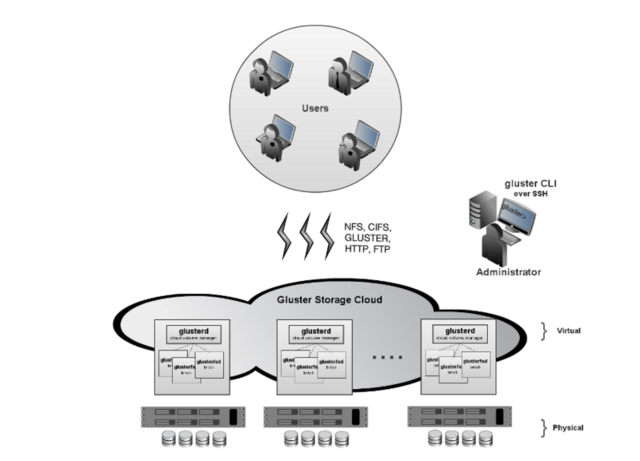

[[chap-Red_Hat_Storage_Architecture_and_Concepts]]
= {{ book.productTitle }} Architecture and Concepts

This chapter provides an overview of {{ book.productTitle }}
architecture and Storage concepts.

[[Red_Hat_Storage_Architecture]]
= {{ book.productTitle }} Architecture

At the core of the {{ book.productTitle }} design is a completely new
method of architecting storage. The result is a system that has immense
scalability, is highly resilient, and offers extraordinary performance.

In a scale-out system, one of the biggest challenges is keeping track of
the logical and physical locations of data and metadata. Most
distributed systems solve this problem by creating a metadata server to
track the location of data and metadata. As traditional systems add more
files, more servers, or more disks, the central metadata server becomes
a performance bottleneck, as well as a central point of failure.

Unlike other traditional storage solutions, {{ book.productTitle }} does
not need a metadata server, and locates files algorithmically using an
elastic hashing algorithm. This no-metadata server architecture ensures
better performance, linear scalability, and reliability.


[[Red_Hat_Storage_Server_for_On-premise_Architecture]]
= {{ book.productTitle }} for On-premise Architecture


{{ book.productTitle }} for On-premise enables enterprises to treat
physical storage as a virtualized, scalable, and centrally managed
storage pool by using commodity storage hardware.

It supports multi-tenancy by partitioning users or groups into logical
volumes on shared storage. It enables users to eliminate, decrease, or
manage their dependence on high-cost, monolithic and difficult-to-deploy
storage arrays.

You can add capacity in a matter of minutes across a wide variety of
workloads without affecting performance. Storage can also be centrally
managed across a variety of workloads, thus increasing storage
efficiency.

image:images/Gluster_diagrams_2.png[ ]

{{ book.productTitle }} On-premise Architecture

{{ book.productTitle }} for On-premise is based on glusterFS, an open
source distributed file system with a modular, stackable design, and a
unique no-metadata server architecture. This no-metadata server
architecture ensures better performance, linear scalability, and
reliability.

[[Storage_Concepts]]
= Storage Concepts

Following are the common terms relating to file systems and storage used
throughout the {{ book.productTitle }} Administration Guide.

*Brick*::
  The glusterFS basic unit of storage, represented by an export
  directory on a server in the trusted storage pool. A brick is
  expressed by combining a server with an export directory in the
  following format:
+
  `SERVER:EXPORT`
+
  For example:
+
  `myhostname:/exports/myexportdir/`
+
*Volume*::
  A volume is a logical collection of bricks. Most of the
  {{ book.productTitle }} management operations happen on the volume.
*Translator*::
  A translator connects to one or more subvolumes, does something with
  them, and offers a subvolume connection.
*Subvolume*::
  A brick after being processed by at least one translator.
*Volfile*::
  Volume (vol) files are configuration files that determine the behavior
  of your {{ book.productTitle }} trusted storage pool. At a high level,
  GlusterFS has three entities, that is, Server, Client and Management
  daemon. Each of these entities have their own volume files. Volume
  files for servers and clients are generated by the management daemon
  upon creation of a volume.
  +
  Server and Client Vol files are located in
  `/var/lib/glusterd/vols/VOLNAME` directory. The management daemon vol
  file is named as `glusterd.vol` and is located in `/etc/glusterfs/`
  directory.
  +
  _______________________________________________________________________________________________________________________________________________________
  *Warning*

  You must not modify any vol file in `/var/lib/glusterd` manually as
  {{ book.company }} does not support vol files that are not generated by the
  management daemon.
  _______________________________________________________________________________________________________________________________________________________
*glusterd*::
  glusterd is the glusterFS Management Service that must run on all
  servers in the trusted storage pool.
*Cluster*::
  A trusted pool of linked computers working together, resembling a
  single computing resource. In {{ book.productTitle }}, a cluster is
  also referred to as a trusted storage pool.
*Client*::
  The machine that mounts a volume (this may also be a server).
*File System*::
  A method of storing and organizing computer files. A file system
  organizes files into a database for the storage, manipulation, and
  retrieval by the computer's operating system.
  +
  Source: http://en.wikipedia.org/wiki/Filesystem[Wikipedia]
*Distributed File System*::
  A file system that allows multiple clients to concurrently access data
  which is spread across servers/bricks in a trusted storage pool. Data
  sharing among multiple locations is fundamental to all distributed
  file systems.
*Virtual File System (VFS)*::
  VFS is a kernel software layer that handles all system calls related
  to the standard Linux file system. It provides a common interface to
  several kinds of file systems.
*POSIX*::
  Portable Operating System Interface (for Unix) (POSIX) is the name of
  a family of related standards specified by the IEEE to define the
  application programming interface (API), as well as shell and
  utilities interfaces, for software that is compatible with variants of
  the UNIX operating system. {{ book.productTitle }} exports a fully
  POSIX compatible file system.
*Metadata*::
  Metadata is data providing information about other pieces of data.
*FUSE*::
  Filesystem in User space (FUSE) is a loadable kernel module for
  Unix-like operating systems that lets non-privileged users create
  their own file systems without editing kernel code. This is achieved
  by running file system code in user space while the FUSE module
  provides only a "bridge" to the kernel interfaces.
  +
  Source:
  http://en.wikipedia.org/wiki/Filesystem_in_Userspace[Wikipedia]
*Geo-Replication*::
  Geo-replication provides a continuous, asynchronous, and incremental
  replication service from one site to another over Local Area Networks
  (LAN), Wide Area Networks (WAN), and the Internet.
*N-way Replication*::
  Local synchronous data replication that is typically deployed across
  campus or Amazon Web Services Availability Zones.
*Petabyte*::
  A petabyte is a unit of information equal to one quadrillion bytes, or
  1000 terabytes. The unit symbol for the petabyte is PB. The prefix
  peta- (P) indicates a power of 1000:
  +
  1 PB = 1,000,000,000,000,000 B = 1000^5 B = 10^15 B.
  +
  The term "pebibyte" (PiB), using a binary prefix, is used for the
  corresponding power of 1024.
  +
  Source: http://en.wikipedia.org/wiki/Petabyte[Wikipedia]
*RAID*::
  Redundant Array of Independent Disks (RAID) is a technology that
  provides increased storage reliability through redundancy. It combines
  multiple low-cost, less-reliable disk drives components into a logical
  unit where all drives in the array are interdependent.
*RRDNS*::
  Round Robin Domain Name Service (RRDNS) is a method to distribute load
  across application servers. RRDNS is implemented by creating multiple
  records with the same name and different IP addresses in the zone file
  of a DNS server.
*Server*::
  The machine (virtual or bare metal) that hosts the file system in
  which data is stored.
*Block Storage*::
  Block special files, or block devices, correspond to devices through
  which the system moves data in the form of blocks. These device nodes
  often represent addressable devices such as hard disks, CD-ROM drives,
  or memory regions. {{ book.productTitle }} supports the XFS file
  system with extended attributes.
*Scale-Up Storage*::
  Increases the capacity of the storage device in a single dimension.
  For example, adding additional disk capacity in a trusted storage
  pool.
*Scale-Out Storage*::
  Increases the capability of a storage device in single dimension. For
  example, adding more systems of the same size, or adding servers to a
  trusted storage pool that increases CPU, disk capacity, and throughput
  for the trusted storage pool.
*Trusted Storage Pool*::
  A storage pool is a trusted network of storage servers. When you start
  the first server, the storage pool consists of only that server.
*Namespace*::
  An abstract container or environment that is created to hold a logical
  grouping of unique identifiers or symbols. Each {{ book.productTitle }}
  trusted storage pool exposes a single namespace as a POSIX
  mount point which contains every file in the trusted storage pool.
*User Space*::
  Applications running in user space do not directly interact with
  hardware, instead using the kernel to moderate access. User space
  applications are generally more portable than applications in kernel
  space. glusterFS is a user space application.

*Distributed Hash Table Terminology.*

*Hashed subvolume*::
  A Distributed Hash Table Translator subvolume to which the file or
  directory name is hashed to.
*Cached subvolume*::
  A Distributed Hash Table Translator subvolume where the file content
  is actually present. For directories, the concept of cached-subvolume
  is not relevant. It is loosely used to mean subvolumes which are not
  hashed-subvolume.
*Linkto-file*::
  For a newly created file, the hashed and cached subvolumes are the
  same. When directory entry operations like rename (which can change
  the name and hence hashed subvolume of the file) are performed on the
  file, instead of moving the entire data in the file to a new hashed
  subvolume, a file is created with the same name on the newly hashed
  subvolume. The purpose of this file is only to act as a pointer to the
  node where the data is present. In the extended attributes of this
  file, the name of the cached subvolume is stored. This file on the
  newly hashed-subvolume is called a linkto-file. The linkto file is
  relevant only for non-directory entities.
*Directory Layout*::
  The directory layout specifies the hash-ranges of the subdirectories
  of a directory to which subvolumes they correspond to.

  Properties of directory layouts:

  * The layouts are created at the time of directory creation and are
  persisted as extended attributes of the directory.
  * A subvolume is not included in the layout if it remained offline at
  the time of directory creation and no directory entries ( such as
  files and directories) of that directory are created on that
  subvolume. The subvolume is not part of the layout until the
  fix-layout is complete as part of running the rebalance command. If a
  subvolume is down during access (after directory creation), access to
  any files that hash to that subvolume fails.
*Fix Layout*::
  A command that is executed during the rebalance process.

  The rebalance process itself comprises of two stages:

  1.  Fixes the layouts of directories to accommodate any subvolumes
  that are added or removed. It also heals the directories, checks
  whether the layout is non-contiguous, and persists the layout in
  extended attributes, if needed. It also ensures that the directories
  have the same attributes across all the subvolumes.
  2.  Migrates the data from the cached-subvolume to the
  hashed-subvolume.
