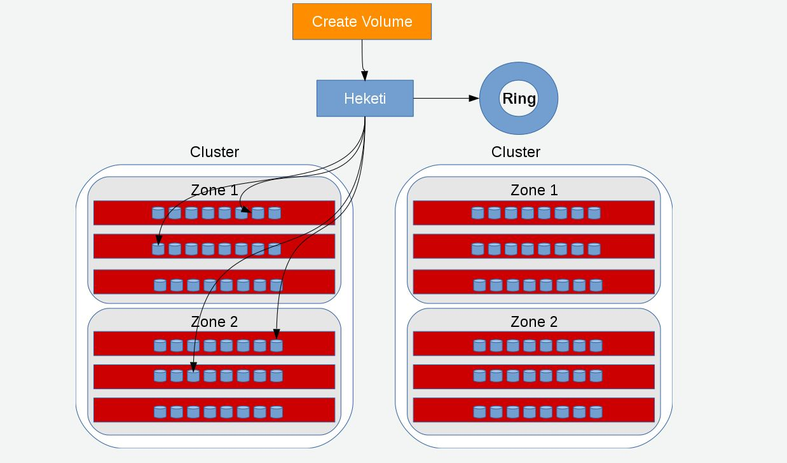

[[chap-Gluster_Volumes]]
= {{ book.productTitle }} Volumes

A {{ book.productTitle }} volume is a logical collection of bricks,
where each brick is an export directory on a server in the trusted
storage pool. Most of the {{ book.productTitle }} Server management
operations are performed on the volume. For a detailed information about
configuring {{ book.productTitle }} for enhancing performance see,
<<../cluster/chap-Configuring_Gluster_for_Enhancing_Performance.adoc#chap-Configuring_Gluster_for_Enhancing_Performance,
Configuring {{ book.productTitle }} for Enhancing Performance>>.

_________________________________________________________________________________________________________________________________________________
*Warning*

Red Hat does not support writing data directly into the bricks. Read and
write data only through the Native Client, or through NFS or SMB mounts.
_________________________________________________________________________________________________________________________________________________

____________________________________________________________________________________________________________________________________________________________________________________________________________________________________________________
*Note*

{{ book.productTitle }} supports IP over Infiniband (IPoIB). Install
Infiniband packages on all {{ book.productTitle }} servers and clients
to support this feature. Run the `yum groupinstall "Infiniband Support"`
to install Infiniband packages.
____________________________________________________________________________________________________________________________________________________________________________________________________________________________________________________

Distributed::
  Distributes files across bricks in the volume.
  +
  Use this volume type where scaling and redundancy requirements are not
  important, or provided by other hardware or software layers.
  +
  See <<Creating_Distributed_Volumes>> for additional information about this volume type.
Replicated::
  Replicates files across bricks in the volume.
  +
  Use this volume type in environments where high-availability and
  high-reliability are critical.
  +
  See <<sect-Creating_Replicated_Volumes>> for additional information about this volume type.
Distributed Replicated::
  Distributes files across replicated bricks in the volume.
  +
  Use this volume type in environments where high-reliability and
  scalability are critical. This volume type offers improved read
  performance in most environments.
  +
  See <<sect-Creating_Distributed_Replicated_Volumes>> for additional information about this volume type.
Dispersed::
  Disperses the file's data across the bricks in the volume.
  +
  Use this volume type where you need a configurable level of
  reliability with a minimum space waste.
  +
  See <<chap-Gluster_Volumes-Creating_Dispersed_Volumes_1>> for additional information about this volume type.
Distributed Dispersed::
  Distributes file's data across the dispersed subvolume.
  +
  Use this volume type where you need a configurable level of
  reliability with a minimum space waste.
  +
  See <<sect-Creating_Distributed_Dispered_Volumes_1>> for additional information about this volume type.

[[chap-Gluster_Volumes-gdeploy]]
= Setting up {{ book.productTitle }} Volumes using gdeploy

The gdeploy tool automates the process of creating, formatting, and
mounting bricks. With gdeploy, the manual steps listed between Section
6.3 Formatting and Mounting Bricks and Section 6.8 Creating Distributed
Dispersed Volumes are automated.

When setting-up a new trusted storage pool, gdeploy could be the
preferred choice of trusted storage pool set up, as manually executing
numerous commands can be error prone.

The advantages of using gdeploy to automate brick creation are as
follows:

* Setting-up the backend on several machines can be done from one's
laptop/desktop. This saves time and scales up well when the number of
nodes in the trusted storage pool increase.
* Flexibility in choosing the drives to configure. (sd, vd, ...).
* Flexibility in naming the logical volumes (LV) and volume groups (VG).

== Getting Started

*Prerequisites.*

1.  Generate the passphrase-less SSH keys for the nodes which are going
to be part of the trusted storage pool by running the following command:
+
------------------------------------
# ssh-keygen -f id_rsa -t rsa -N '' 
------------------------------------
2.  Set up password-less SSH access between the gdeploy controller and
servers by running the following command:
+
----------------------------
# ssh-copy-id -i root@server
----------------------------
+
_____________________________________________________________________________________________________________________________________________________________________________________________________________________________________________________
*Note*

If you are using a {{ book.productTitle }} node as the deployment node
and not an external node, then the password-less SSH must be set up for
the {{ book.productTitle }} node from where the installation is
performed using the following command:

-------------------------------
# ssh-copy-id -i root@localhost
-------------------------------
_____________________________________________________________________________________________________________________________________________________________________________________________________________________________________________________
3.  Install `ansible` by executing the following command:
* For {{ book.productTitle }} 3.1.3 on Red Hat Enterprise Linux 7.2,
execute the following command:
+
---------------------
# yum install ansible
---------------------
* For {{ book.productTitle }} 3.1.3 on Red Hat Enterprise Linux 6.8,
execute the following command:
+
------------------------
# yum install ansible1.9
------------------------
4.  You must also ensure the following:
* Devices should be raw and unused
* For multiple devices, use multiple volume groups, thinpool and thinvol
in the `gdeploy` configuration file

gdeploy can be used to deploy {{ book.productTitle }} in two ways::

* Using a node in a trusted storage pool
* Using a machine outside the trusted storage pool

*Using a node in a cluster.*

The `gdeploy` package is bundled as part of the initial installation of
{{ book.productTitle }}.

*Using a machine outside the trusted storage pool.*


You must ensure that the {{ book.productTitle }} is subscribed to the
required channels. For more information see, Subscribing to the Red Hat
{{ book.productTitle }} Server Channels in the {{ book.productTitle }}
{{ book.productVersion }} Installation Guide.


Execute the following command to install gdeploy:

---------------------
# yum install gdeploy
---------------------


For more information on installing `gdeploy` see, Installing Ansible to
Support Gdeploy section in the {{ book.productTitle }} 3.1 Installation
Guide.


== Setting up a Trusted Storage Pool

Creating a trusted storage pool is a tedious task and becomes more
tedious as the nodes in the trusted storage pool grow. With gdeploy,
just a configuration file can be used to set up a trusted storage pool.
When gdeploy is installed, a sample configuration file will be created
at:

-----------------------------------------------------------
/usr/share/doc/ansible/gdeploy/examples/gluster.conf.sample
-----------------------------------------------------------

_____________________________________________________________________________________________________________________________________________________________________________________________________
*Note*

The trusted storage pool can be created either by performing each tasks,
such as, setting up a backend, creating a volume, and mounting volumes
independently or summed up as a single configuration.
_____________________________________________________________________________________________________________________________________________________________________________________________________

For example, for a basic trusted storage pool of a 2 x 2 replicated
volume the configuration details in the configuration file will be as
follows:

**2x2-volume-create.conf**:

--------------------------------------------------------------------
#
# Usage:
#       gdeploy -c 2x2-volume-create.conf
#
# This does backend setup first and then create the volume using the
# setup bricks.
#
#

[hosts]
10.70.46.13
10.70.46.17

# Common backend setup for 2 of the hosts.
[backend-setup]
devices=sdb,sdc
vgs=vg1,vg2
pools=pool1,pool2
lvs=lv1,lv2
mountpoints=/mnt/data1,/mnt/data2
brick_dirs=/mnt/data1/1,/mnt/data2/2

# If backend-setup is different for each host
# [backend-setup:10.70.46.13]
# devices=sdb
# brick_dirs=/rhgs/brick1
#
# [backend-setup:10.70.46.17]
# devices=sda,sdb,sdc
# brick_dirs=/gluster/brick/brick{1,2,3}
#

[volume]
action=create
volname=sample_volname
replica=yes
replica_count=2
force=yes

[clients]
action=mount
volname=sample_volname
hosts=10.70.46.15
fstype=glusterfs
client_mount_points=/mnt/gluster
--------------------------------------------------------------------

With this configuration a 2 x 2 replica trusted storage pool with the
given IP addresses and backend device as /dev/sdb,/dev/sdc with the
volume name as sample_volname will be created.

For more information on possible values, see <<chap-Gluster_Volumes-gdeploy_configfile>>

After modifying the configuration file, invoke the configuration using
the command:

---------------------
# gdeploy -c conf.txt
---------------------

______________________________________________________________________________________________________________________________________________________________________________________________________________________________________________
*Note*

You can create a new configuration file by referencing the template file
available at
`/usr/share/doc/ansible/gdeploy/examples/gluster.conf.sample` . To
invoke the new configuration file, run
`gdeploy -c /path_to_file/config.txt` command.
______________________________________________________________________________________________________________________________________________________________________________________________________________________________________________

To `only` setup the backend see, <<chap-Gluster_Volumes-gdeploy_backend>>

To `only` create a volume see, <<chap-Gluster_Volumes-gdeploy_create_volume>>

To `only` mount clients see, <<chap-Gluster_Volumes-gdeploy_mount_clients>>

[[chap-Gluster_Volumes-gdeploy_backend]]
== Setting up the Backend

In order to setup a {{ book.productTitle }} volume, the LVM thin-p must be set
up on the storage disks. If the number of machines in the trusted
storage pool is huge, these tasks takes a long time, as the number of
commands involved are huge and error prone if not cautious. With
gdeploy, just a configuration file can be used to set up a backend. The
backend is setup at the time of setting up a fresh trusted storage pool,
which requires bricks to be setup before creating a volume. When gdeploy
is installed, a sample configuration file will be created at:

-----------------------------------------------------------
/usr/share/doc/ansible/gdeploy/examples/gluster.conf.sample
-----------------------------------------------------------

A backend can be setup in two ways:

* Using the [backend-setup] module
* Creating Physical Volume (PV), Volume Group (VG), and Logical Volume
(LV) individually

=== Using the [backend-setup] Module

Backend setup can be done on specific machines or on all the machines.
The backend-setup module internally creates PV, VG, and LV and mounts
the device. Thin-p logical volumes are created as per the performance
recommendations by Red Hat.

The backend can be setup based on the requirement, such as:

* Generic
* Specific

*Generic.*

If the disk names are uniform across the machines then backend setup can
be written as below. The backend is setup for all the hosts in the
`hosts’ section.

For more information on possible values, see <<chap-Gluster_Volumes-gdeploy_configfile>>

Example configuration file: Backend-setup-generic.conf

--------------------------------------------------------------------------
#
# Usage:
#       gdeploy -c backend-setup-generic.conf
#
# This configuration creates backend for GlusterFS clusters
#

[hosts]
10.70.46.130
10.70.46.32
10.70.46.110
10.70.46.77

# Backend setup for all the nodes in the `hosts' section. This will create
# PV, VG, and LV with gdeploy generated names.
[backend-setup]
devices=vdb
--------------------------------------------------------------------------

*Specific.*

If the disks names vary across the machines in the cluster then backend
setup can be written for specific machines with specific disk names.
gdeploy is quite flexible in allowing to do host specific setup in a
single configuration file.

For more information on possible values, see <<chap-Gluster_Volumes-gdeploy_configfile>>

Example configuration file: backend-setup-hostwise.conf

------------------------------------------------------------------------------
#
# Usage:
#       gdeploy -c backend-setup-hostwise.conf
#
# This configuration creates backend for GlusterFS clusters
#

[hosts]
10.70.46.130
10.70.46.32
10.70.46.110
10.70.46.77

# Backend setup for 10.70.46.77 with default gdeploy generated names for
# Volume Groups and Logical Volumes. Volume names will be GLUSTER_vg1,
# GLUSTER_vg2...
[backend-setup:10.70.46.77]
devices=vda,vdb

# Backend setup for remaining 3 hosts in the `hosts' section with custom names
# for Volumes Groups and Logical Volumes.
[backend-setup:10.70.46.{130,32,110}]
devices=vdb,vdc,vdd
vgs=vg1,vg2,vg3
pools=pool1,pool2,pool3
lvs=lv1,lv2,lv3
mountpoints=/mnt/data1,/mnt/data2,/mnt/data3
brick_dirs=/mnt/data1/1,/mnt/data2/2,/mnt/data3/3
------------------------------------------------------------------------------

=== Creating Backend by Setting up PV, VG, and LV

If the user needs more control over setting up the backend, then pv, vg,
and lv can be created individually. LV module provides flexibility to
create more than one LV on a VG. For example, the `backend-setup’ module
setups up a thin-pool by default and applies default performance
recommendations. However, if the user has a different use case which
demands more than one LV, and a combination of thin and thick pools then
`backend-setup’ is of no help. The user can use PV, VG, and LV modules
to achieve this.

For more information on possible values, see <<chap-Gluster_Volumes-gdeploy_configfile>>

The below example shows how to create four logical volumes on a single
volume group. The examples shows a mix of thin and thickpool LV
creation.

---------------------
[hosts]
10.70.46.130
10.70.46.32

[pv]
action=create
devices=vdb

[vg1]
action=create
vgname=RHS_vg1
pvname=vdb

[lv1]
action=create
vgname=RHS_vg1
lvname=engine_lv
lvtype=thick
size=10GB
mount=/rhgs/brick1

[lv2]
action=create
vgname=RHS_vg1
poolname=lvthinpool
lvtype=thinpool
poolmetadatasize=10MB
chunksize=1024k
size=30GB

[lv3]
action=create
lvname=lv_vmaddldisks
poolname=lvthinpool
vgname=RHS_vg1
lvtype=thinlv
mount=/rhs/brick2
virtualsize=9GB

[lv4]
action=create
lvname=lv_vmrootdisks
poolname=lvthinpool
vgname=RHS_vg1
size=19GB
lvtype=thinlv
mount=/rhs/brick3
virtualsize=19GB
---------------------

Example to extend an existing VG:

---------------------------------------------------------------------------------
#
# Extends a given given VG. pvname and vgname is mandatory, in this example the
# vg `RHS_vg1' is extended by adding pv, vdd. If the pv is not alreay present, it
# is created by gdeploy.
#
[hosts]
10.70.46.130
10.70.46.32

[vg2]
action=extend
vgname=RHS_vg1
pvname=vdd
---------------------------------------------------------------------------------

[[chap-Gluster_Volumes-gdeploy_create_volume]]
== Creating Volumes

Setting up volume involves writing long commands by choosing the
hostname/IP and brick order carefully and this could be error prone.
gdeploy helps in simplifying this task. When gdeploy is installed, a
sample configuration file will be created at:

-----------------------------------------------------------
/usr/share/doc/ansible/gdeploy/examples/gluster.conf.sample
-----------------------------------------------------------

For example, for a basic trusted storage pool of a 2 x 2 replicate
volume the configuration details in the configuration file will be as
follows:

------------------
[hosts]
10.0.0.1
10.0.0.2
10.0.0.3
10.0.0.4

[volume]
action=create
volname=glustervol
transport=tcp,rdma
replica=yes
replica_count=2
force=yes
------------------

For more information on possible values, see <<chap-Gluster_Volumes-gdeploy_configfile>>

After modifying the configuration file, invoke the configuration using
the command:

---------------------
# gdeploy -c conf.txt
---------------------

*Creating Multiple Volumes.*

_______________________________________________________________________________________________________________________________
*Note*

Support of creating multiple volumes only from gdeploy 2.0, please check
your gdeploy version before trying this configuration.
_______________________________________________________________________________________________________________________________

While creating multiple volumes in a single configuration, the [volume]
modules should be numbered. For example, if there are two volumes they
will be numbered [volume1], [volume2]

vol-create.conf

---------------------------------
[hosts]
10.70.46.130
10.70.46.32

[backend-setup]
devices=vdb,vdc
mountpoints=/mnt/data1,/mnt/data2

[volume1]
action=create
volname=vol-one
transport=tcp
replica=yes
replica_count=2
brick_dirs=/mnt/data1/1

[volume2]
action=create
volname=vol-two
transport=tcp
replica=yes
replica_count=2
brick_dirs=/mnt/data2/2
---------------------------------

With gdeploy 2.0, a volume can be created with multiple volume options
set. Number of keys should match number of values.

----------------------------------------------------------------------------------------------------------------------------------------------------
[hosts]
10.70.46.130
10.70.46.32

[backend-setup]
devices=vdb,vdc
mountpoints=/mnt/data1,/mnt/data2

[volume1]
action=create
volname=vol-one
transport=tcp
replica=yes
replica_count=2
key=group,storage.owner-uid,storage.owner-gid,features.shard,features.shard-block-size,performance.low-prio-threads,cluster.data-self-heal-algorithm
value=virt,36,36,on,512MB,32,full
brick_dirs=/mnt/data1/1

[volume2]
action=create
volname=vol-two
transport=tcp
replica=yes
key=group,storage.owner-uid,storage.owner-gid,features.shard,features.shard-block-size,performance.low-prio-threads,cluster.data-self-heal-algorithm
value=virt,36,36,on,512MB,32,full
replica_count=2
brick_dirs=/mnt/data2/2
----------------------------------------------------------------------------------------------------------------------------------------------------

The above configuration will create two volumes with multiple volume
options set.

[[chap-Gluster_Volumes-gdeploy_mount_clients]]
== Mounting Clients

When mounting clients, instead of logging into every client which has to
be mounted, gdeploy can be used to mount clients remotely. When gdeploy
is installed, a sample configuration file will be created at:

-----------------------------------------------------------
/usr/share/doc/ansible/gdeploy/examples/gluster.conf.sample
-----------------------------------------------------------

Following is an example of the modifications to the configuration file
in order to mount clients:

--------------------------------
[clients]
action=mount
hosts=10.70.46.159
fstype=glusterfs
client_mount_points=/mnt/gluster
volname=10.0.0.1:glustervol
--------------------------------

___________________________________________________________________________
*Note*

If the `fstype` is NFS, then mention it as nfs-version. By default it is
3.
___________________________________________________________________________

For more information on possible values, see <<chap-Gluster_Volumes-gdeploy_configfile>>

After modifying the configuration file, invoke the configuration using
the command:

---------------------
# gdeploy -c conf.txt
---------------------

== Configuring a Volume

The volumes can be configured using the configuration file. The volumes
can be configured remotely using the configuration file without having
to log into the trusted storage pool. For more information regarding the
sections and options in the configuration file, see <<chap-Gluster_Volumes-gdeploy_configfile>>

=== Adding and Removing a Brick

The configuration file can be modified to add or remove a brick:

*Adding a Brick.*

Modify the [volume] section in the configuration file to add a brick.
For example:

-------------------------------
[volume]
action=add-brick
volname=10.0.0.1:glustervol
bricks=10.0.0.1:/mnt/new_brick 
-------------------------------

After modifying the configuration file, invoke the configuration using
the command:

---------------------
# gdeploy -c conf.txt
---------------------

*Removing a Brick.*

Modify the [volume] section in the configuration file to remove a brick.
For example:

---------------------------
[volume]
action=remove-brick
volname=10.0.0.1:glustervol
bricks=10.0.0.2:/mnt/brick
state=commit 
---------------------------

Other options for `state` are stop, start, and force.

After modifying the configuration file, invoke the configuration using
the command:

---------------------
# gdeploy -c conf.txt
---------------------

For more information on possible values, see <<chap-Gluster_Volumes-gdeploy_configfile>>

=== Rebalancing a Volume

Modify the [volume] section in the configuration file to rebalance a
volume. For example:

------------------------------
[volume]
action=rebalance
volname=10.70.46.13:glustervol
state=start
------------------------------

Other options for `state` are stop, and fix-layout.

After modifying the configuration file, invoke the configuration using
the command:

---------------------
# gdeploy -c conf.txt
---------------------

For more information on possible values, see <<chap-Gluster_Volumes-gdeploy_configfile>>

=== Starting, Stopping, or Deleting a Volume

The configuration file can be modified to start, stop, or delete a
volume:

*Starting a Volume.*

Modify the [volume] section in the configuration file to start a volume.
For example:

---------------------------
[volume]
action=start
volname=10.0.0.1:glustervol
---------------------------

After modifying the configuration file, invoke the configuration using
the command:

---------------------
# gdeploy -c conf.txt
---------------------

*Stopping a Volume.*

Modify the [volume] section in the configuration file to start a volume.
For example:

---------------------------
[volume]
action=stop
volname=10.0.0.1:glustervol
---------------------------

After modifying the configuration file, invoke the configuration using
the command:

---------------------
# gdeploy -c conf.txt
---------------------

*Deleting a Volume.*

Modify the [volume] section in the configuration file to start a volume.
For example:

------------------------------
[volume]
action=delete
volname=10.70.46.13:glustervol
------------------------------

After modifying the configuration file, invoke the configuration using
the command:

---------------------
# gdeploy -c conf.txt
---------------------

For more information on possible values, see <<chap-Gluster_Volumes-gdeploy_configfile>>

[[chap-Gluster_Volumes-gdeploy_configfile]]
== Configuration File

The configuration file includes the various options that can be used to
change the settings for gdeploy. The following options are currently
supported:

With the new release of gdeploy the configuration file has added many
more sections and has enhanced the variables in the existing sections.

* [hosts]
* [devices]
* [disktype]
* [diskcount]
* [stripesize]
* [vgs]
* [pools]
* [lvs]
* [mountpoints]
* \{host-specific-data-for-above}
* [clients]
* [volume]
* [backend-setup]
* [pv]
* [vg]
* [lv]
* [RH-subscription]
* [yum]
* [shell]
* [update-file]
* [service]
* [script]
* [firewalld]

The options are briefly explained in the following list:

* *hosts.*
+
This is a mandatory section which contains the IP address or hostname of
the machines in the trusted storage pool. Each hostname or IP address
should be listed in a separate line.
+
For example:
+
--------
[hosts]
10.0.0.1
10.0.0.2
--------
* *devices.*
+
This is a generic section and is applicable to all the hosts listed in
the [hosts] section. However, if sections of hosts such as the
[hostname] or [IP-address] is present, then the data in the generic
sections like [devices] is ignored. Host specific data take precedence.
This is an optional section.
+
For example:
+
---------
[devices]
/dev/sda
/dev/sdb
---------
+
________________________________________________________________________________________________________________________
*Note*

When configuring the backend setup, the devices should be either listed
in this section or in the host specific section.
________________________________________________________________________________________________________________________
* *disktype.*
+
This section specifies the disk configuration that is used while setting
up the backend. gdeploy supports RAID 10, RAID 6, and JBOD
configurations. This is an optional section and if the field is left
empty, JBOD is taken as the default configuration.
+
For example:
+
----------
[disktype]
raid6
----------
* *diskcount.*
+
This section specifies the number of data disks in the setup. This is a
mandatory field if the [disktype] specified is either RAID 10 or RAID 6.
If the [disktype] is JBOD the [diskcount] value is ignored. This is a
host specific data.
+
For example:
+
-----------
[diskcount]
10
-----------
* *stripesize.*
+
This section specifies the stripe_unit size in KB.
+
Case 1: This field is not necessary if the [disktype] is JBOD, and any
given value will be ignored.
+
Case 2: This is a mandatory field if [disktype] is specified as RAID 6.
+
For [disktype] RAID 10, the default value is taken as 256KB. If you
specify any other value the following warning is displayed:
+
----------------------------------------------------------------
"Warning: We recommend a stripe unit size of 256KB for RAID 10" 
----------------------------------------------------------------
+
_____________________________________________________________________________________________________________
*Note*

Do not add any suffixes like K, KB, M, etc. This is host specific data
and can be added in the hosts section.
_____________________________________________________________________________________________________________
+
For example:
+
------------
[stripesize]
128
------------
* *vgs.*
+
This section is deprecated in gdeploy 2.0. Please see [backend-setup]
for more details for gdeploy 2.0. This section specifies the volume
group names for the devices listed in [devices]. The number of volume
groups in the [vgs] section should match the one in [devices]. If the
volume group names are missing, the volume groups will be named as
GLUSTER_vg\{1, 2, 3, ...} as default.
+
For example:
+
----------
[vgs]
CUSTOM_vg1
CUSTOM_vg2
----------
* *pools.*
+
This section is deprecated in gdeploy 2.0. Please see [backend-setup]
for more details for gdeploy 2.0. This section specifies the pool names
for the volume groups specified in the [vgs] section. The number of
pools listed in the [pools] section should match the number of volume
groups in the [vgs] section. If the pool names are missing, the pools
will be named as GLUSTER_pool\{1, 2, 3, ...}.
+
For example:
+
------------
[pools]
CUSTOM_pool1
CUSTOM_pool2
------------
* *lvs.*
+
This section is deprecated in gdeploy 2.0. Please see [backend-setup]
for more details for gdeploy 2.0. This section provides the logical
volume names for the volume groups specified in [vgs]. The number of
logical volumes listed in the [lvs] section should match the number of
volume groups listed in [vgs]. If the logical volume names are missing,
it is named as GLUSTER_lv\{1, 2, 3, ...}.
+
For example:
+
----------
[lvs]
CUSTOM_lv1
CUSTOM_lv2
----------
* *mountpoints.*
+
This section is deprecated in gdeploy 2.0. Please see [backend-setup]
for more details for gdeploy 2.0. This section specifies the brick mount
points for the logical volumes. The number of mount points should match
the number of logical volumes specified in [lvs] If the mount points are
missing, the mount points will be names as /gluster/brick\{1, 2, 3…}.
+
For example:
+
-------------
[mountpoints]
/rhs/mnt1
/rhs/mnt2
-------------
* *brick_dirs.*
+
This section is deprecated in gdeploy 2.0. Please see [backend-setup]
for more details for gdeploy 2.0. This is the directory which will be
used as a brick while creating the volume. A mount point cannot be used
as a brick directory, hence brick_dir should be a directory inside the
mount point.
+
This field can be left empty, in which case a directory will be created
inside the mount point with a default name. If the backend is not setup,
then this field will be ignored. In case mount points have to be used as
brick directory, then use the force option in the volume section.
+
____________________________________________________________________________________________________________________________________________________________________________________________________________________
*Important*

If you only want to create a volume and not setup the back-end, then
provide the absolute path of brick directories for each host specified
in the [hosts] section under this section along with the volume section.
____________________________________________________________________________________________________________________________________________________________________________________________________________________
+
For example:
+
----------------
[brick_dirs]
/mnt/rhgs/brick1
/mnt/rhgs/brick2
----------------
* *host-specific-data.*
+
This section is deprecated in gdeploy 2.0. Please see [backend-setup]
for more details for gdeploy 2.0. For the hosts (IP/hostname) listed
under [hosts] section, each host can have its own specific data. The
following are the variables that are supported for hosts.
+
--------------------------------------------------------------------------------------------
* devices - List of devices to use
* vgs - Custom volume group names
* pools - Custom pool names
* lvs - Custom logical volume names
* mountpoints - Mount points for the logical names
* brick_dirs - This is the directory which will be used as a brick while creating the volume
--------------------------------------------------------------------------------------------
+
For example:
+
-----------------------------------
[10.0.01]
devices=/dev/vdb,/dev/vda
vgs=CUSTOM_vg1,CUSTOM_vg2
pools=CUSTOM_pool1,CUSTOM_pool1
lvs=CUSTOM_lv1,CUSTOM_lv2
mountpoints=/rhs/mount1,/rhs/mount2
brick_dirs=brick1,brick2
-----------------------------------
* *peer.*
+
This section specifies the configurations for the Trusted Storage Pool
management (TSP). This section helps in making all the hosts specified
in the [hosts] section to either probe each other to create the trusted
storage pool or detach all of them from the trusted storage pool. The
only option in this section is the option names 'manage' which can have
it's values to be either probe or detach.
+
For example:
+
------------
[peer]
manage=probe
------------
* *clients.*
+
This section specifies the client hosts and client_mount_points to mount
the gluster storage volume created. The 'action' option is to be
specified for the framework to determine the action that has to be
performed. The options are 'mount' and 'unmount'. The Client hosts field
is mandatory. If the mount points are not specified, default will be
taken as /mnt/gluster for all the hosts.
+
The option fstype specifies how the gluster volume is to be mounted.
Default is glusterfs (FUSE mount). The volume can also be mounted as
NFS. Each client can have different types of volume mount, which has to
be specified with a comma separated. The following fields are included:
+
---------------------
* action
* hosts
* fstype
* client_mount_points
---------------------
+
For example:
+
----------------------------
[clients]
action=mount
hosts=10.0.0.10
fstype=nfs
nfs-version=3
client_mount_points=/mnt/rhs
----------------------------
* *volume.*
+
The section specifies the configuration options for the volume. The
following fields are included in this section:
+
------------------
* action
* volname
* transport
* replica
* replica_count
* disperse
* disperse_count
* redundancy_count
* force
------------------
** *action.*
+
This option specifies what action must be performed in the volume. The
choices can be [create, delete, add-brick, remove-brick].
+
__create__: This choice is used to create a volume.
+
__delete__: If the delete choice is used, all the options other than
'volname' will be ignored.
+
_add-brick_ or __remove-brick__: If the add-brick or remove-brick is
chosen, extra option bricks with a comma separated list of brick
names(in the format <hostname>:<brick path> should be provided. In case
of remove-brick, state option should also be provided specifying the
state of the volume after brick removal.
** *volname.*
+
This option specifies the volume name. Default name is glustervol
+
_____________________________________________________________________________________________________________________________________________________________________________________________________
*Note*

*** In case of a volume operation, the 'hosts' section can be omitted,
provided volname is in the format <hostname>:<volname>, where hostname
is the hostname / IP of one of the nodes in the cluster
*** Only single volume creation/deletion/configuration is supported.
_____________________________________________________________________________________________________________________________________________________________________________________________________
** *transport.*
+
This option specifies the transport type. Default is tcp. Options are
tcp or rdma or tcp,rdma.
** *replica.*
+
This option will specify if the volume should be of type replica.
options are yes and no. Default is no. If 'replica' is provided as yes,
the 'replica_count' should be provided.
** *disperse.*
+
This option specifies if the volume should be of type disperse. Options
are yes and no. Default is no.
** *disperse_count.*
+
This field is optional even if 'disperse' is yes. If not specified, the
number of bricks specified in the command line is taken as the
disperse_count value.
** *redundancy_count.*
+
If this value is not specified, and if 'disperse' is yes, it's default
value is computed so that it generates an optimal configuration.
** *force.*
+
This is an optional field and can be used during volume creation to
forcefully create the volume.
+
For example:
+
------------------
[volname]
action=create
volname=glustervol
transport=tcp,rdma
replica=yes
replica_count=3
force=yes
------------------
* *backend-setup.*
+
Available in gdeploy 2.0. This section sets up the backend for using
with GlusterFS volume. If more than one backend-setup has to be done,
they can be done by numbering the section like [backend-setup1],
[backend-setup2], ...
+
backend-setup section supports the following variables:
** devices: This replaces the [pvs] section in gdeploy 1.x. devices
variable lists the raw disks which should be used for backend setup. For
example:
+
-------------------
[backend-setup]
devices=sda,sdb,sdc
-------------------
+
This is a mandatory field.
** vgs: This is an optional variable. This variable replaces the [vgs]
section in gdeploy 1.x. vgs variable lists the names to be used while
creating volume groups. The number of VG names should match the number
of devices or should be left blank. gdeploy will generate names for the
VGs. For example:
+
------------------------------------
[backend-setup]
devices=sda,sdb,sdc
vgs=custom_vg1,custom_vg2,custom_vg3
------------------------------------
+
A pattern can be provided for the vgs like custom_vg\{1..3}, this will
create three vgs.
+
-------------------
[backend-setup]
devices=sda,sdb,sdc
vgs=custom_vg{1..3}
-------------------
** pools: This is an optional variable. The variable replaces the
[pools] section in gdeploy 1.x. pools lists the thin pool names for the
volume.
+
--------------------------------------------
[backend-setup]
devices=sda,sdb,sdc
vgs=custom_vg1,custom_vg2,custom_vg3
pools=custom_pool1,custom_pool2,custom_pool3
--------------------------------------------
+
Similar to vg, pattern can be provided for thin pool names. For example
custom_pool\{1..3}
** lvs: This is an optional variable. This variable replaces the [lvs]
section in gdeploy 1.x. lvs lists the logical volume name for the
volume.
+
--------------------------------------------
[backend-setup]
devices=sda,sdb,sdc
vgs=custom_vg1,custom_vg2,custom_vg3
pools=custom_pool1,custom_pool2,custom_pool3
lvs=custom_lv1,custom_lv2,custom_lv3
--------------------------------------------
+
Patterns for LV can be provided similar to vg. For example
custom_lv\{1..3}.
** mountpoints: This variable deprecates the [mountpoints] section in
gdeploy 1.x. Mountpoints lists the mount points where the logical
volumes should be mounted. Number of mount points should be equal to the
number of logical volumes. For example:
+
--------------------------------------------------------
[backend-setup]
devices=sda,sdb,sdc
vgs=custom_vg1,custom_vg2,custom_vg3
pools=custom_pool1,custom_pool2,custom_pool3
lvs=custom_lv1,custom_lv2,custom_lv3
mountpoints=/gluster/data1,/gluster/data2,/gluster/data3
--------------------------------------------------------
** ssd - This variable is set if caching has to be added. For example,
the backed setup with ssd for caching should be:
+
------------------------------
[backend-setup]
ssd=sdc
vgs=RHS_vg1
datalv=lv_data
chachedatalv=lv_cachedata:1G
chachemetalv=lv_cachemeta:230G
------------------------------
+
________________________________________________________________________________________________________________________________________________________________________________________
*Note*

Specifying the name of the data LV is necessary while adding SSD. Make
sure the datalv is created already. Otherwise ensure to create it in one
of the earlier `backend-setup’ sections.
________________________________________________________________________________________________________________________________________________________________________________________
* *PV.*
+
Available in gdeploy 2.0. If the user needs to have more control over
setting up the backend, and does not want to use backend-setup section,
then pv, vg, and lv modules are to be used. The pv module supports the
following variables.
** action: Supports two values `create’ and `resize’
** devices: The list of devices to use for pv creation.
+
`action’ and `devices’ variables are mandatory. When `resize’ value is
used for action then we have two more variables `expand’ and `shrink’
which can be set. Please see below for examples.
+
Example 1: Creating a few physical volumes
+
-------------------
[pv]
action=create
devices=vdb,vdc,vdd
-------------------
+
Example 2: Creating a few physical volumes on a host
+
-------------------
[pv:10.0.5.2]
action=create
devices=vdb,vdc,vdd
-------------------
+
Example 3: Expanding an already created pv
+
-------------
[pv]
action=resize
devices=vdb
expand=yes
-------------
+
Example 4: Shrinking an already created pv
+
-------------
[pv]
action=resize
devices=vdb
shrink=100G
-------------
* *VG.*
+
Available in gdeploy 2.0. This module is used to create and extend
volume groups. The vg module supports the following variables.
** action - Action can be one of create or extend.
** pvname - PVs to use to create the volume. For more than one PV use
comma separated values.
** vgname - The name of the vg. If no name is provided GLUSTER_vg will
be used as default name.
** one-to-one - If set to yes, one-to-one mapping will be done between
pv and vg.
+
If action is set to extend, the vg will be extended to include pv
provided.
+
Example1: Create a vg named images_vg with two PVs
+
----------------
[vg]
action=create
vgname=images_vg
pvname=sdb,sdc
----------------
+
Example2: Create two vgs named rhgs_vg1 and rhgs_vg2 with two PVs
+
--------------
[vg]
action=create
vgname=rhgs_vg
pvname=sdb,sdc
one-to-one=yes
--------------
+
Example3: Extend an existing vg with the given disk.
+
------------------
[vg]
action=extend
vgname=rhgs_images
pvname=sdc
------------------
* *LV.*
+
Available in gdeploy 2.0. This module is used to create, setup-cache,
and convert logical volumes. The lv module supports the following
variables:
+
action - The action variable allows three values `create’,
`setup-cache’, `convert’, and `change’. If the action is 'create', the
following options are supported:
** lvname: The name of the logical volume, this is an optional field.
Default is GLUSTER_lv
** poolname - Name of the thinpool volume name, this is an optional
field. Default is GLUSTER_pool
** lvtype - Type of the logical volume to be created, allowed values are
`thin’ and `thick’. This is an optional field, default is thick.
** size - Size of the logical volume volume. Default is to take all
available space on the vg.
** extent - Extent size, default is 100%FREE
** force - Force lv create, do not ask any questions. Allowed values
`yes’, `no’. This is an optional field, default is yes.
** vgname - Name of the volume group to use.
** pvname - Name of the physical volume to use.
** chunksize - Size of chunk for snapshot.
** poolmetadatasize - Sets the size of pool's metadata logical volume.
** virtualsize - Creates a thinly provisioned device or a sparse device
of the given size
** mkfs - Creates a filesystem of the given type. Default is to use xfs.
** mkfs-opts - mkfs options.
** mount - Mount the logical volume.
+
If the action is setup-cache, the below options are supported:
** ssd - Name of the ssd device. For example sda/vda/ … to setup cache.
** vgname - Name of the volume group.
** poolname - Name of the pool.
** cache_meta_lv - Due to requirements from dm-cache (the kernel
driver), LVM further splits the cache pool LV into two devices - the
cache data LV and cache metadata LV. Provide the cache_meta_lv name
here.
** cache_meta_lvsize - Size of the cache meta lv.
** cache_lv - Name of the cache data lv.
** cache_lvsize - Size of the cache data.
** force - Force
+
If the action is convert, the below options are supported:
** lvtype - type of the lv, available options are thin and thick
** force - Force the lvconvert, default is yes.
** vgname - Name of the volume group.
** poolmetadata - Specifies cache or thin pool metadata logical volume.
** cachemode - Allowed values writeback, writethrough. Default is
writethrough.
** cachepool - This argument is necessary when converting a logical
volume to a cache LV. Name of the cachepool.
** lvname - Name of the logical volume.
** chunksize - Gives the size of chunk for snapshot, cache pool and thin
pool logical volumes. Default unit is in kilobytes.
** poolmetadataspare - Controls creation and maintanence of pool
metadata spare logical volume that will be used for automated pool
recovery.
** thinpool - Specifies or converts logical volume into a thin pool's
data volume. Volume’s name or path has to be given.
+
If the action is change, the below options are supported:
** lvname - Name of the logical volume.
** vgname - Name of the volume group.
** zero - Set zeroing mode for thin pool.
+
Example 1: Create a thin LV
+
---------------------
[lv]
action=create
vgname=RHGS_vg1
poolname=lvthinpool
lvtype=thinpool
poolmetadatasize=10MB
chunksize=1024k
size=30GB
---------------------
+
Example 2: Create a thick LV
+
------------------
[lv]
action=create
vgname=RHGS_vg1
lvname=engine_lv
lvtype=thick
size=10GB
mount=/rhgs/brick1
------------------
+
If there are more than one LVs, then the LVs can be created by numbering
the LV sections, like [lv1], [lv2] …
* *RH-subscription.*
+
Available in gdeploy 2.0. This module is used to subscribe, unsubscribe,
attach, enable repos etc. The RH-subscription module allows the
following variables:
+
This module is used to subscribe, unsubscribe, attach, enable repos etc.
The RH-subscription module allows the following variables:
+
If the action is register, the following options are supported:
** username/activationkey: Username or activationkey.
** password/activationkey: Password or activation key
** auto-attach: true/false
** pool: Name of the pool.
** repos: Repos to subscribe to.
** disable-repos: Repo names to disable. Leaving this option blank will
disable all the repos.
** If the action is **attach-pool**the following options are supported:
+
pool - Pool name to be attached.
** If the action is *enable-repos* the following options are supported:
+
repos - List of comma separated repos that are to be subscribed to.
** If the action is *disable-repos* the following options are supported:
+
repos - List of comma separated repos that are to be subscribed to.
** If the action is *unregister* the systems will be unregistered.
+
Example 1: Subscribe to Red Hat Subscription network:
+
----------------------
[RH-subscription1]
action=register
username=qa@redhat.com
password=<passwd>
pool=<pool>
----------------------
+
Example 2: Disable all the repos:
+
--------------------
[RH-subscription2]
action=disable-repos
repos=
--------------------
+
Example 3: Enable a few repos
+
-----------------------------------------------------------------------------------------------
[RH-subscription3]
action=enable-repos
repos=rhel-7-server-rpms,rh-gluster-3-for-rhel-7-server-rpms,rhel-7-server-rhev-mgmt-agent-rpms
-----------------------------------------------------------------------------------------------
* *yum.*
+
Available in gdeploy 2.0. This module is used to install or remove rpm
packages, with the yum module we can add repos as well during the
install time.
+
The action variable allows two values `install’ and `remove’.
+
If the action is install the following options are supported:
** packages - Comma separated list of packages that are to be installed.
** repos - The repositories to be added.
** gpgcheck - yes/no values have to be provided.
** update - Whether yum update has to be initiated.
+
If the action is remove then only one option has to be provided:
** remove - The comma separated list of packages to be removed.
+
For example
+
---------------------------------------------------------------------------------------
[yum1]
action=install
gpgcheck=no
# Repos should be an url; eg: http://repo-pointing-glusterfs-builds
repos=<glusterfs.repo>,<vdsm.repo>
packages=vdsm,vdsm-gluster,ovirt-hosted-engine-setup,screen,gluster-nagios-addons,xauth
update=yes
---------------------------------------------------------------------------------------
+
Install a package on a particular host.
+
------------------------
[yum2:host1]
action=install
gpgcheck=no
packages=rhevm-appliance
------------------------
* *shell.*
+
Available in gdeploy 2.0. This module allows user to run shell commands
on the remote nodes.
+
Currently shell provides a single action variable with value execute.
And a command variable with any valid shell command as value.
+
The below command will execute vdsm-tool on all the nodes.
+
-----------------------------------
[shell]
action=execute
command=vdsm-tool configure --force
-----------------------------------
* *update-file.*
+
Available in gdeploy 2.0. update-file module allows users to copy a
file, edit a line in a file, or add new lines to a file. action variable
can be any of copy, edit, or add.
+
When the action variable is set to copy, the following variables are
supported.
** src - The source path of the file to be copied from.
** dest - The destination path on the remote machine to where the file
is to be copied to.
+
When the action variable is set to edit, the following variables are
supported.
** dest - The destination file name which has to be edited.
** replace - A regular expression, which will match a line that will be
replaced.
** line - Text that has to be replaced.
+
When the action variable is set to add, the following variables are
supported.
** dest - File on the remote machine to which a line has to be added.
** line - Line which has to be added to the file. Line will be added
towards the end of the file.
+
Example 1: Copy a file to a remote machine.
+
-------------------------
[update-file]
action=copy
src=/tmp/foo.cfg
dest=/etc/nagios/nrpe.cfg
-------------------------
+
Example 2: Edit a line in the remote machine, in the below example lines
that have allowed_hosts will be replaced with
allowed_hosts=host.redhat.com
+
----------------------------------
[update-file]
action=edit
dest=/etc/nagios/nrpe.cfg
replace=allowed_hosts
line=allowed_hosts=host.redhat.com
----------------------------------
+
Example 3: Add a line to the end of a file
+
-----------------------------------
[update-file]
action=add
dest=/etc/ntp.conf
line=server clock.redhat.com iburst
-----------------------------------
* *service.*
+
Available in gdeploy 2.0. The service module allows user to start, stop,
restart, reload, enable, or disable a service. The action variable
specifies these values.
+
When action variable is set to any of start, stop, restart, reload,
enable, disable the variable servicename specifies which service to
start, stop etc.
** service - Name of the service to start, stop etc.
+
Example: enable and start ntp daemon.
+
-------------
[service1]
action=enable
service=ntpd
-------------
+
--------------
[service2]
action=restart
service=ntpd
--------------
* *script.*
+
Available in gdeploy 2.0. script module enables user to execute a
script/binary on the remote machine. action variable is set to execute.
Allows user to specify two variables file and args.
** file - An executable on the local machine.
** args - Arguments to the above program.
+
Example: Execute script disable-multipath.sh on all the remote nodes
listed in `hosts’ section.
+
------------------------------------------------------------
[script]
action=execute
file=/usr/share/ansible/gdeploy/scripts/disable-multipath.sh
------------------------------------------------------------
* *firewalld.*
+
Available in gdeploy 2.0. firewalld module allows the user to manipulate
firewall rules. action variable supports two values `add’ and `delete’.
Both add and delete support the following variables:
** ports/services - The ports or services to add to firewall.
** permanent - Whether to make the entry permanent. Allowed values are
true/false
** zone - Default zone is public
+
For example:
+
--------------------------------------------------------------------------
[firewalld]
action=add
ports=111/tcp,2049/tcp,54321/tcp,5900/tcp,5900-6923/tcp,5666/tcp,16514/tcp
services=glusterfs
--------------------------------------------------------------------------

= Managing Volumes using Heketi


____________________________________________________________________________________________________________________________________________________________________________________________________________________________________________________________________________________________________________________________________________________________________________________________________________________________________________________________________________________________________________________________________________________________________________________________________________________________________________
*Important*

Heketi is a technology preview feature. Technology preview features are
not fully supported under Red Hat subscription level agreements (SLAs),
may not be functionally complete, and are not intended for production
use. However, these features provide early access to upcoming product
innovations, enabling customers to test functionality and provide
feedback during the development process. As Red Hat considers making
future iterations of technology preview features generally available, we
will provide commercially reasonable support to resolve any reported
issues that customers experience when using these features.
____________________________________________________________________________________________________________________________________________________________________________________________________________________________________________________________________________________________________________________________________________________________________________________________________________________________________________________________________________________________________________________________________________________________________________________________________________________________________________



Heketi provides a RESTful management interface which can be used to
manage the lifecycle of {{ book.productTitle }} volumes. With Heketi,
cloud services like OpenStack Manila, Kubernetes, and OpenShift can
dynamically provision {{ book.productTitle }} volumes with any of the
supported durability types. Heketi will automatically determine the
location for bricks across the cluster, making sure to place bricks and
its replicas across different failure domains. Heketi also supports any
number of {{ book.productTitle }} clusters, allowing cloud services to
provide network file storage without being limited to a single
{{ book.productTitle }} cluster.

With Heketi, the administrator no longer manages or configures bricks,
disks, or trusted storage pools. Heketi service will manage all hardware
for the administrator, enabling it to allocate storage on demand. Any
disks registered with Heketi must be provided in raw format, which will
then be managed by it using LVM on the disks provided.

Heketi can be configured and executed using the CLI or the API. The
sections ahead describe configuring Heketi using the CLI. For more
information regarding the Heketi API, see
https://github.com/heketi/heketi/wiki/API[Heketi API].

== Prerequisites

Heketi requires SSH access to the nodes that it will manage. Hence,
ensure that the following requirements are met:

* *SSH Access.*
** SSH user and public key must be setup on the node.
** SSH user must have password-less sudo.
** Must be able to run sudo commands from SSH. This requires disabling
`requiretty` in the `/etc/sudoers` file
* Start the glusterd service after {{ book.productTitle }} is installed.
* Disks registered with Heketi must be in the raw format.

== Installing Heketi

After installing {{ book.productTitle }} 3.1.2, execute the following
command to install Heketi:

--------------------
# yum install heketi
--------------------

For more information about subscribing to the required channels and
installing {{ book.productTitle }}, see the {{ book.productTitle }}
Installation Guide.

== Starting the Heketi Server

Before starting the server, ensure that the following prerequisites are
met:

* Generate the passphrase-less SSH keys for the nodes which are going to
be part of the trusted storage pool by running the following command:
+
-----------------------------------
# ssh-keygen -f id_rsa -t rsa -N ''
-----------------------------------
* Set up password-less SSH access between Heketi and the {{ book.productTitle }}
servers by running the following command:
+
----------------------------
# ssh-copy-id -i root@server
----------------------------
* Setup the heketi.json configuration file. The file is located in
/etc/heketi/heketi.json. The configuration file has the information
required to run the Heketi server. The config file must be in JSON
format with the following settings:
** port: string, Heketi REST service port number
** use_auth: bool, Enable JWT Authentication
** jwt: map, JWT Authentication settings
*** admin: map, Settings for the Heketi administrator
**** key: string,
**** user: map, Settings for the Heketi volume requests access user
**** key: string, t
** glusterfs: map, {{ book.productTitle }} settings
*** executor: string, Determines the type of command executor to use.
Possible values are:
**** mock: Does not send any commands out to servers. Can be used for
development and tests
**** ssh: Sends commands to real systems over ssh
*** db: string, Location of Heketi database
*** sshexec: map, SSH configuration
**** keyfile: string, File with private ssh key
**** user: string, SSH user
+
Following is an example of the JSON file:
+
------------------------------------------------------------------------
{
  "_port_comment": "Heketi Server Port Number",
  "port": "8080",

  "_use_auth": "Enable JWT authorization. Please enable for deployment",
  "use_auth": false,

  "_jwt": "Private keys for access",
  "jwt": {
    "_admin": "Admin has access to all APIs",
    "admin": {
      "key": "My Secret"
    },
    "_user": "User only has access to /volumes endpoint",
    "user": {
      "key": "My Secret"
    }
  },

.....
------------------------------------------------------------------------
+
_______________________________________________________________________________________________________________________________________________________________________
*Note*

The location for the private SSH key that is created must be set in the
`keyfile` setting of the configuration file, and the key should be
readable by the heketi user.
_______________________________________________________________________________________________________________________________________________________________________
+
*Advanced Options.*
+
The following configuration options should only be set on advanced
configurations.
** brick_max_size_gb: int, Maximum brick size (Gb)
** brick_min_size_gb: int, Minimum brick size (Gb)
** max_bricks_per_volume: int, Maximum number of bricks per volume

=== Starting the Server

*For Red Hat Enterprise Linux 7.*

1.  Enable heketi by executing the following command:
+
-------------------------
# systemctl enable heketi
-------------------------
2.  Start the Heketi server, by executing the following command:
+
------------------------
# systemctl start heketi
------------------------
3.  To check the status of the Heketi server, execute the following
command:
+
-------------------------
# systemctl status heketi
-------------------------
4.  To check the logs, execute the following command:
+
----------------------
# journalctl -u heketi
----------------------

*For Red Hat Enterprise Linux 6.*

1.  To start Heketi, execute the following command:
+
------------------------
# chkconfig --add heketi
# service heketi start
------------------------
2.  Check the logs by executing the following command:
+
----------------------
# less /var/log/heketi
----------------------

__________________________________________________
*Note*

The database will be installed in /var/lib/heketi.
__________________________________________________

=== Verifying the Configuration

To verify if the server is running, execute the following step:

If Heketi is not setup with authentication, then use curl to verify the
configuration:

---------------------------------
# curl http://<server:port>/hello
---------------------------------

You can also verify the configuration using the heketi-cli when
authentication is enabled:

------------------------------------------------------------------------------------
# heketi-cli -server http://<server:port> -user <user> -secret <secret> cluster list
------------------------------------------------------------------------------------

== Setting up the Topology

Setting up the topology allows Heketi to determine which nodes, disks,
and clusters to use.

=== Prerequisites

You have to determine the node failure domains and clusters of nodes.
Failure domains is a value given to a set of nodes which share the same
switch, power supply, or anything else that would cause them to fail at
the same time. Heketi uses this information to make sure that replicas
are created across failure domains, thus providing cloud services
volumes which are resilient to both data unavailability and data loss.

You have to determine which nodes would constitute a cluster. Heketi
supports multiple {{ book.productTitle }} clusters, which gives cloud
services the option of specifying a set of clusters where a volume must
be created. This provides cloud services and administrators the option
of creating SSD, SAS, SATA, or any other type of cluster which provide a
specific quality of service to users.

=== Topology Setup

The command line client loads the information about creating a cluster,
adding nodes to that cluster, and then adding disks to each one of those
nodes.This information is added into the topology file. To load a
topology file with heketi-cli, execute the following command:

------------------------------------------------------
# export HEKETI_CLI_SERVER=http://<heketi_server:port>
# heketi-cli load -json=<topology_file>
------------------------------------------------------

Where `topology_file` is a file in JSON format describing the clusters,
nodes, and disks to add to Heketi. The format of the file is as follows:

clusters: array of clusters, Array of clusters

* Each element on the array is a map which describes the cluster as
follows
** nodes: array of nodes, Array of nodes in a cluster
+
Each element on the array is a map which describes the node as follows
*** node: map, Same map as Node Add except there is no need to supply
the cluster id.
*** devices: array of strings, Name of each disk to be added

**For example**:

1.  Topology file:
+
--------------------------------------------------------
{
    "clusters": [
               {
                  "nodes": [
                                {
                        "node": {
                                  "hostnames": {
                                             "manage": [
                                             "10.0.0.1"
                                    ],
                                    "storage": [
                                             "10.0.0.1"
                                    ]
                                 },
                                         "zone": 1
                               },
                             "devices": [
                            "/dev/sdb",
                            "/dev/sdc",
                            "/dev/sdd",
                            "/dev/sde",
                            "/dev/sdf",
                            "/dev/sdg",
                            "/dev/sdh",
                            "/dev/sdi"
                ]
                   },
               {
                    "node": {
                        "hostnames": {
                            "manage": [
                                "10.0.0.2"
                            ],
                            "storage": [
                                "10.0.0.2"
                            ]
                        },
                        "zone": 2
                    },
                    "devices": [
                        "/dev/sdb",
                        "/dev/sdc",
                        "/dev/sdd",
                        "/dev/sde",
                        "/dev/sdf",
                        "/dev/sdg",
                        "/dev/sdh",
                        "/dev/sdi"
                    ]
                },

......
......
--------------------------------------------------------
2.  Load the Heketi JSON file:
+
-----------------------------------------------------------------------------
# heketi-cli load -json=topology_libvirt.json
Creating cluster ... ID: a0d9021ad085b30124afbcf8df95ec06
        Creating node 192.168.10.100 ... ID: b455e763001d7903419c8ddd2f58aea0
                Adding device /dev/vdb ... OK
                Adding device /dev/vdc ... OK
…….
        Creating node 192.168.10.101 ... ID: 4635bc1fe7b1394f9d14827c7372ef54
                Adding device /dev/vdb ... OK
                Adding device /dev/vdc ... OK
………….
-----------------------------------------------------------------------------
3.  Execute the following command to check the details of a particular
node:
+
-------------------------------------------------------------------------------------------------------------------
# heketi-cli node info b455e763001d7903419c8ddd2f58aea0
Node Id: b455e763001d7903419c8ddd2f58aea0
Cluster Id: a0d9021ad085b30124afbcf8df95ec06
Zone: 1
Management Hostname: 192.168.10.100
Storage Hostname: 192.168.10.100
Devices:
Id:0ddba53c70537938f3f06a65a4a7e88b   Name:/dev/vdi            Size (GiB):499     Used (GiB):0       Free (GiB):499
Id:4fae3aabbaf79d779795824ca6dc433a   Name:/dev/vdg            Size (GiB):499     Used (GiB):0       Free (GiB):499
…………….
-------------------------------------------------------------------------------------------------------------------
4.  Execute the following command to check the details of the cluster:
+
----------------------------------------------------------
# heketi-cli cluster info a0d9021ad085b30124afbcf8df95ec06
Cluster id: a0d9021ad085b30124afbcf8df95ec06
Nodes:
4635bc1fe7b1394f9d14827c7372ef54
802a3bfab2d0295772ea4bd39a97cd5e
b455e763001d7903419c8ddd2f58aea0
ff9eeb735da341f8772d9415166b3f9d
Volumes:
----------------------------------------------------------
5.  To check the details of the device, execute the following command:
+
---------------------------------------------------------
# heketi-cli device info 0ddba53c70537938f3f06a65a4a7e88b
Device Id: 0ddba53c70537938f3f06a65a4a7e88b
Name: /dev/vdi
Size (GiB): 499
Used (GiB): 0
Free (GiB): 499
Bricks:
---------------------------------------------------------

== Creating a Volume

After Heketi is set up, you can use the CLI to create a volume.

1.  Execute the following command to check the various option for
creating a volume:
+
------------------------------------
# heketi-cli volume create [options]
------------------------------------
2.  **For example**: After setting up the topology file with two nodes
on one failure domain, and two nodes in another failure domain, create a
100Gb volume using the following command:
+
-------------------------------------------------------------------------------------------------------------
# heketi-cli volume create -size=100
Name: vol_0729fe8ce9cee6eac9ccf01f84dc88cc
Size: 100
Id: 0729fe8ce9cee6eac9ccf01f84dc88cc
Cluster Id: a0d9021ad085b30124afbcf8df95ec06
Mount: 192.168.10.101:vol_0729fe8ce9cee6eac9ccf01f84dc88cc
Mount Options: backupvolfile-servers=192.168.10.100,192.168.10.102
Durability Type: replicate
Replica: 3
Snapshot: Disabled

Bricks:
Id: 8998961142c1b51ab82d14a4a7f4402d
Path: /var/lib/heketi/mounts/vg_0ddba53c70537938f3f06a65a4a7e88b/brick_8998961142c1b51ab82d14a4a7f4402d/brick
Size (GiB): 50
Node: b455e763001d7903419c8ddd2f58aea0
Device: 0ddba53c70537938f3f06a65a4a7e88b
 …………….
-------------------------------------------------------------------------------------------------------------
3.  If you want to increase the storage capacity of a particular volume
by 1TB, then execute the following command:
+
-------------------------------------------------------------------------------------------------------------
# heketi-cli volume expand -volume=0729fe8ce9cee6eac9ccf01f84dc88cc -expand-size=1024
Name: vol_0729fe8ce9cee6eac9ccf01f84dc88cc
Size: 1224
Id: 0729fe8ce9cee6eac9ccf01f84dc88cc
Cluster Id: a0d9021ad085b30124afbcf8df95ec06
Mount: 192.168.10.101:vol_0729fe8ce9cee6eac9ccf01f84dc88cc
Mount Options: backupvolfile-servers=192.168.10.100,192.168.10.102
Durability Type: replicate
Replica: 3
Snapshot: Disabled

Bricks:
Id: 0b53e8c0d8e2b1a3fa5701e3c876d532
Path: /var/lib/heketi/mounts/vg_0ddba53c70537938f3f06a65a4a7e88b/brick_0b53e8c0d8e2b1a3fa5701e3c876d532/brick
Size (GiB): 256
Node: b455e763001d7903419c8ddd2f58aea0
Device: 0ddba53c70537938f3f06a65a4a7e88b

.........
.........
-------------------------------------------------------------------------------------------------------------
4.  To check the details of the device, execute the following command:
+
----------------------------------------------------------------------------------------------------------------------------------------------------------------------
# heketi-cli device info 0ddba53c70537938f3f06a65a4a7e88b
Device Id: 0ddba53c70537938f3f06a65a4a7e88b
Name: /dev/vdi
Size (GiB): 499
Used (GiB): 201
Free (GiB): 298
Bricks:
Id:0f1766cc142f1828d13c01e6eed12c74   Size (GiB):50      Path: /var/lib/heketi/mounts/vg_0ddba53c70537938f3f06a65a4a7e88b/brick_0f1766cc142f1828d13c01e6eed12c74/brick
Id:5d944c47779864b428faa3edcaac6902   Size (GiB):50      Path: /var/lib/heketi/mounts/vg_0ddba53c70537938f3f06a65a4a7e88b/brick_5d944c47779864b428faa3edcaac6902/brick
Id:8998961142c1b51ab82d14a4a7f4402d   Size (GiB):50      Path: /var/lib/heketi/mounts/vg_0ddba53c70537938f3f06a65a4a7e88b/brick_8998961142c1b51ab82d14a4a7f4402d/brick
Id:a11e7246bb21b34a157e0e1fd598b3f9   Size (GiB):50      Path: /var/lib/heketi/mounts/vg_0ddba53c70537938f3f06a65a4a7e88b/brick_a11e7246bb21b34a157e0e1fd598b3f9/brick
----------------------------------------------------------------------------------------------------------------------------------------------------------------------

== Deleting a Volume

To delete a volume, execute the following command:

------------------------------------
# heketi-cli volume delete <volname>
------------------------------------

For example:

-----------------------------------------------------------
$ heketi-cli volume delete 0729fe8ce9cee6eac9ccf01f84dc88cc
Volume 0729fe8ce9cee6eac9ccf01f84dc88cc deleted
-----------------------------------------------------------

[[About_Encrypted_Disk]]
= About Encrypted Disk

{{ book.productTitle }} provides the ability to create bricks on
encrypted devices to restrict data access. Encrypted bricks can be used
to create {{ book.productTitle }} volumes.

For information on creating encrypted disk, refer to the Disk Encryption
Appendix of the Red Hat Enterprise Linux 6 Installation Guide.

[[Formatting_and_Mounting_Bricks]]
= Formatting and Mounting Bricks

To create a {{ book.productTitle }} volume, specify the bricks that
comprise the volume. After creating the volume, the volume must be
started before it can be mounted.

== Creating Bricks Manually


_______________________________________________________________________________________
*Important*

* Red Hat supports formatting a Logical Volume using the XFS file system
on the bricks.
_______________________________________________________________________________________



*Creating a Thinly Provisioned Logical Volume*

To create a thinly provisioned logical volume, proceed with the
following steps:

1.  Create a physical volume(PV) by using the `pvcreate` command.
+
For example:
+
---------------------------------------
pvcreate --dataalignment 1280K /dev/sdb
---------------------------------------
+
Here, `/dev/sdb` is a storage device.
+
Use the correct `dataalignment` option based on your device. For more
information, see <<../cluster/chap-Configuring_Gluster_for_Enhancing_Performance.adoc#Brick_Configuration,
Brick Configuration>>.
+
____________________________________________________________________________________
*Note*

The device name and the alignment value will vary based on the device
you are using.
____________________________________________________________________________________
2.  Create a Volume Group (VG) from the PV using the `vgcreate` command:
+
For example:
+
---------------------------------------------------
vgcreate --physicalextentsize 1280K rhs_vg /dev/sdb
---------------------------------------------------
3.  Create a thin-pool using the following commands:
+
--------------------------------------------------------------------------------------------------------------
lvcreate --thinpool VOLGROUP/thin_pool -L pool_sz --chuncksize chunk_sz --poolmetadatasize metadev_sz --zero n
   
--------------------------------------------------------------------------------------------------------------
+
For example:
+
--------------------------------------------------------------------------------------------
lvcreate --thinpool rhs_vg/rhs_pool -L 2T --chunksize 1280K  --poolmetadatasize 16G --zero n
--------------------------------------------------------------------------------------------
+
To enhance the performance of {{ book.productTitle }}, ensure you read
<<chap-Configuring_Gluster_for_Enhancing_Performance>> chapter.
4.  Create a thinly provisioned volume that uses the previously created
pool by running the `lvcreate` command with the `-V` and `-T` options:
+
------------------------------------------------
lvcreate -V size -T volgroup/poolname -n volname
------------------------------------------------
+
For example:
+
-------------------------------------------
lvcreate -V 1G -T rhs_vg/rhs_pool -n rhs_lv
-------------------------------------------
+
It is recommended that only one LV should be created in a thin pool.

*Formatting and Mounting Bricks*

Format bricks using the supported XFS configuration, mount the bricks,
and verify the bricks are mounted correctly. To enhance the performance
of {{ book.productTitle }}, ensure you read
<<../cluster/chap-Configuring_Gluster_for_Enhancing_Performance.adoc#chap-Configuring_Gluster_for_Enhancing_Performance,
Configuring {{ book.productTitle }} for Enhancing Performance>>.
before formatting the bricks.

__________________________________________________________________________________________________________________________________________________________________________________________
*Important*

Snapshots are not supported on bricks formatted with external log
devices. Do not use `-l logdev=device` option with `mkfs.xfs` command
for formatting the {{ book.productTitle }} bricks.
__________________________________________________________________________________________________________________________________________________________________________________________

1.  Run `# mkfs.xfs -f -i size=512 -n size=8192 -d su=128K,sw=10 DEVICE`
to format the bricks to the supported XFS file system format. Here,
DEVICE is the created thin LV. The inode size is set to 512 bytes to
accommodate for the extended attributes used by {{ book.productTitle }}.
2.  Run `# mkdir /mountpoint` to create a directory to link the brick
to.
3.  Add an entry in `/etc/fstab`:
+
------------------------------------------------------------------
/dev/rhs_vg/rhs_lv /mountpoint  xfs rw,inode64,noatime,nouuid  1 2
------------------------------------------------------------------
4.  Run `# mount /mountpoint` to mount the brick.
5.  Run the `df -h` command to verify the brick is successfully mounted:
+
-------------------------------------------------------
# df -h /dev/rhs_vg/rhs_lv   16G  1.2G   15G   7% /rhgs
-------------------------------------------------------
6.  If SElinux is enabled, then the SELinux labels that has to be set
manually for the bricks created using the following commands:
+
-------------------------------------------------------
# semanage fcontext -a -t glusterd_brick_t /rhgs/brick1
# restorecon -Rv /rhgs/brick1
-------------------------------------------------------

*Using Subdirectory as the Brick for Volume*

You can create an XFS file system, mount them and point them as bricks
while creating a {{ book.productTitle }} volume. If the mount point is
unavailable, the data is directly written to the root file system in the
unmounted directory.

For example, the `/rhgs` directory is the mounted file system and is
used as the brick for volume creation. However, for some reason, if the
mount point is unavailable, any write continues to happen in the `/rhgs`
directory, but now this is under root file system.

To overcome this issue, you can perform the below procedure.

During {{ book.productTitle }} setup, create an XFS file system and
mount it. After mounting, create a subdirectory and use this
subdirectory as the brick for volume creation. Here, the XFS file system
is mounted as `/bricks`. After the file system is available, create a
directory called `/rhgs/brick1` and use it for volume creation. Ensure
that no more than one brick is created from a single mount. This
approach has the following advantages:

* When the `/rhgs` file system is unavailable, there is no
longer`/rhgs/brick1` directory available in the system. Hence, there
will be no data loss by writing to a different location.
* This does not require any additional file system for nesting.

Perform the following to use subdirectories as bricks for creating a
volume:

1.  Create the `brick1` subdirectory in the mounted file system.
+
--------------------
# mkdir /rhgs/brick1
--------------------
+
Repeat the above steps on all nodes.
2.  Create the {{ book.productTitle }} volume using the subdirectories
as bricks.
+
------------------------------------------------------------
# gluster volume create distdata01 ad-rhs-srv1:/rhgs/brick1 
ad-rhs-srv2:/rhgs/brick2
------------------------------------------------------------
3.  Start the {{ book.productTitle }} volume.
+
---------------------------------
# gluster volume start distdata01
---------------------------------
4.  Verify the status of the volume.
+
-----------------------------------
# gluster  volume status distdata01
-----------------------------------

____________________________________________________________________________________________________________________________
*Note*

If multiple bricks are used from the same server, then ensure the bricks
are mounted in the following format. For example:

-------------------------------------------------
# df -h 

/dev/rhs_vg/rhs_lv1   16G  1.2G   15G   7% /rhgs1
/dev/rhs_vg/rhs_lv2   16G  1.2G   15G   7% /rhgs2
-------------------------------------------------

Create a distribute volume with 2 bricks from each server. For example:

----------------------------------------------------------------------------------------------------------------------------
# gluster volume create test-volume server1:/rhgs1/brick1 server2:/rhgs1/brick1 server1:/rhgs2/brick2 server2:/rhgs2/brick2 
----------------------------------------------------------------------------------------------------------------------------
____________________________________________________________________________________________________________________________

Brick with a File System Suitable for Reformatting (Optimal Method)::
  Run `# mkfs.xfs -f -i size=512 device` to reformat the brick to
  supported requirements, and make it available for immediate reuse in a
  new volume.
  +
  ______________________________________________________
  *Note*

  All data will be erased when the brick is reformatted.
  ______________________________________________________
File System on a Parent of a Brick Directory::
  If the file system cannot be reformatted, remove the whole brick
  directory and create it again.

*Cleaning An Unusable Brick*

1.  Delete all previously existing data in the brick, including the
`.glusterfs` subdirectory.
2.  Run` # setfattr -x trusted.glusterfs.volume-id brick` and
`# setfattr -x trusted.gfid brick` to remove the attributes from the
root of the brick.
3.  Run `# getfattr -d -m . brick` to examine the attributes set on the
volume. Take note of the attributes.
4.  Run `# setfattr -x attribute brick` to remove the attributes
relating to the glusterFS file system.
+
The `trusted.glusterfs.dht` attribute for a distributed volume is one
such example of attributes that need to be removed.

[[Creating_Distributed_Volumes]]
= Creating Distributed Volumes

This type of volume spreads files across the bricks in the volume.

image:images/Distributed_Volume.png[ Illustration of a distributed
volume consisting of two servers. Two files are shown on the server1
brick, and one file is shown on the server2 brick. The distributed
volume is set to a single mount point. ]

____________________________________________________________________________________________________________________________________________________________________
*Warning*

Distributed volumes can suffer significant data loss during a disk or
server failure because directory contents are spread randomly across the
bricks in the volume.

Use distributed volumes where scalable storage and redundancy is either
not important, or is provided by other hardware or software layers.
____________________________________________________________________________________________________________________________________________________________________

Use `gluster volume create` command to create different types of
volumes, and `gluster volume info` command to verify successful volume
creation.

* A trusted storage pool has been created, as described in
<<chap-Trusted_Storage_Pools.adoc#Adding_Servers_to_the_Trusted_Storage_Pool,
Adding Servers to the Truster Storage Pool>>.
* Understand how to start and stop volumes, as described in <<Starting_Volumes1>>.

Run the `gluster volume create` command to create the distributed
volume.

The syntax
is` gluster volume create NEW-VOLNAME [transport tcp | rdma | tcp,rdma] NEW-BRICK...`

The default value for transport is `tcp`. Other options can be passed
such as `auth.allow` or `auth.reject`. See
<<../cluster/chap-Managing_Gluster_Volumes.adoc#Configuring_Volume_Options,
Configuring Volume Options>> for a full list of parameters.

[[exam-Distributed_Vol_Two_Servers]]
-----------------------------------------------------------------------------
# gluster volume create test-volume server1:/rhgs/brick1 server2:/rhgs/brick1
Creation of test-volume has been successful
Please start the volume to access data.
-----------------------------------------------------------------------------

--------------------------------------------------------------------------------------------------------------------------------------
# gluster volume create test-volume transport rdma server1:/rhgs/brick1 server2:/rhgs/brick1 server3:/rhgs/brick1 server4:/rhgs/brick1
Creation of test-volume has been successful
Please start the volume to access data.
--------------------------------------------------------------------------------------------------------------------------------------

Run `# gluster volume start VOLNAME` to start the volume.

----------------------------------------
# gluster volume start test-volume
Starting test-volume has been successful
----------------------------------------

Run `gluster volume info` command to optionally display the volume
information.

The following output is the result of <<exam-Distributed_Vol_Two_Servers,
Distributed volume with two servers>>.

---------------------------
# gluster volume info
Volume Name: test-volume
Type: Distribute
Status: Created
Number of Bricks: 2
Transport-type: tcp
Bricks:
Brick1: server1:/rhgs/brick
Brick2: server2:/rhgs/brick
---------------------------

[[sect-Creating_Replicated_Volumes]]
= Creating Replicated Volumes


_______________________________________________________________________________________________________________________________________________________________________________________________________________________________________________________________________
*Important*

Creating replicated volume with replica count greater than 3 is under
technology preview. Technology Preview features are not fully supported
under Red Hat service-level agreements (SLAs), may not be functionally
complete, and are not intended for production use.

Tech Preview features provide early access to upcoming product
innovations, enabling customers to test functionality and provide
feedback during the development process.

As Red Hat considers making future iterations of Technology Preview
features generally available, we will provide commercially reasonable
efforts to resolve any reported issues that customers experience when
using these features.
_______________________________________________________________________________________________________________________________________________________________________________________________________________________________________________________________________



Replicated volume creates copies of files across multiple bricks in the
volume. Use replicated volumes in environments where high-availability
and high-reliability are critical.

Use `gluster volume create` to create different types of volumes, and
`gluster volume info` to verify successful volume creation.

*Prerequisites.*

* A trusted storage pool has been created, as described in
<<chap-Trusted_Storage_Pools.adoc#Adding_Servers_to_the_Trusted_Storage_Pool,
Adding Servers to the Truster Storage Pool>>.
* Understand how to start and stop volumes, as described in <<Starting_Volumes1>>.

[[Creating_Two-way_Replicated_Volumes]]
== Creating Two-way Replicated Volumes

Two-way replicated volume creates two copies of files across the bricks
in the volume. The number of bricks must be multiple of two for a
replicated volume. To protect against server and disk failures, it is
recommended that the bricks of the volume are from different servers.

image:images/two_way_replication.png[ ]

*Creating two-way replicated volumes*

1.  Run the `gluster volume create` command to create the replicated
volume.
+
The syntax is
`# gluster volume create NEW-VOLNAME [replica COUNT] [transport tcp | rdma | tcp,rdma] NEW-BRICK...`
+
The default value for transport is `tcp`. Other options can be passed
such as `auth.allow` or `auth.reject`. See
<<../cluster/chap-Managing_Gluster_Volumes.adoc#Configuring_Volume_Options,
Configuring Volume Options>> for a full list of parameters.
+
The order in which bricks are specified determines how they are
replicated with each other. For example, every `2` bricks, where `2` is
the replica count, forms a replica set. This is illustrated in <<chap-Red_Hat_Storage_Volumes-twoway_replicated_volume>> .
+
-----------------------------------------------------------------------------------------------------
# gluster volume create test-volume replica 2 transport tcp server1:/rhgs/brick1 server2:/rhgs/brick2
Creation of test-volume has been successful
Please start the volume to access data.
-----------------------------------------------------------------------------------------------------
2.  Run `# gluster volume start VOLNAME` to start the volume.
+
----------------------------------------
# gluster volume start test-volume
Starting test-volume has been successful
----------------------------------------
3.  Run `gluster volume info` command to optionally display the volume
information.

_________________________________________________________________________________________________________________________________________________
*Important*

You must set client-side quorum on replicated volumes to prevent
split-brain scenarios. For more information on setting client-side
quorum, see <<Configuring_Client-Side_Quorum>>
_________________________________________________________________________________________________________________________________________________

[[Creating_Three-way_Replicated_Volumes]]
== Creating Three-way Replicated Volumes

Three-way replicated volume creates three copies of files across
multiple bricks in the volume. The number of bricks must be equal to the
replica count for a replicated volume. To protect against server and
disk failures, it is recommended that the bricks of the volume are from
different servers.

Synchronous three-way replication is now fully supported in
{{ book.productTitle }}. Three-way replication volumes are supported only on
JBOD configuration.

image:images/three_way_replication.png[ ]

*Creating three-way replicated volumes*

1.  Run the `gluster volume create` command to create the replicated
volume.
+
The syntax is
`# gluster volume create NEW-VOLNAME [replica COUNT] [transport tcp | rdma | tcp,rdma] NEW-BRICK...`
+
The default value for transport is `tcp`. Other options can be passed
such as `auth.allow` or `auth.reject`. See
<<../cluster/chap-Managing_Gluster_Volumes.adoc#Configuring_Volume_Options,
Configuring Volume Options>> for a full list of parameters.
+
The order in which bricks are specified determines how bricks are
replicated with each other. For example, every `n` bricks, where `3` is
the replica count forms a replica set. This is illustrated in 
<<chap-Red_Hat_Storage_Volumes-twoway_replicated_volume>>.
+
--------------------------------------------------------------------------------------------------------------------------
# gluster volume create test-volume replica 3 transport tcp server1:/rhgs/brick1 server2:/rhgs/brick2 server3:/rhgs/brick3
Creation of test-volume has been successful
Please start the volume to access data.
--------------------------------------------------------------------------------------------------------------------------
2.  Run `# gluster volume start VOLNAME` to start the volume.
+
----------------------------------------
# gluster volume start test-volume
Starting test-volume has been successful
----------------------------------------
3.  Run `gluster volume info` command to optionally display the volume
information.

__________________________________________________________________________________________________________________________________________________________________
*Important*

By default, the client-side quorum is enabled on three-way replicated
volumes to minimize split-brain scenarios. For more information on
client-side quorum, see <<Configuring_Client-Side_Quorum>>
__________________________________________________________________________________________________________________________________________________________________

[[sect-Creating_Distributed_Replicated_Volumes]]
= Creating Distributed Replicated Volumes


__________________________________________________________________________________________________________________________________________________________________________________________________________________________________________________________________________________________________________________________________________________________________________________________________________________________________________________________________________________________________________________________________________________________________________________________________________________________________________________________________________________________________________
*Important*

Creating distributed-replicated volume with replica count greater than 3
is under technology preview. Technology Preview features are not fully
supported under Red Hat subscription level agreements (SLAs), may not be
functionally complete, and are not intended for production use. However,
these features provide early access to upcoming product innovations,
enabling customers to test functionality and provide feedback during the
development process. As Red Hat considers making future iterations of
Technology Preview features generally available, we will provide
commercially reasonable efforts to resolve any reported issues that
customers experience when using these features.
__________________________________________________________________________________________________________________________________________________________________________________________________________________________________________________________________________________________________________________________________________________________________________________________________________________________________________________________________________________________________________________________________________________________________________________________________________________________________________________________________________________________________________



Use distributed replicated volumes in environments where the requirement
to scale storage, and high-reliability is critical. Distributed
replicated volumes also offer improved read performance in most
environments.

______________________________________________________________________________________________________________________________________________________________________________________________________________________________________________________________________________________________________________________________________________________________________________________________________________________________________________________________________________________________________________
*Note*

The number of bricks must be a multiple of the replica count for a
distributed replicated volume. Also, the order in which bricks are
specified has a great effect on data protection. Each replica_count
consecutive bricks in the list you give will form a replica set, with
all replica sets combined into a distribute set. To ensure that
replica-set members are not placed on the same node, list the first
brick on every server, then the second brick on every server in the same
order, and so on.
______________________________________________________________________________________________________________________________________________________________________________________________________________________________________________________________________________________________________________________________________________________________________________________________________________________________________________________________________________________________________________

*Prerequisites.*

* A trusted storage pool has been created, as described in
<<chap-Trusted_Storage_Pools.adoc#Adding_Servers_to_the_Trusted_Storage_Pool,
Adding Servers to the Truster Storage Pool>>.
* Understand how to start and stop volumes, as described in <<Starting_Volumes1>>.

[[Creating_Two-way_Distributed_Replicated_Volumes]]
== Creating Two-way Distributed Replicated Volumes

Two-way distributed replicated volumes distribute and create two copies
of files across the bricks in a volume. The number of bricks must be
multiple of the replica count for a replicated volume. To protect
against server and disk failures, the bricks of the volume should be
from different servers.

image:images/Distributed_Replicated_Volume.png[ ]

*Creating two-way distributed replicated volumes*

1.  Run the `gluster volume create` command to create the distributed
replicated volume.
+
The syntax is
`# gluster volume create NEW-VOLNAME [replica COUNT] [transport tcp | rdma | tcp,rdma] NEW-BRICK...`
+
The default value for transport is `tcp`. Other options can be passed
such as `auth.allow` or `auth.reject`. See
<<../cluster/chap-Managing_Gluster_Volumes.adoc#Configuring_Volume_Options,
Configuring Volume Options>> for a full list of parameters.
+
The order in which bricks are specified determines how they are
replicated with each other. For example, the first two bricks specified
replicate each other where 2 is the replica count.
+
-----------------------------------------------------------------------------------------------------------------------------------------------
# gluster volume create test-volume replica 2 transport tcp server1:/rhgs/brick1 server2:/rhgs/brick1 server3:/rhgs/brick1 server4:/rhgs/brick1
Creation of test-volume has been successful
Please start the volume to access data.
-----------------------------------------------------------------------------------------------------------------------------------------------
+
-----------------------------------------------------------------------------------------------------------------------------------------------------------------------------------------
# gluster volume create test-volume replica 2 transport tcp server1:/rhgs/brick1 server2:/rhgs/brick1 server3:/rhgs/brick1 server4:/rhgs/brick1 server5:/rhgs/brick1 server6:/rhgs/brick1
Creation of test-volume has been successful
Please start the volume to access data.
-----------------------------------------------------------------------------------------------------------------------------------------------------------------------------------------
2.  Run `# gluster volume start VOLNAME` to start the volume.
+
----------------------------------------
# gluster volume start test-volume
Starting test-volume has been successful
----------------------------------------
3.  Run `gluster volume info` command to optionally display the volume
information.

_______________________________________________________________________________________________________________________________________________________________________________________
*Important*

You must ensure to set server-side quorum and client-side quorum on the
distributed-replicated volumes to prevent split-brain scenarios. For
more information on setting quorums, see <<sect-Preventing_Split-brain>>
_______________________________________________________________________________________________________________________________________________________________________________________

[[Creating_Three-way_Distributed_Replicated_Volumes]]
== Creating Three-way Distributed Replicated Volumes

Three-way distributed replicated volume distributes and creates three
copies of files across multiple bricks in the volume. The number of
bricks must be equal to the replica count for a replicated volume. To
protect against server and disk failures, it is recommended that the
bricks of the volume are from different servers.

Synchronous three-way replication is now fully supported in {{ book.productTitle }}
. Three-way replication volumes are supported only on
JBOD configuration.

image:images/Gluster_diagram_AdminGuide-08.png[Illustration
of a Three-way Distributed Replicated Volume]

*Creating three-way distributed replicated volumes*

1.  Run the `gluster volume create` command to create the distributed
replicated volume.
+
The syntax is
`# gluster volume create NEW-VOLNAME [replica COUNT] [transport tcp | rdma | tcp,rdma] NEW-BRICK...`
+
The default value for transport is `tcp`. Other options can be passed
such as `auth.allow` or `auth.reject`. See
<<../cluster/chap-Managing_Gluster_Volumes.adoc#Configuring_Volume_Options,
Configuring Volume Options>> for a full list of parameters.
+
The order in which bricks are specified determines how bricks are
replicated with each other. For example, first 3 bricks, where 3 is the
replica count forms a replicate set.
+
-----------------------------------------------------------------------------------------------------------------------------------------------------------------------------------------
# gluster volume create test-volume replica 3 transport tcp server1:/rhgs/brick1 server2:/rhgs/brick1 server3:/rhgs/brick1 server4:/rhgs/brick1 server5:/rhgs/brick1 server6:/rhgs/brick1
Creation of test-volume has been successful
Please start the volume to access data.
-----------------------------------------------------------------------------------------------------------------------------------------------------------------------------------------
2.  Run `# gluster volume start VOLNAME` to start the volume.
+
----------------------------------------
# gluster volume start test-volume
Starting test-volume has been successful
----------------------------------------
3.  Run `gluster volume info` command to optionally display the volume
information.

________________________________________________________________________________________________________________________________________________________________________________________________________________________________________________________
*Important*

By default, the client-side quorum is enabled on three-way distributed
replicated volumes. You must also set server-side quorum on the
distributed-replicated volumes to prevent split-brain scenarios. For
more information on setting quorums, see <<sect-Preventing_Split-brain>>.
________________________________________________________________________________________________________________________________________________________________________________________________________________________________________________________

[[chap-Gluster_Volumes-Creating_Dispersed_Volumes_1]]
= Creating Dispersed Volumes

Dispersed volumes are based on erasure coding. Erasure coding (EC) is a
method of data protection in which data is broken into fragments,
expanded and encoded with redundant data pieces and stored across a set
of different locations. This allows the recovery of the data stored on
one or more bricks in case of failure. The number of bricks that can
fail without losing data is configured by setting the redundancy count.

Dispersed volume requires less storage space when compared to a
replicated volume. It is equivalent to a replicated pool of size two,
but requires 1.5 TB instead of 2 TB to store 1 TB of data when the
redundancy level is set to 2. In a dispersed volume, each brick stores
some portions of data and parity or redundancy. The dispersed volume
sustains the loss of data based on the redundancy level.

[[chap-Gluster_Volumes-distributed_dispersed_volume]]
image:images/Dispersed_Volume.png[Illustration of a Dispersed Volume]

The data protection offered by erasure coding can be represented in
simple form by the following equation: `n = k + m`. Here `n` is the
total number of bricks, we would require any `k` bricks out of `n`
bricks for recovery. In other words, we can tolerate failure up to any
`m` bricks. With this release, the following configurations are
supported:

* 6 bricks with redundancy level 2 (4 +2)
* 11 bricks with redundancy level 3 (8 +3)
* 12 bricks with redundancy level 4 (8 + 4)

Use `gluster volume create` to create different types of volumes, and
`gluster volume info` to verify successful volume creation.

*Prerequisites*

* Create a trusted storage pool as described in
<<chap-Trusted_Storage_Pools.adoc#Adding_Servers_to_the_Trusted_Storage_Pool,
Adding Servers to the Truster Storage Pool>>.
* Understand how to start and stop volumes, as described in <<Starting_Volumes1>>.

________________________________________________________________________________________________________________________________________
*Important*

{{ book.company }} recommends you to review the Dispersed Volume configuration
recommendations explained in <<chap-Gluster_Volumes-Creating_Dispersed_Volumes_1>>
before creating the Dispersed volume.
________________________________________________________________________________________________________________________________________

*To Create a dispersed volume*

1.  Run the `gluster volume create` command to create the dispersed
volume.
+
The syntax is
`# gluster volume create NEW-VOLNAME [disperse-data COUNT] [redundancy COUNT] [transport tcp | rdma | tcp,rdma] NEW-BRICK...`
+
The number of bricks required to create a disperse volume is the sum of
`disperse-data count` and `redundancy count`.
+
The `disperse-data`` count` option specifies the number of bricks that
is part of the dispersed volume, excluding the count of the redundant
bricks. For example, if the total number of bricks is 6 and
`redundancy-count` is specified as 2, then the disperse-data count is 4
(6 - 2 = 4). If the ` disperse-data count `option is not specified, and
only the` redundancy count` option is specified, then the
`disperse-data count` is computed automatically by deducting the
redundancy count from the specified total number of bricks.
+
Redundancy determines how many bricks can be lost without interrupting
the operation of the volume. If `redundancy count` is not specified,
based on the configuration it is computed automatically to the optimal
value and a warning message is displayed.
+
The default value for transport is `tcp`. Other options can be passed
such as `auth.allow` or `auth.reject`. See <<About_Encrypted_Disk>> for a full list of
parameters.
+
------------------------------------------------------------------------------------------------------------------------------------------------------------------------------------------------------------------
# gluster volume create test-volume disperse-data 4 redundancy 2 transport tcp server1:/rhgs1/brick1 server2:/rhgs2/brick2 server3:/rhgs3/brick3 server4:/rhgs4/brick4 server5:/rhgs5/brick5 server6:/rhgs6/brick6
Creation of test-volume has been successful
Please start the volume to access data.
------------------------------------------------------------------------------------------------------------------------------------------------------------------------------------------------------------------
2.  Run `# gluster volume start VOLNAME` to start the volume.
+
----------------------------------------
# gluster volume start test-volume
Starting test-volume has been successful
----------------------------------------
3.  Run `gluster volume info` command to optionally display the volume
information.

[[sect-Creating_Distributed_Dispered_Volumes_1]]
= Creating Distributed Dispersed Volumes

Distributed dispersed volumes support the same configurations of erasure
coding as dispersed volumes. The number of bricks in a distributed
dispersed volume must be a multiple of (K+M). With this release, the
following configurations are supported:

* Multiple disperse sets containing 6 bricks with redundancy level 2
* Multiple disperse sets containing 11 bricks with redundancy level 3
* Multiple disperse sets containing 12 bricks with redundancy level 4

Use `gluster volume create` to create different types of volumes, and
`gluster volume info` to verify successful volume creation.

*Prerequisites*

* A trusted storage pool has been created, as described in
<<chap-Trusted_Storage_Pools.adoc#Adding_Servers_to_the_Trusted_Storage_Pool,
Adding Servers to the Truster Storage Pool>>.
* Understand how to start and stop volumes, as described in <<Starting_Volumes1>>.

image:images/distributed_dispersed.png[Illustration of a Distributed
Dispersed Volume]

*Creating distributed dispersed volumes*

________________________________________________________________________________________________________________________________________________________________
*Important*

{{ book.company }} recommends you to review the Distributed Dispersed Volume
configuration recommendations explained in <<chap-Recommended-Configuration_Dispersed>>
before creating the Distributed Dispersed volume.
________________________________________________________________________________________________________________________________________________________________

1.  Run the `gluster volume create` command to create the dispersed
volume.
+
The syntax is
`# gluster volume create NEW-VOLNAME disperse-data COUNT [redundancy COUNT] [transport tcp | rdma | tcp,rdma] NEW-BRICK...`
+
The default value for transport is `tcp`. Other options can be passed
such as `auth.allow` or `auth.reject`. See <<chap-Gluster_Volumes-distributed_dispersed_volume>>
for a full list of parameters.
+
------------------------------------------------------------------------------------------------------------------------------------------------------------------------------------------------------------------------------------------------------------------------------------------------------------------------------------------------------------
# gluster volume create test-volume disperse-data 4 redundancy 2 transport tcp server1:/rhgs1/brick1 server2:/rhgs2/brick2 server3:/rhgs3/brick3 server4:/rhgs4/brick4 server5:/rhgs5/brick5 server6:/rhgs6/brick6 server1:/rhgs7/brick7 server2:/rhgs8/brick8 server3:/rhgs9/brick9 server4:/rhgs10/brick10 server5:/rhgs11/brick11 server6:/rhgs12/brick12
Creation of test-volume has been successful
Please start the volume to access data.
------------------------------------------------------------------------------------------------------------------------------------------------------------------------------------------------------------------------------------------------------------------------------------------------------------------------------------------------------------
+
The above example is illustrated in <<chap-Gluster_Volumes-distributed_dispersed_volume>>.
In the illustration and example, you are creating 12 bricks from 6 servers.
2.  Run `# gluster volume start VOLNAME` to start the volume.
+
----------------------------------------
# gluster volume start test-volume
Starting test-volume has been successful
----------------------------------------
3.  Run `gluster volume info` command to optionally display the volume
information.

[[Starting_Volumes1]]
= Starting Volumes

Volumes must be started before they can be mounted.

To start a volume, run `# gluster volume start VOLNAME`

___________________________________________________________________________________________________________________________________________________
*Note*

Every volume that is created is exported by default through the SMB
protocol. If you want to disable it, please refer <<Disabling-SMB-shares>>
before starting the volume.
___________________________________________________________________________________________________________________________________________________

For example, to start test-volume:

----------------------------------------
# gluster volume start test-volume
Starting test-volume has been successful
----------------------------------------
