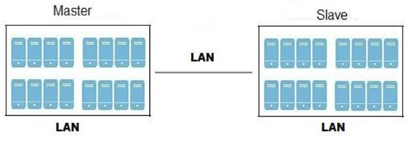

[[chap-Managing_Geo-replication]]
= Managing Geo-replication

This section introduces geo-replication, illustrates the various
deployment scenarios, and explains how to configure geo-replication and
mirroring.

[[About_Geo-replication]]
= About Geo-replication

Geo-replication provides a distributed, continuous, asynchronous, and
incremental replication service from one site to another over Local Area
Networks (LANs), Wide Area Networks (WANs), and the Internet.

Geo-replication uses a master–slave model, where replication and
mirroring occurs between the following partners:

* Master – a {{ book.productTitle }} volume.
* Slave – a {{ book.productTitle }} volume. A slave volume can be a
volume on a remote host, such as `remote-host::volname`.

[[Replicated_Volumes_vs_Geo-replication]]
= Replicated Volumes vs Geo-replication

The following table lists the differences between replicated volumes and
geo-replication:

[cols=",",options="header",]
|=======================================================================
|Replicated Volumes |Geo-replication
|Mirrors data across bricks within one trusted storage pool. |Mirrors
data across geographically distributed trusted storage pools.

|Provides high-availability. |Provides back-ups of data for disaster
recovery.

|Synchronous replication: each and every file operation is applied to
all the bricks. |Asynchronous replication: checks for changes in files
periodically, and syncs them on detecting differences.
|=======================================================================

[[sect-Preparing_to_Deploy_Geo-replication]]
= Preparing to Deploy Geo-replication

This section provides an overview of geo-replication deployment
scenarios, lists prerequisites, and describes how to setup the
environment for geo-replication session.

* <<Exploring_Geo-replication_Deployment_Scenarios>>
* <<Geo-replication_Deployment_Overview>>
* <<Prerequisites36>>
* <<Setting_Up_the_Environment_for_a_Secure_Geo-replication_Slave>>
* <<Setting_Up_the_Environment_for_Geo-replication_Session>>
* <<chap-Managing_Geo-replication-Meta_Volume>>

[[Exploring_Geo-replication_Deployment_Scenarios]]
== Exploring Geo-replication Deployment Scenarios

Geo-replication provides an incremental replication service over Local
Area Networks (LANs), Wide Area Network (WANs), and the Internet. This
section illustrates the most common deployment scenarios for
geo-replication, including the following:

* Geo-replication over LAN
* Geo-replication over WAN
* Geo-replication over the Internet
* Multi-site cascading geo-replication

*Geo-replication over LAN*

*Geo-replication over WAN*

image:images/4449.png[ Geo-replication over WAN ]

*Geo-replication over Internet*

*Multi-site cascading Geo-replication*

[[Geo-replication_Deployment_Overview]]
== Geo-replication Deployment Overview

Deploying geo-replication involves the following steps:

1.  Verify that your environment matches the minimum system
requirements. See <<Prerequisites36>>.
2.  Determine the appropriate deployment scenario. See
<<Exploring_Geo-replication_Deployment_Scenarios>>.
3.  Start geo-replication on the master and slave systems. See
<<sect-Starting_Geo-replication>>.

[[Prerequisites36]]
== Prerequisites

The following are prerequisites for deploying geo-replication:

* The master and slave volumes must be of same version of
{{ book.productTitle }} instances.
* Slave node must not be a peer of the any of the nodes of the Master
trusted storage pool.
* Passwordless SSH access is required between one node of the master
volume (the node from which the `geo-replication create` command will be
executed), and one node of the slave volume (the node whose IP/hostname
will be mentioned in the slave name when running the
`geo-replication create` command).
+
Create the public and private keys using `ssh-keygen` (without
passphrase) on the master node:
+
------------
# ssh-keygen
------------
+
Copy the public key to the slave node using the following command:
+
-----------------------------------------------------------------
# ssh-copy-id -i identity_file root@slave_node_IPaddress/Hostname
-----------------------------------------------------------------
+
If you are setting up a non-root geo-replicaton session, then copy the
public key to the respective `user` location.
+
_____________________________________________________________________________________________________________________________________________________________
*Note*

- Passwordless SSH access is required from the master node to slave
node, whereas passwordless SSH access is not required from the slave
node to master node.
-
ssh-copy-id
command does not work if
ssh authorized_keys
file is configured in the custom location. You must copy the contents of
.ssh/id_rsa.pub
file from the Master and paste it to authorized_keys file in the custom
location on the Slave node.
_____________________________________________________________________________________________________________________________________________________________
+
A passwordless SSH connection is also required for `gsyncd` between
every node in the master to every node in the slave. The
`gluster system:: execute gsec_create` command creates `secret-pem`
files on all the nodes in the master, and is used to implement the
passwordless SSH connection. The `push-pem` option in the
`geo-replication create` command pushes these keys to all the nodes in
the slave.
+
For more information on the `gluster system::execute gsec_create` and
`push-pem` commands, see <<Setting_Up_the_Environment_for_Geo-replication_Session>>.

== Setting Up your Environment

You can set up your environment for a geo-replication session in the
following ways:

* <<Setting_Up_the_Environment_for_Geo-replication_Session>> - In this method,
the slave mount is owned by the root user.
* <<Setting_Up_the_Environment_for_a_Secure_Geo-replication_Slave>> - This method
is more secure as the slave mount is owned by a normal user.

*Time Synchronization*

Before configuring the geo-replication environment, ensure that the time
on all the servers are synchronized.

* All the servers' time must be uniform on bricks of a geo-replicated
master volume. It is recommended to set up a NTP (Network Time Protocol)
service to keep the bricks' time synchronized, and avoid out-of-time
sync effects.
+
For example: In a replicated volume where brick1 of the master has the
time 12:20, and brick2 of the master has the time 12:10 with a 10 minute
time lag, all the changes on brick2 between in this period may go
unnoticed during synchronization of files with a Slave.
+
For more information on configuring NTP, see
https://access.redhat.com/documentation/en-US/Red_Hat_Enterprise_Linux/6/html/Deployment_Guide/ch-Configuring_NTP_Using_ntpd.html[].

[[Setting_Up_the_Environment_for_Geo-replication_Session]]
=== Setting Up your Environment for Geo-replication Session

1.  To create a common `pem pub` file, run the following command on the
master node where the passwordless SSH connection is configured:
+
--------------------------------------
# gluster system:: execute gsec_create
--------------------------------------
2.  Create the geo-replication session using the following command. The
`push-pem` option is needed to perform the necessary `pem-file` setup on
the slave nodes.
+
-----------------------------------------------------------------------------------------
# gluster volume geo-replication MASTER_VOL SLAVE_HOST::SLAVE_VOL create push-pem [force]
-----------------------------------------------------------------------------------------
+
For example:
+
-------------------------------------------------------------------------------
# gluster volume geo-replication Volume1 example.com::slave-vol create push-pem
-------------------------------------------------------------------------------
+
______________________________________________________________________________________________________________________________________________________________________________________________________________________________________________________________________________________________________________________________________________________________________________________________________________________________________
*Note*

There must be passwordless SSH access between the node from which this
command is run, and the slave host specified in the above command. This
command performs the slave verification, which includes checking for a
valid slave URL, valid slave volume, and available space on the slave.
If the verification fails, you can use the `force` option which will
ignore the failed verification and create a geo-replication session.
______________________________________________________________________________________________________________________________________________________________________________________________________________________________________________________________________________________________________________________________________________________________________________________________________________________________________
3.  Configure the meta-volume for geo-replication:
+
---------------------------------------------------------------------------------------------
# gluster volume geo-replication MASTER_VOL SLAVE_HOST::SLAVE_VOL config use_meta_volume true
---------------------------------------------------------------------------------------------
+
For example:
+
-------------------------------------------------------------------------------------------
# gluster volume geo-replication Volume1 example.com::slave-vol config use_meta_volume true
-------------------------------------------------------------------------------------------
+
For more information on configuring meta-volume, see <<chap-Managing_Geo-replication-Meta_Volume>>.
4.  Start the geo-replication by running the following command on the
master node:
+
For example,
+
--------------------------------------------------------------------------------
# gluster volume geo-replication MASTER_VOL SLAVE_HOST::SLAVE_VOL start [force] 
--------------------------------------------------------------------------------
5.  Verify the status of the created session by running the following
command:
+
------------------------------------------------------------------------
# gluster volume geo-replication MASTER_VOL SLAVE_HOST::SLAVE_VOL status
------------------------------------------------------------------------

[[Setting_Up_the_Environment_for_a_Secure_Geo-replication_Slave]]
=== Setting Up your Environment for a Secure Geo-replication Slave

Geo-replication supports access to {{ book.productTitle }} slaves
through SSH using an unprivileged account (user account with non-zero
UID). This method is more secure and it reduces the master's
capabilities over slave to the minimum. This feature relies on
`mountbroker`, an internal service of glusterd which manages the mounts
for unprivileged slave accounts. You must perform additional steps to
configure glusterd with the appropriate `mountbroker's` access control
directives. The following example demonstrates this process:

**Perform the following steps on all the Slave nodes to setup an
auxiliary glusterFS mount for the unprivileged account**:

1.  Create a new group. For example, `geogroup`.
+
____________________________________________________________________________________________________________________________________________________________
*Note*

You must not use multiple groups for the `mountbroker` setup. You can
create multiple user accounts but the group should be same for all the
non-root users.
____________________________________________________________________________________________________________________________________________________________
2.  Create a unprivileged account. For example, ` geoaccount`. Add
`geoaccount` as a member of` geogroup` group.
3.  As a root, create a new directory with permissions _0711_ and with
correct SELinux context. Ensure that the location where this directory
is created is _writeable_ only by root but `geoaccount` is able to
access it.
+
For example,
+
-----------------------------------------------------
# mkdir /var/mountbroker-root
# chmod 0711 /var/mountbroker-root
# semanage fcontext -a -e /home /var/mountbroker-root
# restorecon -Rv /var/mountbroker-root
-----------------------------------------------------
4.  Non-root SSH login is used when the georeplication starts with
non-root configuration. Gsyncd at slave side will be started by the
non-root user. Hence, the read-write permissions must be enabled for
glusterd working directory and the log directories. For example, to
allow access for `geoaccount` to access the working directory and log
directories, run the following commands:
+
-------------------------------------------------------------
# chgrp -R geogroup /var/log/glusterfs/geo-replication-slaves
# chgrp -R geogroup /var/lib/glusterd/geo-replication
# chmod -R 770 /var/lib/glusterd/geo-replication
# chmod -R 770 /var/log/glusterfs/geo-replication-slaves
-------------------------------------------------------------
5.  Run the following commands in any one of the Slave node:
+
---------------------------------------------------------------------------------
# gluster system:: execute mountbroker opt mountbroker-root /var/mountbroker-root
# gluster system:: execute mountbroker user geoaccount slavevol
# gluster system:: execute mountbroker opt geo-replication-log-group geogroup
# gluster system:: execute mountbroker opt rpc-auth-allow-insecure on
---------------------------------------------------------------------------------
+
See <<../architecture/chap-Gluster_Architecture_and_Concepts.adoc#Storage_Concepts,
Storage Concepts>> for information on `glusterd.vol `volume file of a
{{ book.productTitle }} volume.
+
If the above commands fails, check if the `glusterd.vol` file is
available at `/etc/glusterfs/ `directory. If not found, create a
`glusterd.vol` file containing the default configuration and save it at
`/etc/glusterfs/` directory. Now re-run the above commands listed above
to get all the required geo-replication options.
+
The following is the sample `glusterd.vol` file along with default
options:
+
----------------------------------------------------------
volume management
    type mgmt/glusterd
    option working-directory /var/lib/glusterd
    option transport-type socket,rdma
    option transport.socket.keepalive-time 10
    option transport.socket.keepalive-interval 2
    option transport.socket.read-fail-log off
    option rpc-auth-allow-insecure on
    
    option mountbroker-root /var/mountbroker-root 
    option mountbroker-geo-replication.geoaccount slavevol
    option geo-replication-log-group geogroup
end-volume
----------------------------------------------------------
* If you have multiple slave volumes on Slave, repeat Step 2 for each of
them and run the following commands to update the vol file:
+
-----------------------------------------------------------------
# gluster system:: execute mountbroker user geoaccount2 slavevol2
# gluster system:: execute mountbroker user geoaccount3 slavevol3
-----------------------------------------------------------------
+
You can use `gluster system:: execute mountbroker info` command to view
the configured mountbroker options.
* You can add multiple slave volumes within the same account
(geoaccount) by providing comma-separated list (without spaces) as the
argument of `mountbroker-geo-replication.geogroup`. You can also have
multiple options of the form `mountbroker-geo-replication.*`. It is
recommended to use one service account per Master machine. For example,
if there are multiple slave volumes on Slave for the master machines
Master1, Master2, and Master3, then create a dedicated service user on
Slave for them by repeating Step 2. for each (like geogroup1, geogroup2,
and geogroup3), and then run the following commands to add the
corresponding options to the volfile:
+
----------------------------------------------------------------------------------------
# gluster system:: execute mountbroker user geoaccount1 slavevol11,slavevol12,slavevol13
# gluster system:: execute mountbroker user geoaccount2 slavevol21,slavevol22
# gluster system:: execute mountbroker user geoaccount3 slavevol31
----------------------------------------------------------------------------------------
6.  Restart `glusterd` service on all the Slave nodes.
+
**After you setup an auxiliary glusterFS mount for the unprivileged
account on all the Slave nodes, perform the following steps to setup a
non-root geo-replication session.**:
7.  Setup a passwordless SSH from one of the master node to the `user`
on one of the slave node.
+
For example, to setup a passwordless SSH to the user geoaccount.
+
-----------------------------------------------------------------------
# ssh-keygen
# ssh-copy-id -i identity_file geoaccount@slave_node_IPaddress/Hostname
-----------------------------------------------------------------------
8.  Create a common pem pub file by running the following command on the
master node where the passwordless SSH connection is configured to the
`user` on the slave node:
+
--------------------------------------
# gluster system:: execute gsec_create
--------------------------------------
9.  Create a geo-replication relationship between master and slave to
the `user` by running the following command on the master node:
+
For example,
+
-----------------------------------------------------------------------------------------
# gluster volume geo-replication MASTERVOL geoaccount@SLAVENODE::slavevol create push-pem
-----------------------------------------------------------------------------------------
+
If you have multiple slave volumes and/or multiple accounts, create a
geo-replication session with that particular user and volume.
+
For example,
+
-------------------------------------------------------------------------------------------
# gluster volume geo-replication MASTERVOL geoaccount2@SLAVENODE::slavevol2 create push-pem
-------------------------------------------------------------------------------------------
10. In the slavenode, which is used to create relationship, run
`/usr/libexec/glusterfs/set_geo_rep_pem_keys.sh `as a root with user
name, master volume name, and slave volume names as the arguments.
+
For example,
+
-------------------------------------------------------------------------------------
 # /usr/libexec/glusterfs/set_geo_rep_pem_keys.sh geoaccount MASTERVOL SLAVEVOL_NAME 
-------------------------------------------------------------------------------------
11. Configure the meta-volume for geo-replication:
+
---------------------------------------------------------------------------------------------
# gluster volume geo-replication MASTER_VOL SLAVE_HOST::SLAVE_VOL config use_meta_volume true
---------------------------------------------------------------------------------------------
+
For example:
+
-------------------------------------------------------------------------------------------
# gluster volume geo-replication Volume1 example.com::slave-vol config use_meta_volume true
-------------------------------------------------------------------------------------------
+
For more information on configuring meta-volume, see <<chap-Managing_Geo-replication-Meta_Volume>>.
12. Start the geo-replication with slave user by running the following
command on the master node:
+
For example,
+
-------------------------------------------------------------------------------
# gluster volume geo-replication MASTERVOL geoaccount@SLAVENODE::slavevol start
-------------------------------------------------------------------------------
13. Verify the status of geo-replication session by running the
following command on the master node:
+
--------------------------------------------------------------------------------
# gluster volume geo-replication MASTERVOL geoaccount@SLAVENODE::slavevol status
--------------------------------------------------------------------------------

*Deleting a mountbroker geo-replication options after deleting session.*

When mountbroker geo-replicaton session is deleted, use the following
command to remove volumes per mountbroker user. If the volume to be
removed is the last one for the mountbroker user, the user is also
removed.

* To delete a volumes per mountbroker user:
+
----------------------------------------------------------------------
# gluster system:: execute mountbroker volumedel geoaccount2 slavevol2
----------------------------------------------------------------------
+
You can delete multiple volumes per mountbroker user by providing
comma-separated list (without spaces) as the argument of this command.
+
--------------------------------------------------------------------------------
# gluster system:: execute mountbroker volumedel geoaccount2 slavevol2,slavevol3
--------------------------------------------------------------------------------

_____________________________________________________________________________________________________________________________________________________________________________________________________________________
*Important*

If you have a secured geo-replication setup, you must ensure to prefix
the unprivileged user account to the slave volume in the command. For
example, to execute a geo-replication status command, run the following:

--------------------------------------------------------------------------------
# gluster volume geo-replication MASTERVOL geoaccount@SLAVENODE::slavevol status
--------------------------------------------------------------------------------

In this command, `geoaccount` is the name of the unprivileged user
account.
_____________________________________________________________________________________________________________________________________________________________________________________________________________________

[[chap-Managing_Geo-replication-Meta_Volume]]
== Configuring a Meta-Volume

For effective handling of node fail-overs in Master volume,
geo-replication requires a shared storage to be available across all
nodes of the cluster. Hence, you must ensure that a gluster volume named
`gluster_shared_storage` is created in the cluster, and is mounted at
`/var/run/gluster/shared_storage` on all the nodes in the cluster. For
more information on setting up shared storage volume, see
<<../cluster/chap-Managing_Gluster_Volumes.adoc#chap-Managing_Red_Hat_Storage_Volumes-Shared_Volume,
Managing Shared Volume>>.

* Configure the meta-volume for geo-replication:
+
---------------------------------------------------------------------------------------------
# gluster volume geo-replication MASTER_VOL SLAVE_HOST::SLAVE_VOL config use_meta_volume true
---------------------------------------------------------------------------------------------
+
For example:
+
-------------------------------------------------------------------------------------------
# gluster volume geo-replication Volume1 example.com::slave-vol config use_meta_volume true
-------------------------------------------------------------------------------------------

[[sect-Starting_Geo-replication]]
= Starting Geo-replication

This section describes how to and start geo-replication in your storage
environment, and verify that it is functioning correctly.

* <<Starting_a_Geo-replication_Session>>
* <<Verifying_a_Successful_Geo-replication_Deployment>>
* <<Displaying_Geo-replication_Status_Information>>
* <<sect-Configuring_a_Geo-replication_Session>>
* <<Stopping_a_Geo-replication_Session>>
* <<Deleting_a_Geo-replication_Session>>

[[Starting_a_Geo-replication_Session]]
== Starting a Geo-replication Session

_________________________________________________________________________________________________________
*Important*

You must create the geo-replication session before starting
geo-replication. For more information, see
<<Setting_Up_the_Environment_for_Geo-replication_Session>>.
_________________________________________________________________________________________________________

To start geo-replication, use one of the following commands:

* To start the geo-replication session between the hosts:
+
-----------------------------------------------------------------------
# gluster volume geo-replication MASTER_VOL SLAVE_HOST::SLAVE_VOL start
-----------------------------------------------------------------------
+
For example:
+
---------------------------------------------------------------------------------------------
# gluster volume geo-replication Volume1 example.com::slave-vol start
Starting geo-replication session between Volume1 & example.com::slave-vol has been successful
---------------------------------------------------------------------------------------------
+
This command will start distributed geo-replication on all the nodes
that are part of the master volume. If a node that is part of the master
volume is down, the command will still be successful. In a replica pair,
the geo-replication session will be active on any of the replica nodes,
but remain passive on the others.
+
After executing the command, it may take a few minutes for the session
to initialize and become stable.
+
_________________________________________________________________________________________________________________________________________________________________________________________
*Note*

If you attempt to create a geo-replication session and the slave already
has data, the following error message will be displayed:

-----------------------------------------------------------------------------------------------------------------------------------------------------------------------------------------
slave-node::slave is not empty. Please delete existing files in slave-node::slave and retry, or use force to continue without deleting the existing files. geo-replication command failed
-----------------------------------------------------------------------------------------------------------------------------------------------------------------------------------------
_________________________________________________________________________________________________________________________________________________________________________________________

* To start the geo-replication session _forcefully_ between the hosts:
+
-----------------------------------------------------------------------------
# gluster volume geo-replication MASTER_VOL SLAVE_HOST::SLAVE_VOL start force
-----------------------------------------------------------------------------
+
For example:
+
---------------------------------------------------------------------------------------------
# gluster volume geo-replication Volume1 example.com::slave-vol start force
Starting geo-replication session between Volume1 & example.com::slave-vol has been successful
---------------------------------------------------------------------------------------------
+
This command will force start geo-replication sessions on the nodes that
are part of the master volume. If it is unable to successfully start the
geo-replication session on any node which is online and part of the
master volume, the command will still start the geo-replication sessions
on as many nodes as it can. This command can also be used to re-start
geo-replication sessions on the nodes where the session has died, or has
not started.

[[Verifying_a_Successful_Geo-replication_Deployment]]
== Verifying a Successful Geo-replication Deployment

You can use the `status` command to verify the status of geo-replication
in your environment:

------------------------------------------------------------------------
# gluster volume geo-replication MASTER_VOL SLAVE_HOST::SLAVE_VOL status
------------------------------------------------------------------------

For example:

----------------------------------------------------------------------
# gluster volume geo-replication Volume1 example.com::slave-vol status
----------------------------------------------------------------------

[[Displaying_Geo-replication_Status_Information]]
== Displaying Geo-replication Status Information

The `status` command can be used to display information about a specific
geo-replication master session, master-slave session, or all
geo-replication sessions. The status output provides both node and brick
level information.

* To display information on all geo-replication sessions from a
particular master volume, use the following command:
+
--------------------------------------------------
# gluster volume geo-replication MASTER_VOL status
--------------------------------------------------

* To display information of a particular master-slave session, use the
following command:
+
------------------------------------------------------------------------
# gluster volume geo-replication MASTER_VOL SLAVE_HOST::SLAVE_VOL status
------------------------------------------------------------------------
* To display the details of a master-slave session, use the following
command:
+
--------------------------------------------------------------------------------
# gluster volume geo-replication MASTER_VOL SLAVE_HOST ::SLAVE_VOL status detail
--------------------------------------------------------------------------------
+
________________________________________________________________________________________________________________________________________________________________________________________________________________________________________________________________________________________________________________________________________________________________________________________________________________________________________________________________________________________________________________________
*Important*

There will be a mismatch between the outputs of the `df` command
(including `-h` and `-k`) and inode of the master and slave volumes when
the data is in full sync. This is due to the extra inode and size
consumption by the `changelog` journaling data, which keeps track of the
changes done on the file system on the `master` volume. Instead of
running the `df` command to verify the status of synchronization, use
`# gluster volume geo-replication MASTER_VOL SLAVE_HOST::SLAVE_VOL status detail`
instead.
________________________________________________________________________________________________________________________________________________________________________________________________________________________________________________________________________________________________________________________________________________________________________________________________________________________________________________________________________________________________________________________
+
The geo-replication status command output provides the following
information:
** **Master Node**: Master node and Hostname as listed in the
`gluster volume info` command output
** **Master Vol**: Master volume name
** **Master Brick**: The path of the brick
** **Status**: The status of the geo-replication worker can be one of
the following:
*** **Initializing**: This is the initial phase of the Geo-replication
session; it remains in this state for a minute in order to make sure no
abnormalities are present.
*** **Created**: The geo-replication session is created, but not
started.
*** **Active**: The `gsync` daemon in this node is active and syncing
the data.
*** **Passive**: A replica pair of the active node. The data
synchronization is handled by the active node. Hence, this node does not
sync any data.
*** **Faulty**: The geo-replication session has experienced a problem,
and the issue needs to be investigated further. For more information,
see <<sect-Troubleshooting_Geo-replication>> section.
*** **Stopped**: The geo-replication session has stopped, but has not
been deleted.
** *Crawl Status* : Crawl status can be on of the following:
*** *Changelog Crawl:* The `changelog` translator has produced the
changelog and that is being consumed by `gsyncd` daemon to sync data.
*** **Hybrid Crawl**: The ` gsyncd` daemon is crawling the glusterFS
file system and generating pseudo changelog to sync data.
*** **History Crawl**: The `gsyncd` daemon consumes the history
changelogs produced by the changelog translator to sync data.
** **Last Synced**: The last synced time.
** **Entry**: The number of pending entry (CREATE, MKDIR, RENAME, UNLINK
etc) operations per session.
** **Data**: The number of `Data` operations pending per session.
** **Meta**: The number of `Meta` operations pending per session.
** **Failures**: The number of failures. If the failure count is more
than zero, view the log files for errors in the Master bricks.
** **Checkpoint Time**: Displays the date and time of the checkpoint, if
set. Otherwise, it displays as N/A.
** **Checkpoint Completed**: Displays the status of the checkpoint.
** **Checkpoint Completion Time**: Displays the cCompletion time if
Checkpoint is completed. Otherwise, it displays as N/A.

[[sect-Configuring_a_Geo-replication_Session]]
== Configuring a Geo-replication Session

To configure a geo-replication session, use the following command:

---------------------------------------------------------------------------------------
# gluster volume geo-replication MASTER_VOL SLAVE_HOST::SLAVE_VOL config [Name] [Value]
---------------------------------------------------------------------------------------

For example:

---------------------------------------------------------------------------------------
# gluster volume geo-replication Volume1 example.com::slave-vol config use_tarssh true 
---------------------------------------------------------------------------------------

For example, to view the list of all option/value pairs:

----------------------------------------------------------------------
# gluster volume geo-replication Volume1 example.com::slave-vol config
----------------------------------------------------------------------

To delete a setting for a geo-replication config option, prefix the
option with `!` (exclamation mark). For example, to reset `log-level` to
the default value:

-----------------------------------------------------------------------------------
# gluster volume geo-replication Volume1 example.com::slave-vol config '!log-level'
-----------------------------------------------------------------------------------

_________________________________________________________________________________________________________________________________________________________________________________________________________________________________________________________________________________
*Warning*

You must ensure to perform these configuration changes when all the
peers in cluster are in `Connected` (online) state. If you change the
configuration when any of the peer is down, the geo-replication cluster
would be in inconsistent state when the node comes back online.
_________________________________________________________________________________________________________________________________________________________________________________________________________________________________________________________________________________

*Configurable Options.*

The following table provides an overview of the configurable options for
a geo-replication setting:

[cols=",",options="header",]
|=======================================================================
|Option |Description
|gluster-log-file LOGFILE |The path to the geo-replication glusterfs log
file.

|gluster-log-level LOGFILELEVEL |The log level for glusterfs processes.

|log-file LOGFILE |The path to the geo-replication log file.

|log-level LOGFILELEVEL |The log level for geo-replication.

|ssh-command COMMAND |The SSH command to connect to the remote machine
(the default is `SSH`).

|rsync-command COMMAND |The rsync command to use for synchronizing the
files (the default is `rsync`).

|use-tarssh [true | false] |The use-tarssh command allows tar over
Secure Shell protocol. Use this option to handle workloads of files that
have not undergone edits.

|volume_id=UID |The command to delete the existing master UID for the
intermediate/slave node.

|timeout SECONDS |The timeout period in seconds.

|sync-jobs N |The number of simultaneous files/directories that can be
synchronized.

|ignore-deletes |If this option is set to `1`, a file deleted on the
master will not trigger a delete operation on the slave. As a result,
the slave will remain as a superset of the master and can be used to
recover the master in the event of a crash and/or accidental delete.

|checkpoint [LABEL|now] |Sets a checkpoint with the given option LABEL.
If the option is set as `now`, then the current time will be used as the
label.

|sync-acls [true | false] a|
Syncs acls to the Slave cluster. By default, this option is enabled.
____________________________________________________________________________________________________________
*Note*

Geo-replication can sync acls only with `rsync` as the sync engine and
not with `tarssh` as the sync engine.
____________________________________________________________________________________________________________

|sync-xattrs [true | false] a|
Syncs extended attributes to the Slave cluster. By default, this option
is enabled.
___________________________________________________________________________________________________________________________
*Note*

Geo-replication can sync extended attributes only with `rsync` as the
sync engine and not with `tarssh` as the sync engine.
___________________________________________________________________________________________________________________________

|log-rsync-performance [true | false] |If this option is set to
`enable`, geo-replication starts recording the rsync performance in log
files. By default, this option is disabled.

|rsync-options |Additional options to rsync. For example, you can limit
the rsync bandwidth usage "--bwlimit=<value>".

|use-meta-volume [true | false] a|
Set this option to `enable`, to use meta volume in Geo-replicaiton. By
default, this option is disabled.
____________________________________________
*Note*

More more information on meta-volume, see <<chap-Managing_Geo-replication-Meta_Volume>>.
____________________________________________

|meta-volume-mnt PATH |The path of the meta volume mount point.
|=======================================================================

[[sect-Geo-replication_Checkpoints]]
=== Geo-replication Checkpoints

[[About_Geo-replication_Checkpoints]]
==== About Geo-replication Checkpoints

Geo-replication data synchronization is an asynchronous process, so
changes made on the master may take time to be replicated to the slaves.
Data replication to a slave may also be interrupted by various issues,
such network outages.

{{ book.productTitle }} provides the ability to set geo-replication
checkpoints. By setting a checkpoint, synchronization information is
available on whether the data that was on the master at that point in
time has been replicated to the slaves.

[[Configuring_and_Viewing_Geo-replication_Checkpoint_Information]]
==== Configuring and Viewing Geo-replication Checkpoint Information

* To set a checkpoint on a geo-replication session, use the following
command:
+
-----------------------------------------------------------------------------------------------
# gluster volume geo-replication MASTER_VOL SLAVE_HOST::SLAVE_VOL config checkpoint [now|LABEL]
-----------------------------------------------------------------------------------------------
+
For example, to set checkpoint between `Volume1` and
`example.com:/data/remote_dir`:
+
-------------------------------------------------------------------------------------
# gluster volume geo-replication Volume1 example.com::slave-vol config checkpoint now
geo-replication config updated successfully
-------------------------------------------------------------------------------------
+
The label for a checkpoint can be set as the current time using `now`,
or a particular label can be specified, as shown below:
+
------------------------------------------------------------------------------------------------------
# gluster volume geo-replication Volume1 example.com::slave-vol config checkpoint NEW_ACCOUNTS_CREATED
geo-replication config updated successfully.
------------------------------------------------------------------------------------------------------
* To display the status of a checkpoint for a geo-replication session,
use the following command:
+
-------------------------------------------------------------------------------
# gluster volume geo-replication MASTER_VOL SLAVE_HOST::SLAVE_VOL status detail
-------------------------------------------------------------------------------
* To delete checkpoints for a geo-replication session, use the following
command:
+
--------------------------------------------------------------------------------------
# gluster volume geo-replication MASTER_VOL SLAVE_HOST::SLAVE_VOL config '!checkpoint'
--------------------------------------------------------------------------------------
+
For example, to delete the checkpoint set between `Volume1` and
`example.com::slave-vol`:
+
-------------------------------------------------------------------------------------
# gluster volume geo-replication Volume1 example.com::slave-vol config '!checkpoint' 
geo-replication config updated successfully
-------------------------------------------------------------------------------------

[[Stopping_a_Geo-replication_Session]]
== Stopping a Geo-replication Session

To stop a geo-replication session, use one of the following commands:

* To stop a geo-replication session between the hosts:
+
----------------------------------------------------------------------
# gluster volume geo-replication MASTER_VOL SLAVE_HOST::SLAVE_VOL stop
----------------------------------------------------------------------
+
For example:
+
---------------------------------------------------------------------------------------------
# gluster volume geo-replication Volume1 example.com::slave-vol stop
Stopping geo-replication session between Volume1 & example.com::slave-vol has been successful
---------------------------------------------------------------------------------------------
+
______________________________________________________________________________
*Note*

The `stop` command will fail if:

** any node that is a part of the volume is offline.
** if it is unable to stop the geo-replication session on any particular
node.
** if the geo-replication session between the master and slave is not
active.
______________________________________________________________________________
* To stop a geo-replication session _forcefully_ between the hosts:
+
----------------------------------------------------------------------------
# gluster volume geo-replication MASTER_VOL SLAVE_HOST::SLAVE_VOL stop force
----------------------------------------------------------------------------
+
For example:
+
---------------------------------------------------------------------------------------------
# gluster volume geo-replication Volume1 example.com::slave-vol stop force
Stopping geo-replication session between Volume1 & example.com::slave-vol has been successful
---------------------------------------------------------------------------------------------
+
Using `force` will stop the geo-replication session between the master
and slave even if any node that is a part of the volume is offline. If
it is unable to stop the geo-replication session on any particular node,
the command will still stop the geo-replication sessions on as many
nodes as it can. Using `force` will also stop inactive geo-replication
sessions.

[[Deleting_a_Geo-replication_Session]]
== Deleting a Geo-replication Session

____________________________________________________________________________________________________
*Important*

You must first stop a geo-replication session before it can be deleted.
For more information, see <<Stopping_a_Geo-replication_Session>>.
____________________________________________________________________________________________________

To delete a geo-replication session, use the following command:

------------------------------------------------------------------------
# gluster volume geo-replication MASTER_VOL SLAVE_HOST::SLAVE_VOL delete
------------------------------------------------------------------------

For example:

----------------------------------------------------------------------
# gluster volume geo-replication Volume1 example.com::slave-vol delete
geo-replication command executed successfully
----------------------------------------------------------------------

_______________________________________________________________________________
*Note*

The `delete` command will fail if:

* any node that is a part of the volume is offline.
* if it is unable to delete the geo-replication session on any
particular node.
* if the geo-replication session between the master and slave is still
active.
_______________________________________________________________________________

______________________________________________________________________________________________________________________________________________________________________________________________________________________________________
*Important*

The SSH keys will not removed from the master and slave nodes when the
geo-replication session is deleted. You can manually remove the `pem`
files which contain the SSH keys from the
`/var/lib/glusterd/geo-replication/` directory.
______________________________________________________________________________________________________________________________________________________________________________________________________________________________________

[[chap-Managing_Geo-replication-Starting_Geo-replication_on_a_Newly_Added_Brick]]
= Starting Geo-replication on a Newly Added Brick or Node

[[Starting_Geo-replication_for_a_New_Brick_on_a_New_Node]]
== Starting Geo-replication for a New Brick or New Node

If a geo-replication session is running, and a new node is added to the
trusted storage pool or a brick is added to the volume from a newly
added node in the trusted storage pool, then you must perform the
following steps to start the geo-replication daemon on the new node:

1.  Run the following command on the master node where passwordless SSH
connection is configured, in order to create a common `pem pub` file.
+
--------------------------------------
# gluster system:: execute gsec_create
--------------------------------------
2.  Create the geo-replication session using the following command. The
`push-pem` and `force` options are required to perform the necessary
`pem-file` setup on the slave nodes.
+
---------------------------------------------------------------------------------------
# gluster volume geo-replication MASTER_VOL SLAVE_HOST::SLAVE_VOL create push-pem force
---------------------------------------------------------------------------------------
+
For example:
+
-------------------------------------------------------------------------------------
# gluster volume geo-replication Volume1 example.com::slave-vol create push-pem force
-------------------------------------------------------------------------------------
+
____________________________________________________________________________________________________________________________________________________________________________________________________________________________________________________________________________________________
*Note*

There must be passwordless SSH access between the node from which this
command is run, and the slave host specified in the above command. This
command performs the slave verification, which includes checking for a
valid slave URL, valid slave volume, and available space on the slave.
____________________________________________________________________________________________________________________________________________________________________________________________________________________________________________________________________________________________
3.  After successfully setting up the shared storage volume, when a new
node is added to the cluster, the shared storage is not mounted
automatically on this node. Neither is the `/etc/fstab` entry added for
the shared storage on this node. To make use of shared storage on this
node, execute the following commands:
+
----------------------------------------------------------------------
# mount -t glusterfs <local node's ip>:gluster_shared_storage
/var/run/gluster/shared_storage
# cp /etc/fstab /var/run/gluster/fstab.tmp
# echo "<local node's ip>:/gluster_shared_storage
/var/run/gluster/shared_storage/ glusterfs defaults 0 0" >> /etc/fstab
----------------------------------------------------------------------
+
For more information on setting up shared storage volume, see
<<../cluster/chap-Managing_Gluster_Volumes.adoc#chap-Managing_Red_Hat_Storage_Volumes-Shared_Volume,
Managing Shared Volume>>.
4.  Configure the meta-volume for geo-replication:
+
---------------------------------------------------------------------------------------------
# gluster volume geo-replication MASTER_VOL SLAVE_HOST::SLAVE_VOL config use_meta_volume true
---------------------------------------------------------------------------------------------
+
For example:
+
-------------------------------------------------------------------------------------------
# gluster volume geo-replication Volume1 example.com::slave-vol config use_meta_volume true
-------------------------------------------------------------------------------------------
+
For more information on configuring meta-volume, see <<chap-Managing_Geo-replication-Meta_Volume>>.
5.  If a node is added at slave, stop the geo-replication session using
the following command:
+
----------------------------------------------------------------------
# gluster volume geo-replication MASTER_VOL SLAVE_HOST::SLAVE_VOL stop
----------------------------------------------------------------------
6.  Start the geo-replication session between the slave and master
forcefully, using the following command:
+
-----------------------------------------------------------------------------
# gluster volume geo-replication MASTER_VOL SLAVE_HOST::SLAVE_VOL start force
-----------------------------------------------------------------------------
7.  Verify the status of the created session, using the following
command:
+
------------------------------------------------------------------------
# gluster volume geo-replication MASTER_VOL SLAVE_HOST::SLAVE_VOL status
------------------------------------------------------------------------

[[Starting_Geo-replication_for_a_New_Brick_on_an_Existing_Node]]
== Starting Geo-replication for a New Brick on an Existing Node

When adding a brick to the volume on an existing node in the trusted
storage pool with a geo-replication session running, the geo-replication
daemon on that particular node will automatically be restarted. The new
brick will then be recognized by the geo-replication daemon. This is an
automated process and no configuration changes are required.

[[chap-Managing_Geo-replication-Schedule_Cron_Job]]
= Scheduling Geo-replication as a Cron Job

Cron is a daemon that can be used to schedule the execution of recurring
tasks according to a combination of the time, day of the month, month,
day of the week, and week. Cron assumes that the system is ON
continuously. If the system is not ON when a task is scheduled, it is
not executed. A script is provided to run geo-replication only when
required or to schedule geo-replication to run during low I/O.

For more information on installing Cron and configuring Cron jobs, see
https://access.redhat.com/documentation/en-US/Red_Hat_Enterprise_Linux/7/html-single/System_Administrators_Guide/index.html#ch-Automating_System_Tasks

The script provided to schedule the geo-replication session, performs
the following:

1.  Stops the geo-replication session, if started
2.  Starts the geo-replication session
3.  Sets the Checkpoint
4.  Checks the status of checkpoint until it is complete
5.  After the checkpoint is complete, stops the geo-replication session

*Run geo-replication Session.*

To run a geo-reolication session only when required, run the following
script:

--------------------------------------------------------------------------------------
 # python /usr/share/glusterfs/scripts/schedule_georep.py MASTERVOL SLAVEHOST SLAVEVOL
--------------------------------------------------------------------------------------

For example,

---------------------------------------------------------------------------------------
# python /usr/share/glusterfs/scripts/schedule_georep.py Volume1 example.com slave-vol 
---------------------------------------------------------------------------------------

Run the following command to view the help:

---------------------------------------------------------------
# python /usr/share/glusterfs/scripts/schedule_georep.py --help
---------------------------------------------------------------

*Schedule a Cron Job.*

To schedule geo-replication to run automatically using Cron:

----------------------------------------------------------------------------------------------------------------------------
minute hour day month day-of-week directory_and_script-to-execute MASTERVOL SLAVEHOST SLAVEVOL >> log_file_for_script_output
----------------------------------------------------------------------------------------------------------------------------

For example, to run geo-replication daily at 20:30 hours, run the
following:

---------------------------------------------------------------------------------------------------------------------------------------------------------------
30 20 * * * root python /usr/share/glusterfs/scripts/schedule_georep.py --no-color Volume1 example.com slave-vol >> /var/log/glusterfs/schedule_georep.log 2>&1
---------------------------------------------------------------------------------------------------------------------------------------------------------------

[[sect-Disaster_Recovery]]
= Disaster Recovery

{{ book.productTitle }} provides geo-replication failover and failback
capabilities for disaster recovery. If the master goes offline, you can
perform a `failover` procedure so that a slave can replace the master.
When this happens, all the I/O operations, including reads and writes,
are done on the slave which is now acting as the master. When the
original master is back online, you can perform a `failback` procedure
on the original slave so that it synchronizes the differences back to
the original master.

[[Promoting_a_Slave_to_Master]]
== Failover: Promoting a Slave to Master

If the master volume goes offline, you can promote a slave volume to be
the master, and start using that volume for data access.

Run the following commands on the slave machine to promote it to be the
master:

--------------------------------------------------------
# gluster volume set VOLNAME geo-replication.indexing on
# gluster volume set VOLNAME changelog on
--------------------------------------------------------

For example

----------------------------------------------------------
# gluster volume set slave-vol geo-replication.indexing on
volume set: success
# gluster volume set slave-vol changelog on
volume set: success
----------------------------------------------------------

You can now configure applications to use the slave volume for I/O
operations.

[[Failover_and_Failback]]
== Failback: Resuming Master and Slave back to their Original State

When the original master is back online, you can perform the following
procedure on the original slave so that it synchronizes the differences
back to the original master:

1.  Stop the existing geo-rep session from original master to orginal
slave using the following command:
+
--------------------------------------------------------------------------------------------------------
# gluster volume geo-replication  ORIGINAL_MASTER_VOL ORIGINAL_SLAVE_HOST::ORIGINAL_SLAVE_VOL stop force
--------------------------------------------------------------------------------------------------------
+
For example,
+
-----------------------------------------------------------------------------------------------
# gluster volume geo-replication  Volume1 example.com::slave-vol stop force
Stopping geo-replication session between Volume1 and example.com::slave-vol has been successful
-----------------------------------------------------------------------------------------------
2.  Create a new geo-replication session with the original slave as the
new master, and the original master as the new slave with `force`
option. Detailed information on creating geo-replication session is
available at: .
1.  <<Prerequisites36>>
2.  <<Setting_Up_the_Environment_for_Geo-replication_Session>>
3.  <<chap-Managing_Geo-replication-Meta_Volume>>
3.  Start the special synchronization mode to speed up the recovery of
data from slave. This option adds capability to geo-replication to
ignore the files created before enabling `indexing` option. With this
option, geo-replication will synchronize only those files which are
created after making Slave volume as Master volume.
+
------------------------------------------------------------------------------------------------------------------------------
# gluster volume geo-replication ORIGINAL_SLAVE_VOL ORIGINAL_MASTER_HOST::ORIGINAL_MASTER_VOL config special-sync-mode recover
------------------------------------------------------------------------------------------------------------------------------
+
For example,
+
------------------------------------------------------------------------------------------------
# gluster volume geo-replication  slave-vol master.com::Volume1 config special-sync-mode recover
geo-replication config updated successfully
        
------------------------------------------------------------------------------------------------
4.  Start the new geo-replication session using the following command:
+
---------------------------------------------------------------------------------------------------
# gluster volume geo-replication ORIGINAL_SLAVE_VOL ORIGINAL_MASTER_HOST::ORIGINAL_MASTER_VOL start
---------------------------------------------------------------------------------------------------
+
For example,
+
----------------------------------------------------------------------------------------------
# gluster volume geo-replication slave-vol master.com::Volume1 start
Starting geo-replication session between slave-vol and master.com::Volume1 has been successful
          
----------------------------------------------------------------------------------------------
5.  Stop the I/O operations on the original slave and set the
checkpoint. By setting a checkpoint, synchronization information is
available on whether the data that was on the master at that point in
time has been replicated to the slaves.
+
-------------------------------------------------------------------------------------------------------------------
# gluster volume geo-replication ORIGINAL_SLAVE_VOL ORIGINAL_MASTER_HOST::ORIGINAL_MASTER_VOL config checkpoint now
-------------------------------------------------------------------------------------------------------------------
+
For example,
+
------------------------------------------------------------------------------------
# gluster volume geo-replication slave-vol master.com::Volume1 config checkpoint now
geo-replication config updated successfully
          
------------------------------------------------------------------------------------
6.  Checkpoint completion ensures that the data from the original slave
is restored back to the original master. But since the IOs were stopped
at slave before checkpoint was set, we need to touch the slave mount for
checkpoint to be completed
+
-----------------------------
# touch orginial_slave_mount 
-----------------------------
+
-----------------------------------------------------------------------------------------------------------
# gluster volume geo-replication ORIGINAL_SLAVE_VOL ORIGINAL_MASTER_HOST::ORIGINAL_MASTER_VOL status detail
-----------------------------------------------------------------------------------------------------------
+
For example,
+
----------------------------------------------------------------------------
# touch /mnt/gluster/slavevol
# gluster volume geo-replication slave-vol master.com::Volume1 status detail
         
----------------------------------------------------------------------------
7.  After the checkpoint is complete, stop and delete the current
geo-replication session between the original slave and original master
+
---------------------------------------------------------------------------------------------------
# gluster volume geo-replication ORIGINAL_SLAVE_VOL ORIGINAL_MASTER_HOST::ORIGINAL_MASTER_VOL stop 
---------------------------------------------------------------------------------------------------
+
-----------------------------------------------------------------------------------------------------
# gluster volume geo-replication ORIGINAL_SLAVE_VOL ORIGINAL_MASTER_HOST::ORIGINAL_MASTER_VOL delete 
-----------------------------------------------------------------------------------------------------
+
For example,
+
----------------------------------------------------------------------------------------------
# gluster volume geo-replication slave-vol master.com::Volume1 stop
Stopping geo-replication session between slave-vol and master.com::Volume1 has been successful

# gluster volume geo-replication slave-vol master.com::Volume1 delete
geo-replication command executed successfully
          
----------------------------------------------------------------------------------------------
8.  Reset the options that were set for promoting the slave volume as
the master volume by running the following commands:
+
------------------------------------------------------------------------
# gluster volume reset ORIGINAL_SLAVE_VOL geo-replication.indexing force
# gluster volume reset ORIGINAL_SLAVE_VOL changelog
------------------------------------------------------------------------
+
For example,
+
---------------------------------------------------------------
# gluster volume reset slave-vol geo-replication.indexing force
volume set: success

# gluster volume reset slave-vol changelog
volume set: success
     
---------------------------------------------------------------
9.  Resume the original roles by starting the geo-rep session from the
original master using the following command:
+
-----------------------------------------------------------------------------------------------------
 # gluster volume geo-replication  ORIGINAL_MASTER_VOL ORIGINAL_SLAVE_HOST::ORIGINAL_SLAVE_VOL start 
-----------------------------------------------------------------------------------------------------
+
-------------------------------------------------------------------------------------------
# gluster volume geo-replication Volume1 example.com::slave-vol start
Starting geo-replication session between slave-vol  and master.com::Volume1 been successful
-------------------------------------------------------------------------------------------

[[Creating_a_Snapshot_of_Geo-replicated_Volume]]
= Creating a Snapshot of Geo-replicated Volume

The {{ book.productTitle }} Snapshot feature enables you to create
point-in-time copies of {{ book.productTitle }} volumes, which you can
use to protect data. You can create snapshots of Geo-replicated volumes.

For information on prerequisites, creating, and restoring snapshots of
geo-replicated volume, see <<../features/chap-Managing_Snapshots.adoc#chap-Managing_Snapshots,
Managing Snapshots>>. Creation of a snapshot when
geo-replication session is live is not supported and creation of
snapshot in this scenario will display the following error:

----------------------------------------------------------------------------------------------------------------------------------------
# gluster snapshot create snap1 master
snapshot create: failed: geo-replication session is running for the volume master. Session needs to be stopped before taking a snapshot.
Snapshot command failed
----------------------------------------------------------------------------------------------------------------------------------------

.

You must ensure to pause the geo-replication session before creating
snapshot and resume geo-replication session after creating the snapshot.
Information on restoring geo-replicated volume is also available in the
Managing Snapshotschapter.

[[Example_-_Setting_up_Cascading_Geo-replication]]
= Example - Setting up Cascading Geo-replication

This section provides step by step instructions to set up a cascading
geo-replication session. The configuration of this example has three
volumes and the volume names are master-vol, interimmaster-vol, and
slave-vol.

1.  Verify that your environment matches the minimum system requirements
listed in <<Prerequisites36>>.
2.  Determine the appropriate deployment scenario. For more information
on deployment scenarios, see <<Exploring_Geo-replication_Deployment_Scenarios>>.
3.  Configure the environment and create a geo-replication session
between master-vol and interimmaster-vol.
1.  Create a common pem pub file, run the following command on the
master node where the passwordless SSH connection is configured:
+
--------------------------------------
# gluster system:: execute gsec_create
--------------------------------------
2.  Create the geo-replication session using the following command. The
push-pem option is needed to perform the necessary pem-file setup on the
interimmaster nodes.
+
-------------------------------------------------------------------------------------
# gluster volume geo-replication master-vol interimhost.com::interimmaster-vol create
push-pem
-------------------------------------------------------------------------------------
3.  Verify the status of the created session by running the following
command:
+
---------------------------------------------------------------------------------
# gluster volume geo-replication master-vol interimhost::interimmaster-vol status
---------------------------------------------------------------------------------
4.  Configure the meta-volume for geo-replication:
+
----------------------------------------------------------------------------------------------------------
# gluster volume geo-replication master-vol interimhost.com::interimmaster-vol config use_meta_volume true
----------------------------------------------------------------------------------------------------------
+
For more information on configuring meta-volume, see <<chap-Managing_Geo-replication-Meta_Volume>>.
5.  Start a Geo-replication session between the hosts:
+
------------------------------------------------------------------------------------
# gluster volume geo-replication master-vol interimhost.com::interimmaster-vol start
------------------------------------------------------------------------------------
+
This command will start distributed geo-replication on all the nodes
that are part of the master volume. If a node that is part of the master
volume is down, the command will still be successful. In a replica pair,
the geo-replication session will be active on any of the replica nodes,
but remain passive on the others. After executing the command, it may
take a few minutes for the session to initialize and become stable.
6.  Verifying the status of geo-replication session by running the
following command:
+
-------------------------------------------------------------------------------------
# gluster volume geo-replication master-vol interimhost.com::interimmaster-vol status
-------------------------------------------------------------------------------------
7.  Create a geo-replication session between interimmaster-vol and
slave-vol.
1.  Create a common pem pub file by running the following command on the
interimmaster master node where the passwordless SSH connection is
configured:
+
--------------------------------------
# gluster system:: execute gsec_create
--------------------------------------
2.  On interimmaster node, create the geo-replication session using the
following command. The push-pem option is needed to perform the
necessary pem-file setup on the slave nodes.
+
--------------------------------------------------------------------------------------------
# gluster volume geo-replication interimmaster-vol slave_host.com::slave-vol create push-pem
--------------------------------------------------------------------------------------------
3.  Verify the status of the created session by running the following
command:
+
--------------------------------------------------------------------------------
# gluster volume geo-replication interrimmaster-vol slave_host::slave-vol status
--------------------------------------------------------------------------------
8.  Configure the meta-volume for geo-replication:
+
-----------------------------------------------------------------------------------------------------
# gluster volume geo-replication interrimmaster-vol slave_host::slave-vol config use_meta_volume true
-----------------------------------------------------------------------------------------------------
+
For more information on configuring meta-volume, see <<chap-Managing_Geo-replication-Meta_Volume>>.
9.  Start a geo-replication session between interrimaster-vol and
slave-vol by running the following command:
+
-----------------------------------------------------------------------------------
# gluster volume geo-replication interrimmaster-vol slave_host.com::slave-vol start
-----------------------------------------------------------------------------------
10. Verify the status of geo-replication session by running the
following:
+
------------------------------------------------------------------------------------
# gluster volume geo-replication interrimmaster-vol slave_host.com::slave-vol status
------------------------------------------------------------------------------------

[[Recommended_Practices3]]
= Recommended Practices

*Manually Setting the Time.*

If you have to change the time on the bricks manually, then the
geo-replication session and indexing must be disabled when setting the
time on all the bricks. All bricks in a geo-replication environment must
be set to the same time, as this avoids the out-of-time sync issue
described in <<Setting_Up_the_Environment_for_Geo-replication_Session>>.
Bricks not operating on the same time setting, or
changing the time while the geo-replication is running, will corrupt the
geo-replication index. The recommended way to set the time manually is
using the following procedure.

1.  Stop geo-replication between the master and slave, using the
following command:
+
----------------------------------------------------------------------
# gluster volume geo-replication MASTER_VOL SLAVE_HOST::SLAVE_VOL stop
----------------------------------------------------------------------
2.  Stop geo-replication indexing, using the following command:
+
------------------------------------------------------------
# gluster volume set MASTER_VOL geo-replication.indexing off
------------------------------------------------------------
3.  Set a uniform time on all the bricks.
4.  Restart the geo-replication sessions, using the following command:
+
-----------------------------------------------------------------------
# gluster volume geo-replication MASTER_VOL SLAVE_HOST::SLAVE_VOL start
-----------------------------------------------------------------------

*Performance Tuning.*

When the following option is set, it has been observed that there is an
increase in geo-replication performance. On the slave volume, run the
following command:

-------------------------------------------------------
# gluster volume set SLAVE_VOL batch-fsync-delay-usec 0
-------------------------------------------------------

*Initially Replicating Large Volumes to a Remote Slave Locally using a
LAN.*

For replicating large volumes to a slave in a remote location, it may be
useful to do the initial replication to disks locally on a local area
network (LAN), and then physically transport the disks to the remote
location. This eliminates the need of doing the initial replication of
the whole volume over a slower and more expensive wide area network
(WAN) connection. The following procedure provides instructions for
setting up a local geo-replication session, physically transporting the
disks to the remote location, and then setting up geo-replication over a
WAN.

1.  Create a geo-replication session locally within the LAN. For
information on creating a geo-replication session, see <<Setting_Up_the_Environment_for_Geo-replication_Session>>.
+
_______________________________________________________________________________________________________________________________________________________________________________________________________
*Important*

You must remember the order in which the bricks/disks are specified when
creating the slave volume. This information is required later for
configuring the remote geo-replication session over the WAN.
_______________________________________________________________________________________________________________________________________________________________________________________________________
2.  Ensure that the initial data on the master is synced to the slave
volume. You can verify the status of the synchronization by using the
`status` command, as shown in <<Displaying_Geo-replication_Status_Information>>.
3.  Stop and delete the geo-replication session.
+
For information on stopping and deleting the the geo-replication
session, see <<Stopping_a_Geo-replication_Session>> and <<Deleting_a_Geo-replication_Session>>.
+
______________________________________________________________________________________
*Important*

You must ensure that there are no stale files in
`/var/lib/glusterd/geo-replication/`.
______________________________________________________________________________________
4.  Stop and delete the slave volume.
+
For information on stopping and deleting the volume, see
<<../cluster/chap-Managing_Gluster_Volumes.adoc#Stopping_Volumes, Stopping Volumes>> and
<<../cluster/chap-Managing_Gluster_Volumes.adoc#Deleting_Volumes, Deleting Volumes>>.
5.  Remove the disks from the slave nodes, and physically transport them
to the remote location. Make sure to remember the order in which the
disks were specified in the volume.
6.  At the remote location, attach the disks and mount them on the slave
nodes. Make sure that the file system or logical volume manager is
recognized, and that the data is accessible after mounting it.
7.  Configure a trusted storage pool for the slave using the
`peer probe` command.
+
For information on configuring a trusted storage pool,
see <<../architecture/chap-Trusted_Storage_Pools.adoc#chap-Trusted_Storage_Pools,
Trusted Storage Pools.>>
8.  Delete the glusterFS-related attributes on the bricks. This should
be done before creating the volume. You can remove the glusterFS-related
attributes by running the following command:
+
-------------------------------------------------------------------------------------------------------------------------------------------------------
# for i in `getfattr -d -m . ABSOLUTE_PATH_TO_BRICK 2>/dev/null | grep trusted | awk -F = '{print $1}'`; do setfattr -x $i ABSOLUTE_PATH_TO_BRICK; done
-------------------------------------------------------------------------------------------------------------------------------------------------------
+
Run the following command to ensure that there are no `xattrs` still set
on the brick:
+
-----------------------------------------
# getfattr -d -m . ABSOLUTE_PATH_TO_BRICK
-----------------------------------------
9.  After creating the trusted storage pool, create the {{ book.productTitle }}
volume with the same configuration that it had when it was on
the LAN. For information on creating volumes, see
<<../architecture/chap-Gluster_Volumes.adoc#chap-Gluster_Volumes,
Gluster Volumes>>
+
______________________________________________________________________________________________________________________________________________________________________________
*Important*

Make sure to specify the bricks in same order as they were previously
when on the LAN. A mismatch in the specification of the brick order may
lead to data loss or corruption.
______________________________________________________________________________________________________________________________________________________________________________
10. Start and mount the volume, and check if the data is intact and
accessible.
+
For information on starting and mounting volumes, see <<Starting_Volumes1>>
and <<../architecture/chap-Accessing_Data_-_Setting_Up_Clients.adoc#chap-Accessing_Data_-_Setting_Up_Clients,
Setting up clients>>
11. Configure the environment and create a geo-replication session from
the master to this remote slave.
+
For information on configuring the environment and creating a
geo-replication session, see <<Setting_Up_the_Environment_for_Geo-replication_Session>>.
12. Start the geo-replication session between the master and the remote
slave.
+
For information on starting the geo-replication session, see <<sect-Starting_Geo-replication>>.
13. Use the `status` command to verify the status of the session, and
check if all the nodes in the session are stable.
+
For information on the `status`, see <<Displaying_Geo-replication_Status_Information>>.

[[sect-Troubleshooting_Geo-replication]]
= Troubleshooting Geo-replication
 
This section describes the most common troubleshooting scenarios related
to geo-replication.

[[Tuning_Geo-replication_performance_with_Change_Log]]
== Tuning Geo-replication performance with Change Log

There are options for the change log that can be configured to give
better performance in a geo-replication environment.

The `rollover-time` option sets the rate at which the change log is
consumed. The default rollover time is 60 seconds, but it can be
configured to a faster rate. A recommended rollover-time for
geo-replication is 10-15 seconds. To change the `rollover-time` option,
use following the command:

---------------------------------------------
# gluster volume set VOLNAME rollover-time 15
---------------------------------------------

The `fsync-interval` option determines the frequency that updates to the
change log are written to disk. The default interval is 0, which means
that updates to the change log are written synchronously as they occur,
and this may negatively impact performance in a geo-replication
environment. Configuring `fsync-interval` to a non-zero value will write
updates to disk asynchronously at the specified interval. To change the
`fsync-interval` option, use following the command:

---------------------------------------------
# gluster volume set VOLNAME fsync-interval 3
---------------------------------------------

[[Tuning_Geo-replication_performance_with_Change_Log_1]]
== Triggering Explicit Sync on Entries

Geo-replication provides an option to explicitly trigger the sync
operation of files and directories. A virtual extended attribute
`glusterfs.geo-rep.trigger-sync` is provided to accomplish the same.

----------------------------------------------------------------
# setfattr -n glusterfs.geo-rep.trigger-sync -v "1" <file-path> 
----------------------------------------------------------------

The support of explicit trigger of sync is supported only for
directories and regular files.

[[Synchronization_Is_Not_Complete]]
== Synchronization Is Not Complete

*Situation.*

The geo-replication status is displayed as `Stable`, but the data has
not been completely synchronized.

*Solution.*

A full synchronization of the data can be performed by erasing the index
and restarting geo-replication. After restarting geo-replication, it
will begin a synchronization of the data using checksums. This may be a
long and resource intensive process on large data sets.


If the issue persists, contact {{ book.company }} Support.


For more information about erasing the index, see
<<../cluster/chap-Managing_Gluster_Volumes.adoc#Configuring_Volume_Options,
Configuring Volume Options>>.

[[Issues_with_File_Synchronization]]
== Issues with File Synchronization

*Situation.*

The geo-replication status is displayed as `Stable`, but only
directories and symlinks are synchronized. Error messages similar to the
following are in the logs:

---------------------------------------------------------------------------------------
[2011-05-02 13:42:13.467644] E [master:288:regjob] GMaster: failed to sync ./some_file`
---------------------------------------------------------------------------------------

*Solution.*

Geo-replication requires `rsync` v3.0.0 or higher on the host and the
remote machines. Verify if you have installed the required version of
`rsync`.

[[Geo-replication_Status_is_Often_Faulty]]
== Geo-replication Status is Often `Faulty`

*Situation.*

The geo-replication status is often displayed as `Faulty`, with a
backtrace similar to the following:

-----------------------------------------------------------------------------------------------------------------------------------------------------------------------------------------------------------------------------------------------------------------------------------------------------------------------------------------------------------------------------------------------------------------------------------------------------
012-09-28 14:06:18.378859] E [syncdutils:131:log_raise_exception] <top>: FAIL: Traceback (most recent call last): File "/usr/local/libexec/glusterfs/python/syncdaemon/syncdutils.py", line 152, in twraptf(*aa) File "/usr/local/libexec/glusterfs/python/syncdaemon/repce.py", line 118, in listen rid, exc, res = recv(self.inf) File "/usr/local/libexec/glusterfs/python/syncdaemon/repce.py", line 42, in recv return pickle.load(inf) EOFError
-----------------------------------------------------------------------------------------------------------------------------------------------------------------------------------------------------------------------------------------------------------------------------------------------------------------------------------------------------------------------------------------------------------------------------------------------------

*Solution.*

This usually indicates that RPC communication between the master gsyncd
module and slave gsyncd module is broken. Make sure that the following
pre-requisites are met:

* Passwordless SSH is set up properly between the host and remote
machines.
* FUSE is installed on the machines. The geo-replication module mounts
{{ book.productTitle }} volumes using FUSE to sync data.

[[Intermediate_Master_is_in_a_Faulty_State]]
== Intermediate Master is in a Faulty State

*Situation.*

In a cascading environment, the intermediate master is in a faulty
state, and messages similar to the following are in the log:

----------------------------------------------------------------------------------------------------------------------------------------------------------------------------------------
raise RuntimeError ("aborting on uuid change from %s to %s" % \ RuntimeError: aborting on uuid change from af07e07c-427f-4586-ab9f- 4bf7d299be81 to de6b5040-8f4e-4575-8831-c4f55bd41154
----------------------------------------------------------------------------------------------------------------------------------------------------------------------------------------

*Solution.*

In a cascading configuration, an intermediate master is loyal to its
original primary master. The above log message indicates that the
geo-replication module has detected that the primary master has changed.
If this change was deliberate, delete the `volume-id` configuration
option in the session that was initiated from the intermediate master.

[[Remote_gsyncd_Not_Found]]
== Remote gsyncd Not Found

*Situation.*

The master is in a faulty state, and messages similar to the following
are in the log:

--------------------------------------------------------------------------------------------------------------------------------------
[2012-04-04 03:41:40.324496] E [resource:169:errfail] Popen: ssh> bash: /usr/local/libexec/glusterfs/gsyncd: No such file or directory
--------------------------------------------------------------------------------------------------------------------------------------

*Solution.*

The steps to configure a SSH connection for geo-replication have been
updated. Use the steps as described in <<Setting_Up_the_Environment_for_Geo-replication_Session>>.
