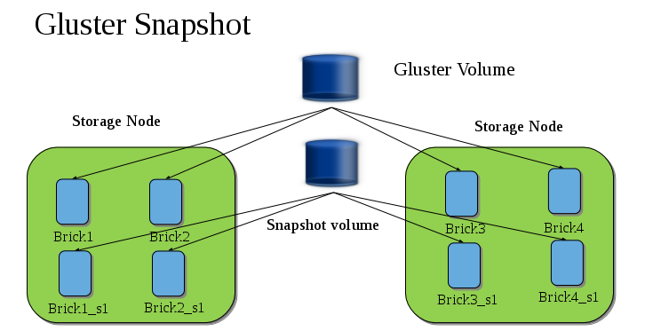

[[chap-Managing_Snapshots]]
= Managing Snapshots

{{ book.productTitle }} Snapshot feature enables you to create
point-in-time copies of {{ book.productTitle }} volumes, which you can
use to protect data. Users can directly access Snapshot copies which are
read-only to recover from accidental deletion, corruption, or
modification of the data.

In the Snapshot Architecture diagram, {{ book.productTitle }} volume
consists of multiple bricks (Brick1 Brick2 etc) which is spread across
one or more nodes and each brick is made up of independent thin Logical
Volumes (LV). When a snapshot of a volume is taken, it takes the
snapshot of the LV and creates another brick. Brick1_s1 is an identical
image of Brick1. Similarly, identical images of each brick is created
and these newly created bricks combine together to form a snapshot
volume.

Some features of snapshot are:

* *Crash Consistency.*
+
A crash consistent snapshot is captured at a particular point-in-time.
When a crash consistent snapshot is restored, the data is identical as
it was at the time of taking a snapshot.
+
__________________________________________________________
*Note*

Currently, application level consistency is not supported.
__________________________________________________________
* *Online Snapshot.*
+
Snapshot is an online snapshot hence the file system and its associated
data continue to be available for the clients even while the snapshot is
being taken.
* *Quorum Based.*
+
The quorum feature ensures that the volume is in a good condition while
the bricks are down. If any brick that is down for a n way replication,
where n <= 2 , quorum is not met. In a n-way replication where n >= 3,
quorum is met when m bricks are up, where m >= (n/2 +1) where n is odd
and m >= n/2 and the first brick is up where n is even. If quorum is not
met snapshot creation fails.
+
_______________________________________________________________________________________________________________________________________________________________________________________________________________________________________________________________________________
*Note*

The quorum check feature in snapshot is in technology preview. Snapshot
delete and restore feature checks node level quorum instead of brick
level quorum. Snapshot delete and restore is successful only when m
number of nodes of a n node cluster is up, where m >= (n/2+1).
_______________________________________________________________________________________________________________________________________________________________________________________________________________________________________________________________________________
* *Barrier.*
+
To guarantee crash consistency some of the fops are blocked during a
snapshot operation.
+
These fops are blocked till the snapshot is complete. All other fops is
passed through. There is a default time-out of 2 minutes, within that
time if snapshot is not complete then these fops are unbarriered. If the
barrier is unbarriered before the snapshot is complete then the snapshot
operation fails. This is to ensure that the snapshot is in a consistent
state.

________________________________________________________________________________________________________________________________________________________________________________________________________________________
*Note*

Taking a snapshot of a {{ book.productTitle }} volume that is hosting
the Virtual Machine Images is not recommended. Taking a Hypervisor
assisted snapshot of a virtual machine would be more suitable in this
use case.
________________________________________________________________________________________________________________________________________________________________________________________________________________________

[[Prerequisites37]]
= Prerequisites

Before using this feature, ensure that the following prerequisites are
met:

* Snapshot is based on thinly provisioned LVM. Ensure the volume is
based on LVM2.


{{ book.productTitle }} is supported on Red Hat
Enterprise Linux 6.7 and later and Red Hat Enterprise Linux 7.1 and
later. Both these versions of Red Hat Enterprise Linux is based on LVM2
by default. For more information, see
https://access.redhat.com/site/documentation/en-US/Red_Hat_Enterprise_Linux/6/html/Logical_Volume_Manager_Administration/thinprovisioned_volumes.html[]


* Each brick must be independent thinly provisioned logical volume(LV).
* The logical volume which contains the brick must not contain any data
other than the brick.
* Only linear LVM is supported with {{ book.productTitle }}. For more
information, see
https://access.redhat.com/site/documentation/en-US/Red_Hat_Enterprise_Linux/4/html-single/Cluster_Logical_Volume_Manager/#lv_overview[]
* Each snapshot creates as many bricks as in the original
{{ book.productTitle }} volume. Bricks, by default, use privileged ports to
communicate. The total number of privileged ports in a system is
restricted to 1024. Hence, for supporting 256 snapshots per volume, the
following options must be set on Gluster volume. These changes will
allow bricks and glusterd to communicate using non-privileged ports.
1.  Run the following command to permit insecure ports:
+
-----------------------------------------------------
# gluster volume set VOLNAME server.allow-insecure on
-----------------------------------------------------
2.  Edit the `/etc/glusterfs/glusterd.vol` in each
{{ book.productTitle }} node, and add the following setting:
+
---------------------------------
option rpc-auth-allow-insecure on
---------------------------------
3.  Restart glusterd service on each {{ book.productTitle }} node using the
following command:
+
--------------------------
# service glusterd restart
--------------------------

*Recommended Setup.*

The recommended setup for using Snapshot is described below. In
addition, you must ensure to read
<<../cluster/chap-Configuring_Gluster_for_Enhancing_Performance.adoc#chap-Configuring_Gluster_for_Enhancing_Performance,
Configuring {{ book.productTitle }} for enhancing snapshot performance>>:

* For each volume brick, create a dedicated thin pool that contains the
brick of the volume and its (thin) brick snapshots. With the current
thin-p design, avoid placing the bricks of different {{ book.productTitle }}
volumes in the same thin pool, as this reduces the performance
of snapshot operations, such as snapshot delete, on other unrelated
volumes.
* The recommended thin pool chunk size is 256KB. There might be
exceptions to this in cases where we have a detailed information of the
customer's workload.
* The recommended pool metadata size is 0.1% of the thin pool size for a
chunk size of 256KB or larger. In special cases, where we recommend a
chunk size less than 256KB, use a pool metadata size of 0.5% of thin
pool size.

*For Example.*

To create a brick from device /dev/sda1.

1.  Create a physical volume(PV) by using the `pvcreate` command.
+
------------------
pvcreate /dev/sda1
------------------
+
Use the correct `dataalignment` option based on your device. For more
information, <<../cluster/chap-Configuring_Gluster_for_Enhancing_Performance.adoc#Brick_Configuration,
Brick Configuration>>.
2.  Create a Volume Group (VG) from the PV using the following command:
+
---------------------------
vgcreate dummyvg /dev/sda1 
---------------------------
3.  Create a thin-pool using the following command:
+
----------------------------------------------------------------------------
lvcreate -L 1T -T dummyvg/dummypool -c 256k --poolmetadatasize 16G  --zero n
----------------------------------------------------------------------------
+
A thin pool of size 1 TB is created, using a chunksize of 256 KB.
Maximum pool metadata size of 16 G is used.
4.  Create a thinly provisioned volume from the previously created pool
using the following command:
+
----------------------------------------------
lvcreate -V 1G -T dummyvg/dummypool -n dummylv
----------------------------------------------
5.  Create a file system (XFS) on this. Use the recommended options to
create the XFS file system on the thin LV.
+
For example,
+
---------------------------------------------------------
mkfs.xfs -f -i size=512 -n size=8192 /dev/dummyvg/dummylv
---------------------------------------------------------
6.  Mount this logical volume and use the mount path as the brick.
+
-------------------------------------
mount/dev/dummyvg/dummylv /mnt/brick1
-------------------------------------

= Creating Snapshots

Before creating a snapshot ensure that the following prerequisites are
met:

* {{ book.productTitle }} volume has to be present and the volume has to
be in the `Started` state.
* All the bricks of the volume have to be on an independent thin logical
volume(LV).
* Snapshot names must be unique in the cluster.
* All the bricks of the volume should be up and running, unless it is a
n-way replication where n >= 3. In such case quorum must be met. For
more information see <<chap-Managing_Snapshots>>
* No other volume operation, like `rebalance`, `add-brick`, etc, should
be running on the volume.
* Total number of snapshots in the volume should not be equal to
Effective snap-max-hard-limit. For more information see Configuring
Snapshot Behavior.
* If you have a geo-replication setup, then pause the geo-replication
session if it is running, by executing the following command:
+
-----------------------------------------------------------------------
# gluster volume geo-replication MASTER_VOL SLAVE_HOST::SLAVE_VOL pause
-----------------------------------------------------------------------
+
For example,
+
---------------------------------------------------------------------------------------------
# gluster volume geo-replication master-vol example.com::slave-vol pause 
Pausing geo-replication session between master-vol example.com::slave-vol has been successful
---------------------------------------------------------------------------------------------
+
Ensure that you take the snapshot of the master volume and then take
snapshot of the slave volume.
* If you have a Hadoop enabled {{ book.productTitle }} volume, you must
ensure to stop all the Hadoop Services in Ambari.

To create a snapshot of the volume, run the following command:

-------------------------------------------------------------------------------------------------
# gluster snapshot create <snapname> <volname> [no-timestamp] [description <description>] [force]
-------------------------------------------------------------------------------------------------

where,

* snapname - Name of the snapshot that will be created.
* VOLNAME(S) - Name of the volume for which the snapshot will be
created. We only support creating snapshot of single volume.
* description - This is an optional field that can be used to provide a
description of the snap that will be saved along with the snap.
* `force` - Snapshot creation will fail if any brick is down. In a n-way
replicated {{ book.productTitle }} volume where n >= 3 snapshot is
allowed even if some of the bricks are down. In such case quorum is
checked. Quorum is checked only when the `force` option is provided,
else by-default the snapshot create will fail if any brick is down.
Refer the Overview section for more details on quorum.
* no-timestamp: By default a timestamp is appended to the snapshot name.
If you do not want to append timestamp then pass no-timestamp as an
argument.

For Example 1:

---------------------------------------------------------
# gluster snapshot create snap1 vol1 no-timestamp
snapshot create: success: Snap snap1 created successfully
---------------------------------------------------------

For Example 2:

---------------------------------------------------------------------------------
# gluster snapshot create snap1 vol1
snapshot create: success: Snap snap1_GMT-2015.07.20-10.02.33 created successfully
---------------------------------------------------------------------------------

Snapshot of a {{ book.productTitle }} volume creates a read-only
{{ book.productTitle }} volume. This volume will have identical configuration as
of the original / parent volume. Bricks of this newly created snapshot
is mounted as
`/var/run/gluster/snaps/<snap-volume-name>/brick<bricknumber>`.

For example, a snapshot with snap volume name
`0888649a92ea45db8c00a615dfc5ea35` and having two bricks will have the
following two mount points:

--------------------------------------------------------------
/var/run/gluster/snaps/0888649a92ea45db8c00a615dfc5ea35/brick1
/var/run/gluster/snaps/0888649a92ea45db8c00a615dfc5ea35/brick2
--------------------------------------------------------------

These mounts can also be viewed using the `df` or `mount` command.

______________________________________________________________________________________________________________________________________
*Note*

If you have a geo-replication setup, after creating the snapshot, resume
the geo-replication session by running the following command:

-------------------------------------------------------------------------
# gluster volume geo-replication MASTER_VOL SLAVE_HOST::SLAVE_VOL resume 
-------------------------------------------------------------------------

For example,

----------------------------------------------------------------------------------------------
# gluster volume geo-replication master-vol example.com::slave-vol resume
Resuming geo-replication session between master-vol example.com::slave-vol has been successful
----------------------------------------------------------------------------------------------
______________________________________________________________________________________________________________________________________

Execute the following command

-------------------------------------------------------
./ganesha-ha.sh --refresh-config <HA_CONFDIR> <volname>
-------------------------------------------------------

= Cloning a Snapshot

A clone or a writable snapshot is a new volume, which is created from a
particular snapshot.

To clone a snapshot, execute the following command.

-----------------------------------------------
# gluster snapshot clone <clonename> <snapname>
-----------------------------------------------

where,

clonename: It is the name of the clone, ie, the new volume that will be
created.

snapname: It is the name of the snapshot that is being cloned.

___________________________________________________________________________________________________________________________________________________________________________________________________________________
*Note*

* Unlike restoring a snapshot, the original snapshot is still retained,
after it has been cloned.
* The snapshot should be in activated state and all the snapshot bricks
should be in running state before taking clone. Also the server nodes
should be in quorum.
* This is a space efficient clone therefore both the Clone (new volume)
and the snapshot LVM share the same LVM backend. The space consumption
of the LVM grow as the new volume (clone) diverge from the snapshot.
___________________________________________________________________________________________________________________________________________________________________________________________________________________

For example:

-------------------------------------------------------------
# gluster snapshot clone clone_vol snap1
snapshot clone: success: Clone clone_vol created successfully
-------------------------------------------------------------

To check the status of the newly cloned snapshot execute the following
command

------------------------------
# gluster vol info <clonename>
------------------------------

For example:

------------------------------------------------------------------
# gluster vol info clone_vol

Volume Name: clone_vol
Type: Distribute
Volume ID: cdd59995-9811-4348-8e8d-988720db3ab9
Status: Created
Number of Bricks: 1
Transport-type: tcp
Bricks:
Brick1: 10.00.00.01:/var/run/gluster/snaps/clone_vol/brick1/brick3
Options Reconfigured:
performance.readdir-ahead: on
------------------------------------------------------------------

In the example it is observed that clone is in `Created` state, similar
to a newly created volume. This volume should be explicitly started to
use this volume.

= Listing of Available Snapshots

To list all the snapshots that are taken for a specific volume, run the
following command:

---------------------------------
# gluster snapshot list [VOLNAME]
---------------------------------

where,

* VOLNAME - This is an optional field and if provided lists the snapshot
names of all snapshots present in the volume.

For Example:

--------------------------------
# gluster snapshot list
snap3
# gluster snapshot list test_vol
No snapshots present
--------------------------------

= Getting Information of all the Available Snapshots

The following command provides the basic information of all the
snapshots taken. By default the information of all the snapshots in the
cluster is displayed:

-------------------------------------------------------
# gluster snapshot info [(<snapname> | volume VOLNAME)]
-------------------------------------------------------

where,

* snapname - This is an optional field. If the snapname is provided then
the information about the specified snap is displayed.
* VOLNAME - This is an optional field. If the VOLNAME is provided the
information about all the snaps in the specified volume is displayed.

For Example:

-----------------------------------------------------------------
# gluster snapshot info snap3
Snapshot                  : snap3
Snap UUID                 : b2a391ce-f511-478f-83b7-1f6ae80612c8
Created                   : 2014-06-13 09:40:57
Snap Volumes:

     Snap Volume Name          : e4a8f4b70a0b44e6a8bff5da7df48a4d
     Origin Volume name        : test_vol1
     Snaps taken for test_vol1      : 1
     Snaps available for test_vol1  : 255
     Status                    : Started
-----------------------------------------------------------------

= Getting the Status of Available Snapshots

This command displays the running status of the snapshot. By default the
status of all the snapshots in the cluster is displayed. To check the
status of all the snapshots that are taken for a particular volume,
specify a volume name:

---------------------------------------------------------
# gluster snapshot status [(<snapname> | volume VOLNAME)]
---------------------------------------------------------

where,

* snapname - This is an optional field. If the snapname is provided then
the status about the specified snap is displayed.
* VOLNAME - This is an optional field. If the VOLNAME is provided the
status about all the snaps in the specified volume is displayed.

For Example:

----------------------------------------------------------------------------------
# gluster snapshot status snap3

Snap Name : snap3
Snap UUID : b2a391ce-f511-478f-83b7-1f6ae80612c8

     Brick Path        :
10.70.42.248:/var/run/gluster/snaps/e4a8f4b70a0b44e6a8bff5da7df48a4d/brick1/brick1
     Volume Group      :   snap_lvgrp1
     Brick Running     :   Yes
     Brick PID         :   1640
     Data Percentage   :   1.54
     LV Size           :   616.00m

     Brick Path        :
10.70.43.139:/var/run/gluster/snaps/e4a8f4b70a0b44e6a8bff5da7df48a4d/brick2/brick3
     Volume Group      :   snap_lvgrp1
     Brick Running     :   Yes
     Brick PID         :   3900
     Data Percentage   :   1.80
     LV Size           :   616.00m

     Brick Path        :
10.70.43.34:/var/run/gluster/snaps/e4a8f4b70a0b44e6a8bff5da7df48a4d/brick3/brick4
     Volume Group      :   snap_lvgrp1
     Brick Running     :   Yes
     Brick PID         :   3507
     Data Percentage   :   1.80
     LV Size           :   616.00m
----------------------------------------------------------------------------------

= Configuring Snapshot Behavior

The configurable parameters for snapshot are:

* snap-max-hard-limit: If the snapshot count in a volume reaches this
limit then no further snapshot creation is allowed. The range is from 1
to 256. Once this limit is reached you have to remove the snapshots to
create further snapshots. This limit can be set for the system or per
volume. If both system limit and volume limit is configured then the
effective max limit would be the lowest of the two value.
* snap-max-soft-limit: This is a percentage value. The default value is
90%. This configuration works along with auto-delete feature. If
auto-delete is enabled then it will delete the oldest snapshot when
snapshot count in a volume crosses this limit. When auto-delete is
disabled it will not delete any snapshot, but it will display a warning
message to the user.
* auto-delete: This will enable or disable auto-delete feature. By
default auto-delete is disabled. When enabled it will delete the oldest
snapshot when snapshot count in a volume crosses the
snap-max-soft-limit. When disabled it will not delete any snapshot, but
it will display a warning message to the user

* *Displaying the Configuration Values.*
+
To display the existing configuration values for a volume or the entire
cluster, run the following command:
+
-----------------------------------
# gluster snapshot config [VOLNAME]
-----------------------------------
+
where:
** VOLNAME: This is an optional field. The name of the volume for which
the configuration values are to be displayed.
+
If the volume name is not provided then the configuration values of all
the volume is displayed. System configuration details are displayed
irrespective of whether the volume name is specified or not.
+
For Example:
+
-----------------------------------------
# gluster snapshot config

Snapshot System Configuration:
snap-max-hard-limit : 256
snap-max-soft-limit : 90%
auto-delete : disable

Snapshot Volume Configuration:

Volume : test_vol
snap-max-hard-limit : 256
Effective snap-max-hard-limit : 256
Effective snap-max-soft-limit : 230 (90%)

Volume : test_vol1
snap-max-hard-limit : 256
Effective snap-max-hard-limit : 256
Effective snap-max-soft-limit : 230 (90%)
-----------------------------------------
* *Changing the Configuration Values.*
+
To change the existing configuration values, run the following command:
+
--------------------------------------------------------------------------------------------------------------------------------------
# gluster snapshot config [VOLNAME] ([snap-max-hard-limit <count>] [snap-max-soft-limit <percent>]) | ([auto-delete <enable|disable>])
--------------------------------------------------------------------------------------------------------------------------------------
+
where:
** VOLNAME: This is an optional field. The name of the volume for which
the configuration values are to be changed. If the volume name is not
provided, then running the command will set or change the system limit.
** snap-max-hard-limit: Maximum hard limit for the system or the
specified volume.
** snap-max-soft-limit: Soft limit mark for the system.
** auto-delete: This will enable or disable auto-delete feature. By
default auto-delete is disabled.
+
For Example:
+
----------------------------------------------------------------------
# gluster snapshot config test_vol snap-max-hard-limit 100
Changing snapshot-max-hard-limit will lead to deletion of snapshots if
they exceed the new limit.
Do you want to continue? (y/n) y
snapshot config: snap-max-hard-limit for test_vol set successfully
----------------------------------------------------------------------

= Activating and Deactivating a Snapshot

Only activated snapshots are accessible. Check the Accessing Snapshot
section for more details. Since each snapshot is a {{ book.productTitle }}
volume it consumes some resources hence if the snapshots are not
needed it would be good to deactivate them and activate them when
required. To activate a snapshot run the following command:

----------------------------------------------
# gluster snapshot activate <snapname> [force]
----------------------------------------------

where:

* snapname: Name of the snap to be activated.
* `force`: If some of the bricks of the snapshot volume are down then
use the `force` command to start them.

For Example:

---------------------------------
# gluster snapshot activate snap1
---------------------------------

To deactivate a snapshot, run the following command:

----------------------------------------
# gluster snapshot deactivate <snapname>
----------------------------------------

where:

* snapname: Name of the snap to be deactivated.

For example:

-----------------------------------
# gluster snapshot deactivate snap1
-----------------------------------

= Deleting Snapshot

Before deleting a snapshot ensure that the following prerequisites are
met:

* Snapshot with the specified name should be present.
* {{ book.productTitle }} nodes should be in quorum.
* No volume operation (e.g. add-brick, rebalance, etc) should be running
on the original / parent volume of the snapshot.

To delete a snapshot run the following command:

------------------------------------
# gluster snapshot delete <snapname>
------------------------------------

where,

* snapname - The name of the snapshot to be deleted.

For Example:

---------------------------------------------------------------------------------------------------
# gluster snapshot delete snap2
Deleting snap will erase all the information about the snap. Do you still want to continue? (y/n) y
snapshot delete: snap2: snap removed successfully
---------------------------------------------------------------------------------------------------

_________________________________________________________________________________________________________________________________________________________________
*Note*

{{ book.productTitle }} volume cannot be deleted if any snapshot is
associated with the volume. You must delete all the snapshots before
issuing a volume delete.
_________________________________________________________________________________________________________________________________________________________________

== Deleting Multiple Snapshots

Multiple snapshots can be deleted using either of the following two
commands.

To delete all the snapshots present in a system, execute the following
command:

-----------------------------
# gluster snapshot delete all
-----------------------------

To delete all the snapshot present in a specified volume, execute the
following command:

------------------------------------------
# gluster snapshot delete volume <volname>
------------------------------------------

= Restoring Snapshot

Before restoring a snapshot ensure that the following prerequisites are
met

* The specified snapshot has to be present
* The original / parent volume of the snapshot has to be in a stopped
state.
* {{ book.productTitle }} nodes have to be in quorum.
* If you have a Hadoop enabled {{ book.productTitle }} volume, you must
ensure to stop all the Hadoop Services in Ambari.
* No volume operation (e.g. add-brick, rebalance, etc) should be running
on the origin or parent volume of the snapshot.
+
-------------------------------------
# gluster snapshot restore <snapname>
-------------------------------------
+
where,
** snapname - The name of the snapshot to be restored.
+
For Example:
+
---------------------------------------------------
# gluster snapshot restore snap1
Snapshot restore: snap1: Snap restored successfully
---------------------------------------------------
+
After snapshot is restored and the volume is started, trigger a
self-heal by running the following command:
+
----------------------------------
# gluster volume heal VOLNAME full
----------------------------------
+
If you have a Hadoop enabled {{ book.productTitle }} volume, you must
start all the Hadoop Services in Ambari.
+
__________________________________________________________________________________________________________________________________________________________________________________________________________________________________________________________________________________________________________________________________________
*Note*

** The snapshot will be deleted once it is restored. To restore to the
same point again take a snapshot explicitly after restoring the
snapshot.
** After restore the brick path of the original volume will change. If
you are using `fstab` to mount the bricks of the origin volume then you
have to fix `fstab` entries after restore. For more information see,
https://access.redhat.com/site/documentation/en-US/Red_Hat_Enterprise_Linux/6/html/Installation_Guide/apcs04s07.html[]
__________________________________________________________________________________________________________________________________________________________________________________________________________________________________________________________________________________________________________________________________________
* In the cluster, identify the nodes participating in the snapshot with
the snapshot status command. For example:
+
------------------------------------------------------------------------------------------------------------
 # gluster snapshot status snapname
       
    Snap Name : snapname
    Snap UUID : bded7c02-8119-491b-a7e1-cc8177a5a1cd

     Brick Path        :   10.70.43.46:/var/run/gluster/snaps/816e8403874f43a78296decd7c127205/brick2/brick2
     Volume Group      :   snap_lvgrp
     Brick Running     :   Yes
     Brick PID         :   8303
     Data Percentage   :   0.43
     LV Size           :   2.60g

     Brick Path        :   10.70.42.33:/var/run/gluster/snaps/816e8403874f43a78296decd7c127205/brick3/brick3
     Volume Group      :   snap_lvgrp
     Brick Running     :   Yes
     Brick PID         :   4594
     Data Percentage   :   42.63
     LV Size           :   2.60g

     Brick Path        :   10.70.42.34:/var/run/gluster/snaps/816e8403874f43a78296decd7c127205/brick4/brick4
     Volume Group      :   snap_lvgrp
     Brick Running     :   Yes
     Brick PID         :   23557
     Data Percentage   :   12.41
     LV Size           :   2.60g 
      
------------------------------------------------------------------------------------------------------------
** In the nodes identified above, check if the `geo-replication`
repository is present in `/var/lib/glusterd/snaps/snapname`. If the
repository is present in any of the nodes, ensure that the same is
present in `/var/lib/glusterd/snaps/snapname` throughout the cluster. If
the `geo-replication` repository is missing in any of the nodes in the
cluster, copy it to `/var/lib/glusterd/snaps/snapname` in that node.
** Restore snapshot of the volume using the following command:
+
------------------------------------
# gluster snapshot restore snapname 
------------------------------------

*Restoring Snapshot of a Geo-replication Volume.*

If you have a geo-replication setup, then perform the following steps to
restore snapshot:

1.  Stop the geo-replication session.
+
----------------------------------------------------------------------
# gluster volume geo-replication MASTER_VOL SLAVE_HOST::SLAVE_VOL stop
----------------------------------------------------------------------
2.  Stop the slave volume and then the master volume.
+
-----------------------------
# gluster volume stop VOLNAME
-----------------------------
3.  Restore snapshot of the slave volume and the master volume.
+
------------------------------------
# gluster snapshot restore snapname 
------------------------------------
4.  Start the slave volume first and then the master volume.
+
------------------------------
# gluster volume start VOLNAME
      
------------------------------
5.  Start the geo-replication session.
+
-----------------------------------------------------------------------
# gluster volume geo-replication MASTER_VOL SLAVE_HOST::SLAVE_VOL start
      
-----------------------------------------------------------------------
6.  Resume the geo-replication session.
+
------------------------------------------------------------------------
# gluster volume geo-replication MASTER_VOL SLAVE_HOST::SLAVE_VOL resume
      
------------------------------------------------------------------------

= Accessing Snapshots

Snapshot of a {{ book.productTitle }} volume can be accessed only via
FUSE mount. Use the following command to mount the snapshot.

---------------------------------------------------------------------------
mount -t glusterfs <hostname>:/snaps/<snapname>/parent-VOLNAME /mount_point
---------------------------------------------------------------------------

* parent-VOLNAME - Volume name for which we have created the snapshot.
+
For example,
+
----------------------------------------------------------
# mount -t glusterfs myhostname:/snaps/snap1/test_vol /mnt
----------------------------------------------------------

Since the {{ book.productTitle }} snapshot volume is read-only, no write
operations are allowed on this mount. After mounting the snapshot the
entire snapshot content can then be accessed in a read-only mode.

_______________________________________________________
*Note*

NFS and CIFS mount of snapshot volume is not supported.
_______________________________________________________

Snapshots can also be accessed via User Serviceable Snapshots. For more
information see, <<sect-User_Serviceable_Snapshots>>

_________________________________________________________________________________________________________________________________________________________________________________
*Warning*

External snapshots, such as snapshots of a virtual machine/instance,
where {{ book.productTitle }} Server is installed as a guest OS or
FC/iSCSI SAN snapshots are not supported.
_________________________________________________________________________________________________________________________________________________________________________________

= Scheduling of Snapshots

Snapshot scheduler creates snapshots automatically based on the
configured scheduled interval of time. The snapshots can be created
every hour, a particular day of the month, particular month, or a
particular day of the week based on the configured time interval. The
following sections describes scheduling of snapshots in detail.

== Prerequisites

* To initialize snapshot scheduler on all the nodes of the cluster,
execute the following command:
+
----------------------
snap_scheduler.py init
----------------------
+
This command initializes the snap_scheduler and interfaces it with the
crond running on the local node. This is the first step, before
executing any scheduling related commands from a node.
+
________________________________________________________________________________________________________________________________________________________________________________________
*Note*

This command has to be run on all the nodes participating in the
scheduling. Other options can be run independently from any node, where
initialization has been successfully completed.
________________________________________________________________________________________________________________________________________________________________________________________
* A shared storage named `gluster_shared_storage` is used across nodes
to co-ordinate the scheduling operations. This shared storage is mounted
at /var/run/gluster/shared_storage on all the nodes. For more
information see, <<../cluster/chap-Managing_Gluster_Volumes.adoc#chap-Managing_Red_Hat_Storage_Volumes-Shared_Volume,
Managing Shared Volume>>.

* All nodes in the cluster have their times synced using NTP or any
other mechanism. This is a hard requirement for this feature to work.

== Snapshot Scheduler Options

__________________________________________________________________________________________________________________________________________________________________________________________________________
*Note*

There is a latency of one minute, between providing a command by the
helper script and for the command to take effect. Hence, currently, we
do not support snapshot schedules with per minute granularity.
__________________________________________________________________________________________________________________________________________________________________________________________________________

*Enabling Snapshot Scheduler.*

To enable snap scheduler, execute the following command:

-------------------------
snap_scheduler.py enable 
-------------------------

______________________________________________________________
*Note*

Snapshot scheduler is disabled by default after initialization
______________________________________________________________

For example:

----------------------------------------------
# snap_scheduler.py enable
snap_scheduler: Snapshot scheduling is enabled
----------------------------------------------

*Disabling Snapshot Scheduler.*

To enable snap scheduler, execute the following command:

--------------------------
 snap_scheduler.py disable
--------------------------

For example:

-----------------------------------------------
# snap_scheduler.py disable
snap_scheduler: Snapshot scheduling is disabled
-----------------------------------------------

*Displaying the Status of Snapshot Scheduler.*

To display the the current status(Enabled/Disabled) of the snap
scheduler, execute the following command:

------------------------
snap_scheduler.py status
------------------------

For example:

----------------------------------------------------
# snap_scheduler.py status
snap_scheduler: Snapshot scheduling status: Disabled
----------------------------------------------------

*Adding a Snapshot Schedule.*

To add a snapshot schedule, execute the following command:

----------------------------------------------------------
snap_scheduler.py add "Job Name" "Schedule" "Volume Name" 
----------------------------------------------------------

where,

Job Name: This name uniquely identifies this particular schedule, and
can be used to reference this schedule for future events like
edit/delete. If a schedule already exists for the specified Job Name,
the add command will fail.

Schedule: The schedules are accepted in the format crond understands.
For example:

--------------------------------------------------------------------------------
Example of job definition:
.---------------- minute (0 - 59)
| .------------- hour (0 - 23)
| | .---------- day of month (1 - 31)
| | | .------- month (1 - 12) OR jan,feb,mar,apr ...
| | | | .---- day of week (0 - 6) (Sunday=0 or 7) OR sun,mon,tue,wed,thu,fri,sat
| | | | |
* * * * * user-name command to be executed
--------------------------------------------------------------------------------

_______________________________________________________________________________
*Note*

Currently, we support snapshot schedules to a maximum of half-hourly
snapshots.
_______________________________________________________________________________

Volume name: The name of the volume on which the scheduled snapshot
operation will be performed

For example:

----------------------------------------------------
# snap_scheduler.py add "Job1" "* * * * *" test_vol
snap_scheduler: Successfully added snapshot schedule
----------------------------------------------------

_______________________________________________________________________________________________________________________________
*Note*

The snapshots taken by the scheduler will have the following naming
convention: Scheduler-<Job Name>-<volume name>_<Timestamp>.

For example:

-----------------------------------------------
Scheduled-Job1-test_vol_GMT-2015.06.19-09.47.01
-----------------------------------------------
_______________________________________________________________________________________________________________________________

*Editing a Snapshot Schedule.*

To edit an existing snapshot schedule, execute the following command:

----------------------------------------------------------
snap_scheduler.py edit "Job Name" "Schedule" "Volume Name"
----------------------------------------------------------

where,

Job Name: This name uniquely identifies this particular schedule, and
can be used to reference this schedule for future events like
edit/delete. If a schedule already exists for the specified Job Name,
the add command will fail.

Schedule: The schedules are accepted in the format crond understands.
For example:

--------------------------------------------------------------------------------
Example of job definition:
.---------------- minute (0 - 59)
| .------------- hour (0 - 23)
| | .---------- day of month (1 - 31)
| | | .------- month (1 - 12) OR jan,feb,mar,apr ...
| | | | .---- day of week (0 - 6) (Sunday=0 or 7) OR sun,mon,tue,wed,thu,fri,sat
| | | | |
* * * * * user-name command to be executed
--------------------------------------------------------------------------------

Volume name: The name of the volume on which the snapshot schedule will
be edited.

For Example:

--------------------------------------------------------------------
# snap_scheduler.py edit "Job1" "*/5 * * * *" gluster_shared_storage
snap_scheduler: Successfully edited snapshot schedule
--------------------------------------------------------------------

*Listing a Snapshot Schedule.*

To list the existing snapshot schedule, execute the following command:

-----------------------
snap_scheduler.py list 
-----------------------

For example:

-------------------------------------------------------------------------------------
# snap_scheduler.py list
JOB_NAME         SCHEDULE         OPERATION        VOLUME NAME      
--------------------------------------------------------------------
Job0                          * * * * *                Snapshot Create    test_vol   
-------------------------------------------------------------------------------------

*Deleting a Snapshot Schedule.*

To delete an existing snapshot schedule, execute the following command:

------------------------------------
snap_scheduler.py delete "Job Name" 
------------------------------------

where,

Job Name: This name uniquely identifies the particular schedule that has
to be deleted.

For example:

------------------------------------------------------
# snap_scheduler.py delete Job1
snap_scheduler: Successfully deleted snapshot schedule
------------------------------------------------------

[[sect-User_Serviceable_Snapshots]]
= User Serviceable Snapshots

User Serviceable Snapshot is a quick and easy way to access data stored
in snapshotted volumes. This feature is based on the core snapshot
feature in {{ book.productTitle }}. With User Serviceable Snapshot
feature, you can access the activated snapshots of the snapshot volume.

Consider a scenario where a user wants to access a file `test.txt` which
was in the Home directory a couple of months earlier and was deleted
accidentally. You can now easily go to the virtual `.snaps` directory
that is inside the home directory and recover the test.txt file using
the `cp` command.

_________________________________________________________________________________________________________________________________________________________________________________________________________________________________________________________________________________________________________________________________________________________________________________________________________________________________________________________________________________________________
*Note*

* User Serviceable Snapshot is not the recommended option for bulk data
access from an earlier snapshot volume. For such scenarios it is
recommended to mount the Snapshot volume and then access the data. For
more information see, <<chap-Managing_Snapshots>>.
* Each activated snapshot volume when initialized by User Serviceable
Snapshots, consumes some memory. Most of the memory is consumed by
various house keeping structures of gfapi and xlators like DHT, AFR,
etc. Therefore, the total memory consumption by snapshot depends on the
number of bricks as well. Each brick consumes approximately 10MB of
space, for example, in a 4x2 replica setup the total memory consumed by
snapshot is around 50MB and for a 6x2 setup it is roughly 90MB.
+
Therefore, as the number of active snapshots grow, the total memory
footprint of the snapshot daemon (snapd) also grows. Therefore, in a low
memory system, the snapshot daemon can get `OOM` killed if there are too
many active snapshots
_________________________________________________________________________________________________________________________________________________________________________________________________________________________________________________________________________________________________________________________________________________________________________________________________________________________________________________________________________________________________

[[Enabling_and_Disabling_User_Serviceable_Snapshots]]
== Enabling and Disabling User Serviceable Snapshot

To enable user serviceable snapshot, run the following command:

------------------------------------------------
# gluster volume set VOLNAME features.uss enable
------------------------------------------------

For example:

-------------------------------------------------
# gluster volume set test_vol features.uss enable
volume set: success
-------------------------------------------------

To disable user serviceable snapshot run the following command:

-------------------------------------------------
# gluster volume set VOLNAME features.uss disable
-------------------------------------------------

For example:

--------------------------------------------------
# gluster volume set test_vol features.uss disable
volume set: success
--------------------------------------------------

[[Viewing_and_Retrieving_Snapshots_through_User_Serviceable_Snapshots]]
== Viewing and Retrieving Snapshots using NFS / FUSE

For every snapshot available for a volume, any user who has access to
the volume will have a read-only view of the volume. You can recover the
files through these read-only views of the volume from different point
in time. Each snapshot of the volume will be available in the `.snaps`
directory of every directory of the mounted volume.

_________________________________________________________________________
*Note*

To access the snapshot you must first mount the volume.

For NFS mount refer <<../architecture/chap-Accessing_Data_-_Setting_Up_Clients.adoc#Manually_Mounting_Volumes_Using_NFS,
Manually Mounting Volumes Using NFS>> for more details. Following command is an example.

---------------------------------------------------------
# mount -t nfs -o vers=3 server1:/test-vol /mnt/glusterfs
---------------------------------------------------------

For FUSE mount refer <<../architecture/chap-Accessing_Data_-_Setting_Up_Clients.adoc#Mounting_Volumes_Manually,
Mounting Volumes Manually>> for more details. Following command is an
example.

-----------------------------------------------------
# mount -t glusterfs server1:/test-vol /mnt/glusterfs
-----------------------------------------------------
_________________________________________________________________________

The `.snaps` directory is a virtual directory which will not be listed
by either the `ls` command, or the `ls -a` option. The .snaps directory
will contain every snapshot taken for that given volume as individual
directories. Each of these snapshot entries will in turn contain the
data of the particular directory the user is accessing from when the
snapshot was taken.

To view or retrieve a file from a snapshot follow these steps:

1.  Go to the folder where the file was present when the snapshot was
taken. For example, if you had a test.txt file in the root directory of
the mount that has to be recovered, then go to that directory.
+
-------------------
# cd /mnt/glusterfs
-------------------
+
__________________________________________________________________________________________________________________________________________________________________________________________________________________________
*Note*

Since every directory has a virtual `.snaps` directory, you can enter
the `.snaps` directory from here. Since `.snaps` is a virtual directory,
`ls` and `ls -a` command will not list the `.snaps` directory. For
example:

-----------------------------------------
# ls -a
      ....Bob  John  test1.txt  test2.txt
-----------------------------------------
__________________________________________________________________________________________________________________________________________________________________________________________________________________________
2.  Go to the `.snaps` folder
+
-----------
# cd .snaps
-----------
3.  Run the `ls` command to list all the snaps
+
For example:
+
----------------------------------------------------------------------------------
 # ls -p
 snapshot_Dec2014/    snapshot_Nov2014/    snapshot_Oct2014/    snapshot_Sept2014/
----------------------------------------------------------------------------------
4.  Go to the snapshot directory from where the file has to be
retrieved.
+
For example:
+
-------------------
cd snapshot_Nov2014
-------------------
+
-------------------------------
# ls -p
    John/  test1.txt  test2.txt
-------------------------------
5.  Copy the file/directory to the desired location.
+
------------------------
# cp -p test2.txt  $HOME
------------------------

[[Viewing_and_Retrieving_Snapshots_using_CIFS_for_Windows_Client]]
== Viewing and Retrieving Snapshots using CIFS for Windows Client

For every snapshot available for a volume, any user who has access to
the volume will have a read-only view of the volume. You can recover the
files through these read-only views of the volume from different point
in time. Each snapshot of the volume will be available in the `.snaps`
folder of every folder in the root of the CIFS share. The `.snaps`
folder is a hidden folder which will be displayed only when the
following option is set to `ON` on the volume using the following
command:

----------------------------------------------------------------
# gluster volume set volname features.show-snapshot-directory on
----------------------------------------------------------------

After the option is set to `ON`, every Windows client can access the
`.snaps` folder by following these steps:

1.  In the `Folder` options, enable the
`Show hidden files, folders, and drives` option.
2.  Go to the root of the CIFS share to view the `.snaps` folder.
+
________________________________________________________________________________________________
*Note*

The `.snaps` folder is accessible only in the root of the CIFS share and
not in any sub folders.
________________________________________________________________________________________________
3.  The list of snapshots are available in the `.snaps` folder. You can
now access the required file and retrieve it.

You can also access snapshots on Windows using Samba. For more
information see, <<../architecture/chap-Accessing_Data_-_Setting_Up_Clients.adoc#sect-accessing_snapshots_windows,
Accessing Snapshots in Windows>>.

[[Troubleshooting1]]
= Troubleshooting

* *Situation.*
+
Snapshot creation fails.
+
*Step 1.*
+
Check if the bricks are thinly provisioned by following these steps:
1.  Execute the `mount` command and check the device name mounted on the
brick path. For example:
+
-----------------------------------------------------------------------
# mount
/dev/mapper/snap_lvgrp-snap_lgvol on /brick/brick-dirs type xfs (rw)
/dev/mapper/snap_lvgrp1-snap_lgvol1 on /brick/brick-dirs1 type xfs (rw)
-----------------------------------------------------------------------
2.  Run the following command to check if the device has a LV pool name.
+
---------------
lvs device-name
---------------
+
For example:
+
---------------------------------------------------
#  lvs -o pool_lv /dev/mapper/snap_lvgrp-snap_lgvol
   Pool
   snap_thnpool

     
---------------------------------------------------
+
If the `Pool` field is empty, then the brick is not thinly provisioned.
3.  Ensure that the brick is thinly provisioned, and retry the snapshot
create command.
+
*Step 2.*
+
Check if the bricks are down by following these steps:
1.  Execute the following command to check the status of the volume:
+
-------------------------------
# gluster volume status VOLNAME
-------------------------------
2.  If any bricks are down, then start the bricks by executing the
following command:
+
------------------------------------
# gluster volume start VOLNAME force
------------------------------------
3.  To verify if the bricks are up, execute the following command:
+
-------------------------------
# gluster volume status VOLNAME
-------------------------------
4.  Retry the snapshot create command.
+
*Step 3.*
+
Check if the node is down by following these steps:
1.  Execute the following command to check the status of the nodes:
+
-------------------------------
# gluster volume status VOLNAME
-------------------------------
2.  If a brick is not listed in the status, then execute the following
command:
+
-------------------
# gluster pool list
-------------------
3.  If the status of the node hosting the missing brick is
`Disconnected`, then power-up the node.
4.  Retry the snapshot create command.
+
*Step 4.*
+
Check if rebalance is in progress by following these steps:
1.  Execute the following command to check the rebalance status:
+
---------------------------------------
gluster volume rebalance VOLNAME status
---------------------------------------
2.  If rebalance is in progress, wait for it to finish.
3.  Retry the snapshot create command.
* *Situation.*
+
Snapshot delete fails.
+
*Step 1.*
+
Check if the server quorum is met by following these steps:
1.  Execute the following command to check the peer status:
+
-------------------
# gluster pool list
-------------------
2.  If nodes are down, and the cluster is not in quorum, then power up
the nodes.
3.  To verify if the cluster is in quorum, execute the following
command:
+
-------------------
# gluster pool list
-------------------
4.  Retry the snapshot delete command.
* *Situation.*
+
Snapshot delete command fails on some node(s) during commit phase,
leaving the system inconsistent.
+
*Solution.*
1.  Identify the node(s) where the delete command failed. This
information is available in the delete command's error output. For
example:
+
---------------------------------------------------------------------------------------------------
# gluster snapshot delete snapshot1
Deleting snap will erase all the information about the snap. Do you still want to continue? (y/n) y
snapshot delete: failed: Commit failed on 10.00.00.02. Please check log file for details.
Snapshot command failed
---------------------------------------------------------------------------------------------------
2.  On the node where the delete command failed, bring down glusterd
using the following command:
+
-----------------------
# service glusterd stop
-----------------------
3.  Delete that particular snaps repository in
`/var/lib/glusterd/snaps/` from that node. For example:
+
------------------------------------------
# rm -rf /var/lib/glusterd/snaps/snapshot1
------------------------------------------
4.  Start glusterd on that node using the following command:
+
-------------------------
# service glusterd start.
-------------------------
5.  Repeat the 2nd, 3rd, and 4th steps on all the nodes where the commit
failed as identified in the 1st step.
6.  Retry deleting the snapshot. For example:
+
-----------------------------------
# gluster snapshot delete snapshot1
-----------------------------------
* *Situation.*
+
Snapshot restore fails.
+
*Step 1.*
+
Check if the server quorum is met by following these steps:
1.  Execute the following command to check the peer status:
+
-------------------
# gluster pool list
-------------------
2.  If nodes are down, and the cluster is not in quorum, then power up
the nodes.
3.  To verify if the cluster is in quorum, execute the following
command:
+
-------------------
# gluster pool list
-------------------
4.  Retry the snapshot restore command.
+
*Step 2.*
+
Check if the volume is in `Stop` state by following these steps:
1.  Execute the following command to check the volume info:
+
-----------------------------
# gluster volume info VOLNAME
-----------------------------
2.  If the volume is in `Started` state, then stop the volume using the
following command:
+
---------------------------
gluster volume stop VOLNAME
---------------------------
3.  Retry the snapshot restore command.
* *Situation.*
+
The brick process is hung.
+
*Solution.*
+
Check if the LVM data / metadata utilization had reached 100% by
following these steps:
1.  Execute the mount command and check the device name mounted on the
brick path. For example:
+
-----------------------------------------------------------------------------
# mount 
      /dev/mapper/snap_lvgrp-snap_lgvol on /brick/brick-dirs type xfs (rw)
      /dev/mapper/snap_lvgrp1-snap_lgvol1 on /brick/brick-dirs1 type xfs (rw)
      
-----------------------------------------------------------------------------
2.  Execute the following command to check if the
data/metadatautilization has reached 100%:
+
------------------
lvs -v device-name
------------------
+
For example:
+
----------------------------------------------------------------------------
#  lvs -o data_percent,metadata_percent -v /dev/mapper/snap_lvgrp-snap_lgvol
     Using logical volume(s) on command line
   Data%  Meta%
     0.40
     
----------------------------------------------------------------------------
+
_______________________________________________________________________________________________________________________________________________________________________________________________________
*Note*

Ensure that the data and metadata does not reach the maximum limit.
Usage of monitoring tools like Nagios, will ensure you do not come
across such situations. For more information about Nagios, see
<<../cluster/chap-Monitoring_Gluster.adoc#chap-Monitoring_Gluster,
Monitoring {{ book.productTitle }}>>.
_______________________________________________________________________________________________________________________________________________________________________________________________________
* *Situation.*
+
Snapshot commands fail.
+
*Step 1.*
+
Check if there is a mismatch in the operating versions by following
these steps:
1.  Open the following file and check for the operating version:
+
-------------------------------
/var/lib/glusterd/glusterd.info
-------------------------------
+
If the `operating-version` is lesser than 30000, then the snapshot
commands are not supported in the version the cluster is operating on.
2.  Upgrade all nodes in the cluster to {{ book.productTitle }} 3.1.
3.  Retry the snapshot command.
* *Situation.*
+
After rolling upgrade, snapshot feature does not work.
+
*Solution.*
+
You must ensure to make the following changes on the cluster to enable
snapshot:
1.  Restart the volume using the following commands.
+
------------------------------
# gluster volume stop VOLNAME
# gluster volume start VOLNAME
------------------------------
2.  Restart glusterd services on all nodes.
+
--------------------------
# service glusterd restart
--------------------------
