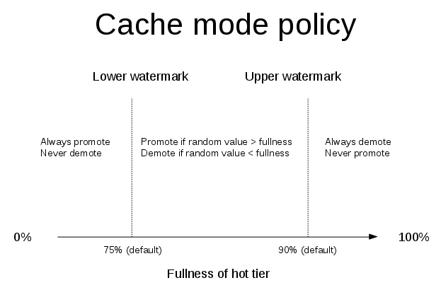

[[chap-Managing_Data_Tiering]]
= Managing Tiering

Tiering refers to automatic classification and movement of data based on
the user I/O access. The tiering feature continuously monitors the
workload, identifies hotspots by measuring and analysing the statistics
of the activity, and places the frequently accessed data on to the
highest performance hot tier (such as solid state drives (SSDs)), and
inactive data to the lower performing cold tier (such as Spinning disks)
all without I/O interruption. With tiering, data promotion and
auto-rebalancing address performance while cold demotion works to
address capacity.

Tiering monitors and identifies the activity level of the data and auto
rebalances the active and inactive data to the most appropriate storage
tier. Moving data between tiers of hot and cold storage is a
computationally expensive task. To address this, {{ book.productTitle }}
supports automated promotion and demotion of data within a volume in the
background so as to minimize impact on foreground I/O. Data becomes hot
or cold based on the rate at which it is accessed. If access to a file
increases, it moves, or retains its place in the hot tier. If the file
is not accessed for a while, it moves, or retains it place in the cold
tier. Hence, the data movement can happen in either direction which is
based totally on the access frequency.

Different sub-volume types act as hot and cold tiers and data is
automatically assigned or reassigned a “temperature” based on the
frequency of access. {{ book.productTitle }} allows attaching fast
performing disks as hot tier, uses the existing volume as cold tier, and
these hot tier and cold tier forms a single tiered volume. For example,
the existing volume may be distributed dispersed on HDDs and the hot
tier could be distributed-replicated on SSDs.

*Hot Tier.*

The hot tier is the tiering volume created using better performing
subvolumes, an example of which could be SSDs. Frequently accessed data
is placed in the highest performance and most expensive hot tier. Hot
tier volume could be a distributed volume or distributed-replicated
volume.

____________________________________________________________________________________________________________________________________________________________________________________________________________________________________
*Warning*

Distributed volumes can suffer significant data loss during a disk or
server failure because directory contents are spread randomly across the
bricks in the volume. Red Hat recommends creating distributed-replicated
tier volume.
____________________________________________________________________________________________________________________________________________________________________________________________________________________________________

*Cold Tier.*

The cold tier is the existing {{ book.productTitle }} volume created
using slower storage such as Spinning disks. Inactive or infrequently
accessed data is placed in the lowest-cost cold tier.

*Data Migration.*

Tiering automatically migrates files between hot tier and cold tier to
improve the storage performance and resource use.

[[chap-Managing_Data_Tiering-Architecture]]
= Tiering Architecture

Tiering provides better I/O performance as a subset of the data is
stored in the hot tier. Tiering involves creating a pool of relatively
fast/expensive storage devices (example, solid state drives) configured
to act as a hot tier, and an existing volume which are relatively
slower/cheaper devices configured to act as a cold tier. The tiering
translator handles where to place the files and when to migrate files
from the cold tier to the hot tier and vice versa. .

The following diagrams illustrates how tiering works when attached to a
distributed-dispersed volume. Here, the existing distributed-dispersed
volume would become a cold-tier and the new fast/expensive storage
device would act as a hot tier. Frequently accessed files will be
migrated from cold tier to the hot tier for better performance.

[[chap-Managing_Data_Tiering-Benefits]]
= Key Benefits of Tiering

The following are the key benefits of data tiering:

* Automatic classification and movement of files based on the access
patterns
* Faster response time and reduced latency
* Better I/O performance
* Improved data-storage efficiency
* Reduced deployment and operating costs

[[chap-Managing_Data_Tiering-Limitations]]
= Tiering Limitations

The following limitations apply to the use Tiering feature:

* Native client support for tiering is limited to Red Hat Enterprise
Linux version 6.7, 6.8 and 7.x clients. Tiered volumes cannot be mounted
by Red Hat Enterprise Linux 5.x clients.
* Tiering works only with `cache friendly` workloads. Attaching a tier
volume to a cache unfriendly workload will lead to slow performance. In
a `cache friendly` workload, most of the reads and writes are accessing
a subset of the total amount of data. And, this subset fits on the hot
tier. This subset should change only infrequently.
* Tiering feature is supported only on Red Hat Enterprise Linux 7 based
{{ book.productTitle }}. Tiering feature is not supported on Red Hat
Enterprise Linux 6 based {{ book.productTitle }}.
* In this release, only Fuse and NFSv3 access is supported. Server
Message Block (SMB) and NFSv4 access to tiered volume is not supported.
* Snapshot clones are not supported with the tiered volumes.
* When you run `tier detach commit force`, ongoing I/O operation may
fail with _Transport endpoint is not connected_ error.
* Files with hardlinks and softlinks are not migrated.
* Files on which POSIX locks has been taken are not migrated until all
locks are released.
* Add brick, remove brick, and rebalance operations are not supported on
the tiered volume. For information on expanding a tiered volume, see
<<../cluster/chap-Managing_Gluster_Volumes.adoc#chap-Managing_Red_Hat_Storage_Volumes-Expanding_Tiered_Volume,
Expanding Tiered Volume>> and for information on shrinking a tiered volume, see
<<../cluster/chap-Managing_Gluster_Volumes.adoc#chap-Managing_Red_Hat_Storage_Volumes-Shrinking_Tiered_Volume,
Shrinking Tiered Volume>>.

[[chap-Managing_Data_Tiering-Attach_Volumes]]
= Attaching a Tier to a Volume

By default, tiering is not enabled on gluster volumes. An existing
volume can be modified via a CLI command to have a __hot-tier__. You
must enable a volume by performing an attach tier operation. The
`attach` command will declare an existing volume as _cold-tier_ and
creates a new _hot-tier_ volume which is appended to it. Together, the
combination is a single _cache tiered_ volume.

It is highly recommended to provision your storage liberally and
generously before attaching a tier. You create a normal volume and then
_attach_ bricks to it, which are the __hot tier__:

1.  Attach the tier to the volume by executing the following command:
+
`# gluster volume tier VOLNAME attach [replica COUNT] NEW-BRICK...`
+
For example,
+
----------------------------------------------------------------------------------------------
# gluster volume tier test-volume attach replica 2 server1:/rhgs5/brick5 server2:/rhgs6/brick6
server1:/rhgs7/brick7 server2:/rhgs8/brick8
----------------------------------------------------------------------------------------------
2.  Run `gluster volume info` command to optionally display the volume
information.
+
The command output displays information similar to the following:
+
--------------------------------------
# gluster volume info test-volume
Volume Name: test-volume
Type: Tier
Status: Started
Number of Bricks: 8
Transport-type: tcp
Hot Tier :
Hot Tier Type : Distributed-Replicate
Number of Bricks: 2 x 2 = 4
Brick1: server1:/rhgs5/brick5 
Brick2: server2:/rhgs6/brick6
Brick3: server1:/rhgs7/brick7
Brick4: server2:/rhgs8/brick8
Cold Tier:
Cold Tier Type : Distributed-Replicate
Number of Bricks: 2 x 2 = 4
Brick5: server1:/rhgs1/brick1
Brick6: server2:/rhgs1/brick2
Brick7: server1:/rhgs2/brick3
Brick8: server2:/rhgs2/brick4  
Options Reconfigured:
cluster.watermark-low: 70
cluster.watermark-hi: 90
cluster.tier-demote-frequency: 45
cluster.tier-mode: cache
features.ctr-enabled: on
performance.readdir-ahead: on 
--------------------------------------

The tier start command is triggered automatically after the tier has
been attached. In some cases, if the tier process has not started you
must start it manually using the
`gluster volume tier VOLNAME start force` command.

== Attaching a Tier to a Geo-replicated Volume

You can attach a tier volume to the master volume of the geo-replication
session for better performance.

____________________________________________________________________________________________________________________________________________________________________________________________________________________________________________________________________________________________
*Important*

A crash has been observed in the Slave mounts when
`performance.quick-read` option is enabled and geo-replicated from a
tiered master volume. If the master volume is a tiered volume, you must
disable the `performance.quick-read` option in the Slave Volume using
the following command:

---------------------------------------------------------
# gluster volume set Slavevol performance.quick-read off 
---------------------------------------------------------
____________________________________________________________________________________________________________________________________________________________________________________________________________________________________________________________________________________________

1.  Stop geo-replication between the master and slave, using the
following command:
+
`# gluster volume geo-replication MASTER_VOL SLAVE_HOST::SLAVE_VOL stop`
+
For example:
+
--------------------------------------------------------------------
# gluster volume geo-replication Volume1 example.com::slave-vol stop
--------------------------------------------------------------------
2.  Attach the tier to the volume using the following command:
+
`# gluster volume tier VOLNAME attach [replica COUNT] NEW-BRICK...`
+
For example, to create a distributed-replicated tier volume with replica
count two:
+
--------------------------------------------------------------------------------------------
# gluster volume tier test-volume attach replica 2 server1:/rhgs1/tier1 server2:/rhgs2/tier2
server1:/rhgs3/tier3 server2:/rhgs4/tier4
--------------------------------------------------------------------------------------------
3.  Restart the geo-replication sessions, using the following command:
+
`# gluster volume geo-replication MASTER_VOL SLAVE_HOST::SLAVE_VOL start`
+
For example
+
---------------------------------------------------------------------
# gluster volume geo-replication Volume1 example.com::slave-vol start
---------------------------------------------------------------------
4.  Verify whether geo-replication session has started with tier's
bricks, using the following command:
+
`# gluster volume geo-replication MASTER_VOL SLAVE_HOST::SLAVE_VOL status`
+
For example,
+
----------------------------------------------------------------------
# gluster volume geo-replication Volume1 example.com::slave-vol status
----------------------------------------------------------------------

[[chap-Managing_Data_Tiering-Configuring_Tiered_Volume]]
= Configuring a Tiering Volume

Tiering volume has several configuration options. You may set tier
volume configuration options with the following usage:

`# gluster volume set VOLNAME key value`

[[chap-Managing_Data_Tiering-Configuring_Watermarks]]
== Configuring Watermarks

When the tier volume is configured to use the `cache` mode, the
configured watermark values and the percentage of the hot tier that is
full determine whether a file will be promoted or demoted. The
`cluster.watermark-low` and `cluster.watermark-hi` volume options set
the lower and upper watermark values respectively for a tier volume.

The promotion and demotion of files is determined by how full the hot
tier is. Data accumulates on the hot tier until it reaches the low
watermark, even if it is not accessed for a period of time. This
prevents files from being demoted unnecessarily when there is plenty on
free space on the hot tier. When the hot tier is fuller than the lower
watermark but less than the high watermark, data is randomly promoted
and demoted where the likelihood of promotion decreases as the tier
becomes fuller; the opposite holds for demotion. If the hot tier is
fuller than the high watermark, promotions stop and demotions happen
more frequently in order to free up space.

The following diagram illustrates how cache mode works and the example
values you can set.

To set the percentage for promotion and demotion of files, run the
following commands:

`# gluster volume set VOLNAME cluster.watermark-hi value`

`# gluster volume set VOLNAME cluster.watermark-low value`

== Configuring Promote and Demote Frequency

You can configure how frequently the files are to be checked for
promotion and demotion of files. The check is based on whether the file
was accessed or not in the last n seconds. If the promote/demote
frequency is not set, then the default value for promote frequency is
120 seconds and demote frequency is 3600 seconds.

To set the frequency for the promotion and demotion of files, run the
following command:

`# gluster volume set VOLNAME cluster.tier-demote-frequency value_in_seconds`

`# gluster volume set VOLNAME cluster.tier-promote-frequency value_in_seconds`

== Configuring Read and Write Frequency

You can configure the number of reads and writes in a promotion/demotion
cycle, that would mark a file `HOT` for promotion. Any file that has
read or write hits less than this value will be considered as `COLD` and
will be demoted. If the read/write access count is not set, then the
default count is set to 0.

Set the read and write frequency threshold by executing the following
command:

`# gluster volume set VOLNAME cluster.write-freq-threshold value`

________________________________________________________________________________________________________________________________________________________________________________________________________________
*Note*

The value of 0 indicates that the threshold value is not considered. Any
value in the range of 1-1000 denotes the number of times the contents of
file must be modified to consider for promotion or demotion...
________________________________________________________________________________________________________________________________________________________________________________________________________________

`# gluster volume set VOLNAME cluster.read-freq-threshold value`

_________________________________________________________________________________________________________________________________________________________________________________________________________________________
*Note*

The value of 0 indicates that the threshold value is not considered. Any
value in the range of 1-1000 denotes the number of times the contents of
file contents have been accessed to consider for promotion or demotion.
_________________________________________________________________________________________________________________________________________________________________________________________________________________________

== Configuring Target Data Size

The maximum amount of data that may be migrated in any direction in one
promotion/demotion cycle from each node can be configured using the
following command:

`# gluster volume set VOLNAME cluster.tier-max-mb value_in_mb`

If the `cluster.tier-max-mb` count is not set, then the default data
size is set to 4000 MB.

== Configuring the File Count per Cycle

The maximum number of files that may be migrated in any direction in one
promotion/demotion cycle from each node can be configured using the
following command:

` # gluster volume set VOLNAME cluster.tier-max-files count`

If the `cluster.tier-max-files `count is not set, then the default count
is set to 10000.

[[chap-Managing_Data_Tiering-Status]]
= Displaying Tiering Status Information

The status command displays the tiering volume information.

`# gluster volume tier VOLNAME status`

For example,

-----------------------------------------------------------------------------------
# gluster volume tier test-volume status
Node                 Promoted files       Demoted files        Status              
---------            ---------            ---------            ---------           
localhost            1                    5                    in progress         
server1              0                    2                    in progress         
Tiering Migration Functionality: test-volume: success
-----------------------------------------------------------------------------------

[[chap-Managing_Data_Tiering-Detach_Tier]]
= Detaching a Tier from a Volume

To detach a tier, perform the following steps:

1.  Start the detach tier by executing the following command:
+
`# gluster volume tier VOLNAME detach start`
+
For example,
+
----------------------------------------------
# gluster volume tier test-volume detach start
----------------------------------------------
2.  Monitor the status of detach tier until the status displays the
status as complete.
+
`# gluster volume tier VOLNAME detach status`
+
For example,
+
-------------------------------------------------------------------------------------------------------------------------
# gluster volume tier test-volume detach status
Node Rebalanced-files          size       scanned      failures       skipped               status       run time in secs
--------      -----------   -----------   -----------   -----------   -----------         ------------     --------------
localhost           0        0Bytes             0             0             0            completed               0.00
server1             0        0Bytes             0             0             0            completed               1.00
server2             0        0Bytes             0             0             0            completed               0.00
server1             0        0Bytes             0             0             0            completed  
server2             0        0Bytes             0             0             0            completed  
-------------------------------------------------------------------------------------------------------------------------
+
___________________________________________________________________________________________________________________________________________________________________________________________________________________________________________________________________________________________________________________________________________
*Note*

It is possible that some files are not migrated to the cold tier on a
detach operation for various reasons like POSIX locks being held on
them. Check for files on the hot tier bricks and you can either manually
move the files, or turn off applications (which would presumably unlock
the files) and stop/start detach tier, to retry.
___________________________________________________________________________________________________________________________________________________________________________________________________________________________________________________________________________________________________________________________________________
3.  When the tier is detached successfully as shown in the previous
status command, run the following command to commit the tier detach:
+
`# gluster volume tier VOLNAME detach commit`
+
For example,
+
----------------------------------------------------------------------------------------------------------------------------
# gluster volume tier test-volume detach commit 
Removing tier can result in data loss. Do you want to Continue? (y/n) 
y
volume detach-tier commit: success
Check the detached bricks to ensure all files are migrated.
If files with data are found on the brick path, copy them via a gluster mount point before re-purposing the removed brick.  
----------------------------------------------------------------------------------------------------------------------------

After the detach tier commit is completed, you can verify that the
volume is no longer a tier volume by running `gluster volume info`
command.

== Detaching a Tier of a Geo-replicated Volume

1.  Start the detach tier by executing the following command:
+
`# gluster volume tier VOLNAME detach start`
+
For example,
+
----------------------------------------------
# gluster volume tier test-volume detach start
----------------------------------------------
2.  Monitor the status of detach tier until the status displays the
status as complete.
+
`# gluster volume tier VOLNAME detach status`
+
For example,
+
-------------------------------------------------------------------------------------------------------------------------
# gluster volume tier test-volume detach status
Node Rebalanced-files          size       scanned      failures       skipped               status       run time in secs
--------      -----------   -----------   -----------   -----------   -----------         ------------     --------------
localhost           0        0Bytes             0             0             0            completed               0.00
server1             0        0Bytes             0             0             0            completed               1.00
server2             0        0Bytes             0             0             0            completed               0.00
server1             0        0Bytes             0             0             0            completed  
server2             0        0Bytes             0             0             0            completed  
-------------------------------------------------------------------------------------------------------------------------
+
_______________________________________________________________________________________________________________________________________________________________________________________________________________________________________________________________________________________________________________________________________________________________________________________________
*Note*

There could be some number of files that were not moved. Such files may
have been locked by the user, and that prevented them from moving to the
cold tier on the detach operation. You must check for such files. If you
find any such files, you can either manually move the files, or turn off
applications (which would presumably unlock the files) and stop/start
detach tier, to retry.
_______________________________________________________________________________________________________________________________________________________________________________________________________________________________________________________________________________________________________________________________________________________________________________________________
3.  Set a checkpoint on a geo-replication session to ensure that all the
data in that cold-tier is synced to the slave. For more information on
geo-replication checkpoints, see <<chap-Managing_Geo-replication.adoc#sect-Geo-replication_Checkpoints,
Geo-replication Checkpoints>>.
+
`# gluster volume geo-replication MASTER_VOL SLAVE_HOST::SLAVE_VOL config checkpoint now`
+
For example,
+
-------------------------------------------------------------------------------------
# gluster volume geo-replication Volume1 example.com::slave-vol config checkpoint now
-------------------------------------------------------------------------------------
4.  Use the following command to verify the checkpoint completion for
the geo-replication session
+
` # gluster volume geo-replication MASTER_VOL SLAVE_HOST::SLAVE_VOL status detail`
5.  Stop geo-replication between the master and slave, using the
following command:
+
` # gluster volume geo-replication MASTER_VOL SLAVE_HOST::SLAVE_VOL stop`
+
For example:
+
--------------------------------------------------------------------
# gluster volume geo-replication Volume1 example.com::slave-vol stop
--------------------------------------------------------------------
6.  Commit the detach tier operation using the following command:
+
`# gluster volume tier VOLNAME detach commit`
+
For example,
+
----------------------------------------------------------------------------------------------------------------------------
# gluster volume tier test-volume detach commit 
Removing tier can result in data loss. Do you want to Continue? (y/n) 
y
volume detach-tier commit: success
Check the detached bricks to ensure all files are migrated.
If files with data are found on the brick path, copy them via a gluster mount point before re-purposing the removed brick.  
----------------------------------------------------------------------------------------------------------------------------
+
After the detach tier commit is completed, you can verify that the
volume is no longer a tier volume by running `gluster volume info`
command.
7.  Restart the geo-replication sessions, using the following command:
+
` # gluster volume geo-replication MASTER_VOL SLAVE_HOST::SLAVE_VOL start`
+
For example,
+
---------------------------------------------------------------------
# gluster volume geo-replication Volume1 example.com::slave-vol start
---------------------------------------------------------------------
